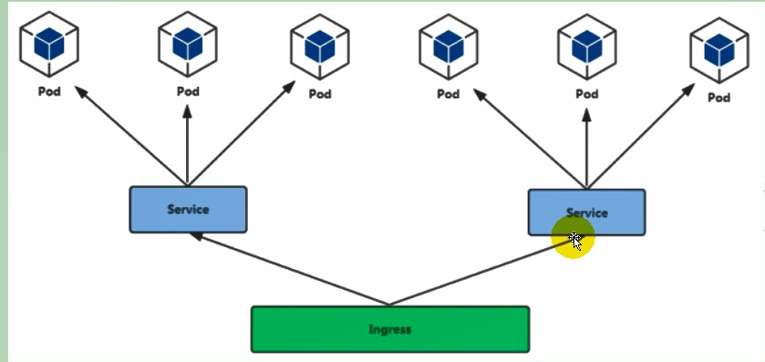

# Ingress部署



### 部署Ingress

```shell
kubectl apply -f ingress-controller.yaml
```

### 暴露Ingress规则

```
kubectl apply -f ingress-tomcat.yaml
```

### 注意

**example.atguigu.com需要配置绑定在安装Ingress主机IP上，不能绑定master**