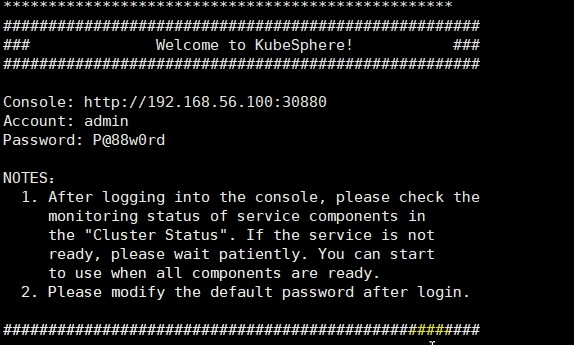

# kubersphere安装

您可以在虚拟机和裸机上安装 KubeSphere，并同时配置 Kubernetes。另外，只要 Kubernetes 集群满足以下前提条件，那么您也可以在云托管和本地 Kubernetes 集群上部署 KubeSphere。

- Kubernetes 版本：`1.15.x，1.16.x，1.17.x，1.18.x`
- 可用 CPU > 1 核；内存 > 2 G
- Kubernetes 集群已配置**默认** StorageClass（请使用 `kubectl get sc` 进行确认）
- 使用 `--cluster-signing-cert-file` 和 `--cluster-signing-key-file` 参数启动集群时，kube-apiserver 将启用 CSR 签名功能

# 预检查

1. 在集群节点中运行 `kubectl version`，确保 Kubernetes 版本可兼容。输出如下所示：

   ```shell
   $ kubectl version
   Client Version: version.Info{Major:"1", Minor:"15", GitVersion:"v1.15.1", GitCommit:"4485c6f18cee9a5d3c3b4e523bd27972b1b53892", GitTreeState:"clean", BuildDate:"2019-07-18T09:09:21Z", GoVersion:"go1.12.5", Compiler:"gc", Platform:"linux/amd64"}
   Server Version: version.Info{Major:"1", Minor:"15", GitVersion:"v1.15.1", GitCommit:"4485c6f18cee9a5d3c3b4e523bd27972b1b53892", GitTreeState:"clean", BuildDate:"2019-07-18T09:09:21Z", GoVersion:"go1.12.5", Compiler:"gc", Platform:"linux/amd64"}
   ```

   > 请注意 `Server Version` 这一行。如果 `GitVersion` 显示为旧版本，则需要先升级 Kubernetes。

2. 检查集群中的可用资源是否满足最低要求

   ```shell
   $ free -g
                  total        used        free      shared  buff/cache   available
   Mem:              16          4          10           0           3           2
   Swap:             0           0           0
   ```

3. 检查集群中是否有**默认** StorageClass（准备默认 StorageClass 是安装 KubeSphere 的前提条件）

   ```shell
   $ kubectl get sc
   NAME                      PROVISIONER               AGE
   glusterfs (default)       kubernetes.io/glusterfs   3d4h
   ```

# 安装

确保现有的 Kubernetes 集群满足所有要求之后，您可以使用 kubectl 以默认最小安装包来安装 KubeSphere

1. 执行以下命令以开始安装：

   ```shell
   kubectl apply -f https://github.com/kubesphere/ks-installer/releases/download/v3.1.0/kubesphere-installer.yaml
      
   kubectl apply -f https://github.com/kubesphere/ks-installer/releases/download/v3.1.0/cluster-configuration.yaml
   ```

2. 检查安装日志

   ```shell
   kubectl logs -n kubesphere-system $(kubectl get pod -n kubesphere-system -l app=ks-install -o jsonpath='{.items[0].metadata.name}') -f
   ```

3. 使用 `kubectl get pod --all-namespaces` 查看所有 Pod 在 KubeSphere 相关的命名空间是否正常运行。如果是正常运行，请通过以下命令来检查控制台的端口（默认为 30880）：

   ```shell
   kubectl get svc/ks-console -n kubesphere-system
   ```

**等上一伙**



### Default StorageClass Not Found（问题）

https://v2-1.docs.kubesphere.io/docs/zh-CN/appendix/install-openebs/

重启集群

