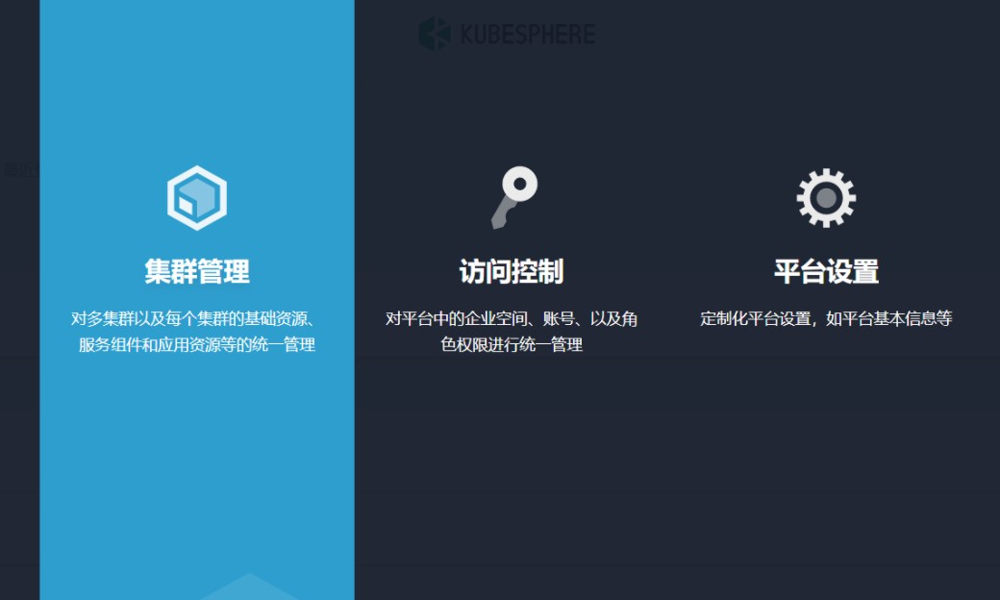
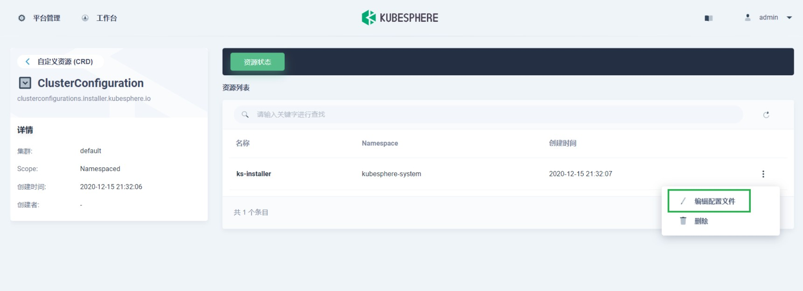

# DEVOPS安装

**参考官网*：**

https://kubesphere.io/zh/docs/pluggable-components/devops/

### Kubernetes上安装

##### 第一种方式(kubesphere未安装)

1. 下载 [cluster-configuration.yaml](https://github.com/kubesphere/ks-installer/releases/download/v3.1.0/cluster-configuration.yaml) 文件，然后打开并开始编辑。

   ```shell
   vi cluster-configuration.yaml
   ```

2. 在该本地 `cluster-configuration.yaml` 文件中，搜寻到 `devops`，并将 `enabled` 的 `false` 改为 `true`，完成后保存文件。

   ```shell
   devops:
       enabled: true # Change "false" to "true"
   ```

3. 执行以下命令开始安装：

   ```shell
   kubectl apply -f https://github.com/kubesphere/ks-installer/releases/download/v3.1.0/kubesphere-installer.yaml
   
   kubectl apply -f cluster-configuration.yaml
   ```

#### 第二种方式(在安装后启用 DevOps)

1. 以 `admin` 身份登录控制台，点击左上角的**平台管理**，选择**集群管理**

   

2. 点击**自定义资源 CRD**，在搜索栏中输入 `clusterconfiguration`，点击搜索结果查看其详细页面。

3. 在**资源列表**中，点击 `ks-installer` 右边的三个点，选择**编辑配置文件**。

   

4. 在该 YAML 文件中，搜寻到 `devops`，将 `enabled` 的 `false` 改为 `true`。完成后，点击右下角的**更新**，保存配置。

   ```shell
   devops:
       enabled: true # Change "false" to "true"
   ```

   