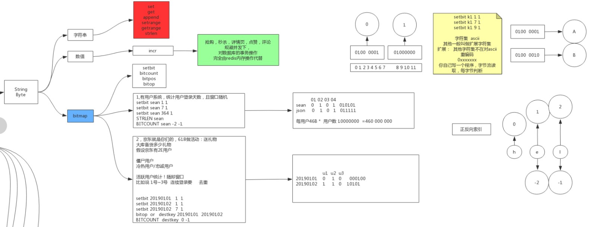

# 字符串

### SET  key  value  [选项]

- `EX` *seconds* – 设置键key的过期时间，单位时秒
- `PX` *milliseconds* – 设置键key的过期时间，单位时毫秒
- `NX` – 只有键key不存在的时候才会设置key的值
- `XX` – 只有键key存在的时候才会设置key的值

### MSET  k1  v1  k2  v2

- `MSET`是原子的，所以所有给定的keys是一次性set的。客户端不可能看到这种一部分keys被更新而另外的没有改变的情况。

### MSETNX  key  value  [key  value...]

- 设置多个key value 仅当key不存在，只要有一个key已经存在，`MSETNX`一个操作都不会执行

- 1 如果所有的key被set

- 0 如果没有key被set(至少其中有一个key是存在的)

  ```shell
  redis> MSETNX key1 "Hello" key2 "there"
  (integer) 1
  redis> MSETNX key2 "there" key3 "world"
  (integer) 0
  redis> MGET key1 key2 key3
  1) "Hello"
  2) "there"
  3) (nil)
  redis> 
  ```

### SETEX  key  value

设置key对应字符串value，并且设置key在给定的seconds时间之后超时过期。这个命令等效于执行下面的命令：

```shell
SET mykey value
EXPIRE mykey seconds

redis> SETEX mykey 10 "Hello"
OK
redis> TTL mykey
(integer) 10
redis> GET mykey
"Hello"
redis>
```

### PSETEX  key  milliseconds  value

[PSETEX](http://redis.cn/commands/psetex.html)和[SETEX](http://redis.cn/commands/setex.html)一样，唯一的区别是到期时间以毫秒为单位,而不是秒。

### SETNX

将`key`设置值为`value`，如果`key`不存在，这种情况下等同[SET](http://redis.cn/commands/set.html)命令。 当`key`存在时，什么也不做。`SETNX`是”**SET** if **N**ot e**X**ists”的简写

```shell
redis> SETNX mykey "Hello"
(integer) 1
redis> SETNX mykey "World"
(integer) 0
redis> GET mykey
"Hello"
redis> 
```

### SETRANGE  key  offset  value

这个命令的作用是覆盖key对应的string的一部分，从指定的offset处开始，覆盖value的长度。如果offset比当前key对应string还要长，那这个string后面就补0以达到offset。不存在的keys被认为是空字符串，所以这个命令可以确保key有一个足够大的字符串，能在offset处设置value。

注意，offset最大可以是229-1(536870911),因为redis字符串限制在512M大小。如果你需要超过这个大小，你可以用多个keys。

**警告**：当set最后一个字节并且key还没有一个字符串value或者其value是个比较小的字符串时，Redis需要立即分配所有内存，这有可能会导致服务阻塞一会。在一台2010MacBook Pro上，set536870911字节（分配512MB）需要～300ms，set134217728字节(分配128MB)需要～80ms，set33554432比特位（分配32MB）需要～30ms，set8388608比特（分配8MB）需要8ms。注意，一旦第一次内存分配完，后面对同一个key调用[SETRANGE](http://redis.cn/commands/setrange.html)就不会预先得到内存分配。

```shell
redis> SET key1 "Hello World"
OK
redis> SETRANGE key1 6 "Redis"
(integer) 11
redis> GET key1
"Hello Redis"
redis> 

# 补0的案例

```

### GET  key

返回`key`的`value`。如果key不存在，返回特殊值`nil`。如果`key`的`value`不是string，就返回错误，因为`GET`只处理string类型的`values`。

### MGET  key  [key...]

返回所有指定的key的value。对于每个不对应string或者不存在的key，都返回特殊值`nil`。正因为此，这个操作从来不会失败。

```shell
redis> SET key1 "Hello"
OK
redis> SET key2 "World"
OK
redis> MGET key1 key2 nonexisting
1) "Hello"
2) "World"
3) (nil)
redis> 
```

### APPEND  key  value

如果 `key` 已经存在，并且值为字符串，那么这个命令会把 `value` 追加到原来值（value）的结尾。 如果 `key` 不存在，那么它将首先创建一个空字符串的`key`，再执行追加操作，这种情况 [APPEND](http://redis.cn/ommands/append.html) 将类似于 [SET](http://redis.cn/ommands/set.html) 操作。

**返回值：**返回append后字符串值（value）的长度。

```shell
redis> EXISTS mykey
(integer) 0
redis> APPEND mykey "Hello"
(integer) 5
redis> APPEND mykey " World"
(integer) 11
redis> GET mykey
"Hello World"
redis>
```

### STRLEN  key

返回key的string类型value的长度。如果key对应的非string类型，就返回错误。

```shell
redis> SET mykey "Hello world"
OK
redis> STRLEN mykey
(integer) 11
redis> STRLEN nonexisting
(integer) 0
redis> 
```

### GETSET

自动将key对应到value并且返回原来key对应的value。如果key存在但是对应的value不是字符串，就返回错误。

[GETSET](http://redis.cn/commands/getset.html)可以和[INCR](http://redis.cn/commands/incr.html)一起使用实现支持重置的计数功能。举个例子：每当有事件发生的时候，一段程序都会调用[INCR](http://redis.cn/commands/incr.html)给key mycounter加1，但是有时我们需要获取计数器的值，并且自动将其重置为0。这可以通过GETSET mycounter “0”来实现：

**返回值：**返回之前的旧值，如果之前`Key`不存在将返回`nil`

```shell
redis> INCR mycounter
(integer) 1
redis> GETSET mycounter "0"
"1"
redis> GET mycounter
"0"
redis> 
```

### GETRANGE  key  start  end

**警告**：这个命令是被改成GETRANGE的，在小于2.0的Redis版本中叫SUBSTR。 返回key对应的字符串value的子串，这个子串是由start和end位移决定的（两者都在string内）。可以用负的位移来表示从string尾部开始数的下标。所以-1就是最后一个字符，-2就是倒数第二个，以此类推。

这个函数处理超出范围的请求时，都把结果限制在string内。

```shell
redis> SET mykey "This is a string"
OK
redis> GETRANGE mykey 0 3
"This"
redis> GETRANGE mykey -3 -1
"ing"
redis> GETRANGE mykey 0 -1
"This is a string"
redis> GETRANGE mykey 10 100
"string"
redis> 
```

# 数值

### DECR   key

对key对应的数字做减1操作。如果key不存在，那么在操作之前，这个key对应的值会被置为0。如果key有一个错误类型的value或者是一个不能表示成数字的字符串，就返回错误。这个操作最大支持在64位有符号的整型数字。

**返回值：**减小之后的value

```shell
redis> SET mykey "10"
OK
redis> DECR mykey
(integer) 9
redis> SET mykey "234293482390480948029348230948"
OK
redis> DECR mykey
ERR value is not an integer or out of range
redis> 
```

### DECRBY  key  decrement 

将key对应的数字减decrement。如果key不存在，操作之前，key就会被置为0。如果key的value类型错误或者是个不能表示成数字的字符串，就返回错误。这个操作最多支持64位有符号的正型数字。

**返回值：**减小之后的value

```shell
redis> SET mykey "10"
OK
redis> DECRBY mykey 5
(integer) 5
redis> 
```

### INCR  key 

对存储在指定`key`的数值执行原子的加1操作。

如果指定的key不存在，那么在执行incr操作之前，会先将它的值设定为`0`。

如果指定的key中存储的值不是字符串类型（fix：）或者存储的字符串类型不能表示为一个整数，

那么执行这个命令时服务器会返回一个错误(eq:(error) ERR value is not an integer or out of range)。

这个操作仅限于64位的有符号整型数据

**注意**: 由于redis并没有一个明确的类型来表示整型数据，所以这个操作是一个字符串操作。

执行这个操作的时候，key对应存储的字符串被解析为10进制的**64位有符号整型**

**返回值：**执行递增操作后`key`对应的值。

```shell
redis> SET mykey "10"
OK
redis> INCR mykey
(integer) 11
redis> GET mykey
"11"
redis> 
```

### INCRBY key increment

将key对应的数字加decrement。如果key不存在，操作之前，key就会被置为0。如果key的value类型错误或者是个不能表示成数字的字符串，就返回错误。这个操作最多支持64位有符号的正型数字。

```shell
redis> SET mykey "10"
OK
redis> INCRBY mykey 5
(integer) 15
redis> 
```

### INCRBYFLOAT key increment

通过指定浮点数`key`来增长浮点数(存放于string中)的值. 当键不存在时,先将其值设为0再操作.下面任一情况都会返回错误:

- key 包含非法值(不是一个string).
- 当前的key或者相加后的值不能解析为一个双精度的浮点值.(超出精度范围了)

如果操作命令成功, 相加后的值将替换原值存储在对应的键值上, 并以string的类型返回. string中已存的值或者相加参数可以任意选用指数符号,但相加计算的结果会以科学计数法的格式存储. 无论各计算的内部精度如何, 输出精度都固定为小数点后17位.

**返回值：**当前`key`增加increment后的值

```shell
redis> SET mykey 10.50
OK
redis> INCRBYFLOAT mykey 0.1
"10.6"
redis> SET mykey 5.0e3
OK
redis> INCRBYFLOAT mykey 2.0e2
"5200"
redis> 
```


# 位图

### SETBIT  key  offset  value

设置或者清空key的value(字符串)在offset处的bit值。

那个位置的bit要么被设置，要么被清空，这个由value（只能是0或者1）来决定。当key不存在的时候，就创建一个新的字符串value。要确保这个字符串大到在offset处有bit值。参数offset需要大于等于0，并且小于232(限制bitmap大小为512)。当key对应的字符串增大的时候，新增的部分bit值都是设置为0。

警告：当set最后一个bit(offset等于232-1)并且key还没有一个字符串value或者其value是个比较小的字符串时，Redis需要立即分配所有内存，这有可能会导致服务阻塞一会。在一台2010MacBook Pro上，offset为232-1（分配512MB）需要～300ms，offset为230-1(分配128MB)需要～80ms，offset为228-1（分配32MB）需要～30ms，offset为226-1（分配8MB）需要8ms。注意，一旦第一次内存分配完，后面对同一个key调用[SETBIT](http://redis.cn/commands/setbit.html)就不会预先得到内存分配。

**返回值：**在offset处原来的bit值

```shell
redis> SETBIT mykey 7 1
(integer) 0
redis> SETBIT mykey 7 0
(integer) 1
redis> GET mykey
"\x00"
redis> 
```

### GETBIT  key  offset

返回key对应的string在offset处的bit值 当offset超出了字符串长度的时候，这个字符串就被假定为由0比特填充的连续空间。当key不存在的时候，它就认为是一个空字符串，所以offset总是超出范围，然后value也被认为是由0比特填充的连续空间。到内存分配。

**返回值：**在offset处的bit值

```shell
127.0.0.1:6379> SETBIT k1 1 1
(integer) 1
127.0.0.1:6379> SETBIT k1 7 1
(integer) 1
127.0.0.1:6379> GETBIT k1 1
(integer) 1
127.0.0.1:6379> GETBIT k1 7
(integer) 1
127.0.0.1:6379> GETBIT k1 6
(integer) 0
127.0.0.1:6379> get k1
"A"
127.0.0.1:6379> 
```

### BITCOUNT  key  [start  end]

统计字符串被设置为1的bit数.

一般情况下，给定的整个字符串都会被进行计数，通过指定额外的 start 或 end 参数，可以让计数只在特定的位上进行。

start 和 end 参数的设置和 [GETRANGE](http://redis.cn/commands/getrange.html) 命令类似，都可以使用负数值：比如 -1 表示最后一个位，而 -2 表示倒数第二个位，以此类推。

不存在的 key 被当成是空字符串来处理，因此对一个不存在的 key 进行 BITCOUNT 操作，结果为 0 。

**返回值：**被设置为 1 的位的数量

```shell
redis> SET mykey "foobar"
OK
redis> BITCOUNT mykey
(integer) 26
redis> BITCOUNT mykey 0 0
(integer) 4
redis> BITCOUNT mykey 1 1
(integer) 6
redis>
```

### BITOP  operation  destkey  key  [key...]

对一个或多个保存二进制位的字符串 key 进行位元操作，并将结果保存到 destkey 上。

`BITOP` 命令支持 AND 、 OR 、 NOT 、 XOR 这四种操作中的任意一种参数：

- `BITOP AND destkey srckey1 srckey2 srckey3 ... srckeyN` ，对一个或多个 key 求逻辑并，并将结果保存到 destkey 。
- `BITOP OR destkey srckey1 srckey2 srckey3 ... srckeyN`，对一个或多个 key 求逻辑或，并将结果保存到 destkey 。
- `BITOP XOR destkey srckey1 srckey2 srckey3 ... srckeyN`，对一个或多个 key 求逻辑异或，并将结果保存到 destkey 。
- `BITOP NOT destkey srckey`，对给定 key 求逻辑非，并将结果保存到 destkey 。

除了 NOT 操作之外，其他操作都可以接受一个或多个 key 作为输入。执行结果将始终保持到`destkey`里面。

**处理不同长度的字符串：**

当 BITOP 处理不同长度的字符串时，较短的那个字符串所缺少的部分会被看作 0 。

空的 key 也被看作是包含 0 的字符串序列。

**返回值：**保存到 destkey 的字符串的长度，和输入 key 中最长的字符串长度相等。

```shell
redis> SET key1 "foobar"
OK
redis> SET key2 "abcdef"
OK
redis> BITOP AND dest key1 key2
(integer) 6
redis> GET dest
"`bc`ab"
redis>
```

### BITPOS key bit [start] [end]

返回字符串里面第一个被设置为1或者0的bit位。

返回一个位置，把字符串当做一个从左到右的字节数组，第一个符合条件的在位置0，其次在位置8，等等。

[GETBIT](http://redis.cn/commands/getbit.html) 和 [SETBIT](http://redis.cn/commands/setbit.html) 相似的也是操作字节位的命令。

默认情况下整个字符串都会被检索一次，只有在指定start和end参数(指定start和end位是可行的)，该范围被解释为一个字节的范围，而不是一系列的位。所以`start=0` 并且 `end=2`是指前三个字节范围内查找。

**注意：**返回的位的位置始终是从0开始的，即使使用了start来指定了一个开始字节也是这样

和[GETRANGE](http://redis.cn/commands/getrange.html)命令一样，start和end也可以包含负值，负值将从字符串的末尾开始计算，-1是字符串的最后一个字节，-2是倒数第二个，等等。

不存在的key将会被当做空字符串来处理。

**返回值：**

命令返回字符串里面第一个被设置为1或者0的bit位。

如果我们在空字符串或者0字节的字符串里面查找bit为1的内容，那么结果将返回-1。

如果我们在字符串里面查找bit为0而且字符串只包含1的值时，将返回字符串最右边的第一个空位。如果有一个字符串是三个字节的值为`0xff`的字符串，那么命令`BITPOS key 0`将会返回24，因为0-23位都是1。

基本上，我们可以把字符串看成右边有无数个0。

然而，如果你用指定start和end范围进行查找指定值时，如果该范围内没有对应值，结果将返回-1。

```shell
redis> SET mykey "\xff\xf0\x00"
OK
redis> BITPOS mykey 0 # 查找字符串里面bit值为0的位置
(integer) 12
redis> SET mykey "\x00\xff\xf0"
OK
redis> BITPOS mykey 1 0 # 查找字符串里面bit值为1从第0个字节开始的位置
(integer) 8
redis> BITPOS mykey 1 2 # 查找字符串里面bit值为1从第2个字节(12)开始的位置
(integer) 16
redis> set mykey "\x00\x00\x00"
OK
redis> BITPOS mykey 1 # 查找字符串里面bit值为1的位置
(integer) -1
redis>
```

### BITFIELD key [GET type offset] [SET type offset value] [INCRBY type offset increment] [OVERFLOW WRAP|SAT|FAIL]

// TODO


1. BITFIELD
2. BITOP
3. BITOPS
4. 