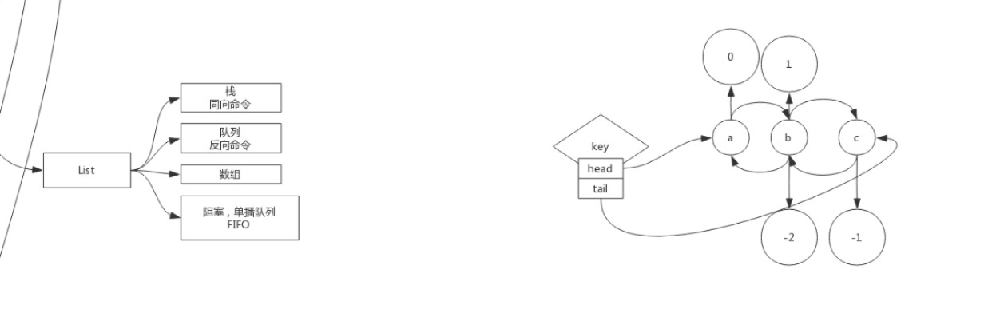

# Lists



## l 打头的命令中主要分为两类  1. left 左边开始操作   2.代表list操作

### LPUSH  key  value  [value...]

#### 描述

将所有指定的值插入到存于 key 的列表的头部

如果 key 不存在，那么在进行 push 操作前会创建一个空列表。如果 key 对应的值不是一个 list 的话，那么会返回一个错误。

#### 返回值

在 push 操作后的 list 长度。

#### 案例

```shell
redis> LPUSH mylist "world"
(integer) 1
redis> LPUSH mylist "hello"
(integer) 2
redis> LRANGE mylist 0 -1
1) "hello"
2) "world"
redis> 
```


### LPOP  key

#### 描述

移除并且返回 key 对应的 list 的第一个元素

#### 返回值

返回第一个元素的值，或者当 key 不存在时返回 nil

#### 案例

```shell
redis> RPUSH mylist "one"
(integer) 1
redis> RPUSH mylist "two"
(integer) 2
redis> RPUSH mylist "three"
(integer) 3
redis> LPOP mylist
"one"
redis> LRANGE mylist 0 -1
1) "two"
2) "three"
redis> 
```

### LPUSH  key value

#### 描述

只有当 key 已经存在并且存着一个 list 的时候，在这个 key 下面的 list 的头部插入 value。 与 LPUSH 相反，当 key 不存在的时候不会进行任何操作。

#### 返回值

在 push 操作后的 list 长度。

#### 案例

```shell
redis> LPUSH mylist "World"
(integer) 1
redis> LPUSHX mylist "Hello"
(integer) 2
redis> LPUSHX myotherlist "Hello"
(integer) 0
redis> LRANGE mylist 0 -1
1) "Hello"
2) "World"
redis> LRANGE myotherlist 0 -1
(empty list or set)
redis>
```

### RPUSH  key  value  [value...]

#### 描述

向存于 key 的列表的尾部插入所有指定的值。如果 key 不存在，那么会创建一个空的列表然后再进行 push 操作。 当 key 保存的不是一个列表，那么会返回一个错误。

可以使用一个命令把多个元素打入队列，只需要在命令后面指定多个参数。元素是从左到右一个接一个从列表尾部插入。 比如命令 RPUSH mylist a b c 会返回一个列表，其第一个元素是 a ，第二个元素是 b ，第三个元素是 c。

#### 返回值

在 push 操作后的 list 长度。

#### 案例

```shell
redis> RPUSH mylist "hello"
(integer) 1
redis> RPUSH mylist "world"
(integer) 2
redis> LRANGE mylist 0 -1
1) "hello"
2) "world"
redis> 
```

### RPOP  key

#### 描述

移除并返回存于 key 的 list 的最后一个元素

#### 返回值

最后一个元素的值，或者当 key 不存在的时候返回 nil

#### 案例

```shell
redis> RPUSH mylist "one"
(integer) 1
redis> RPUSH mylist "two"
(integer) 2
redis> RPUSH mylist "three"
(integer) 3
redis> RPOP mylist
"three"
redis> LRANGE mylist 0 -1
1) "one"
2) "two"
redis> 
```

### RPUSHX  key  value

#### 描述

将值 value 插入到列表 key 的表尾, 当且仅当 key 存在并且是一个列表。 和 [RPUSH](http://redis.cn/commands/rpush.html) 命令相反, 当 key 不存在时，RPUSHX 命令什么也不做。

#### 返回值

RPUSHX 命令执行之后，表的长度。

#### 案例

```shell
redis> RPUSH mylist "Hello"
(integer) 1
redis> RPUSHX mylist "World"
(integer) 2
redis> RPUSHX myotherlist "World"
(integer) 0
redis> LRANGE mylist 0 -1
1) "Hello"
2) "World"
redis> LRANGE myotherlist 0 -1
(empty list or set)
redis>
```

### RPOPLPUSH source destination

#### 描述

原子性地返回并移除存储在 source 的列表的最后一个元素（列表尾部元素）， 并把该元素放入存储在 destination 的列表的第一个元素位置（列表头部）。

例如：假设 source 存储着列表 a,b,c， destination存储着列表 x,y,z。 执行 RPOPLPUSH 得到的结果是 source 保存着列表 a,b ，而 destination 保存着列表 c,x,y,z。

如果 source 不存在，那么会返回 nil 值，并且不会执行任何操作。 如果 source 和 destination 是同样的，那么这个操作等同于移除列表最后一个元素并且把该元素放在列表头部， 所以这个命令也可以当作是一个旋转列表的命令。

#### 返回值

被移除和放入的元素

#### 案例

```shell
redis> RPUSH mylist "one"
(integer) 1
redis> RPUSH mylist "two"
(integer) 2
redis> RPUSH mylist "three"
(integer) 3
redis> RPOPLPUSH mylist myotherlist
"three"
redis> LRANGE mylist 0 -1
1) "one"
2) "two"
redis> LRANGE myotherlist 0 -1
1) "three"
redis> 
```

### LLEN  key

#### 描述

返回存储在 key 里的list的长度。 如果 key 不存在，那么就被看作是空list，并且返回长度为 0。 当存储在 key 里的值不是一个list的话，会返回error。

#### 返回值

key对应的list的长度

#### 例子

```shell
redis> LPUSH mylist "World"
(integer) 1
redis> LPUSH mylist "Hello"
(integer) 2
redis> LLEN mylist
(integer) 2
redis>
```

### LRANGE key start stop

#### 描述

返回存储在 key 的列表里指定范围内的元素。 start 和 end 偏移量都是基于0的下标，即list的第一个元素下标是0（list的表头），第二个元素下标是1，以此类推

偏移量也可以是负数，表示偏移量是从list尾部开始计数。 例如， -1 表示列表的最后一个元素，-2 是倒数第二个，以此类推。

**超过范围的下标：**当下标超过list范围的时候不会产生error。 如果start比list的尾部下标大的时候，会返回一个空列表。 如果stop比list的实际尾部大的时候，Redis会当它是最后一个元素的下标

#### 返回值

指定范围里的列表元素

#### 例子

```shell
redis> RPUSH mylist "one"
(integer) 1
redis> RPUSH mylist "two"
(integer) 2
redis> RPUSH mylist "three"
(integer) 3
redis> LRANGE mylist 0 0
1) "one"
redis> LRANGE mylist -3 2
1) "one"
2) "two"
3) "three"
redis> LRANGE mylist -100 100
1) "one"
2) "two"
3) "three"
redis> LRANGE mylist 5 10
(empty list or set)
redis> 
```

### LREM key count value

#### 描述

从存于 key 的列表里移除前 count 次出现的值为 value 的元素。 这个 count 参数通过下面几种方式影响这个操作

- count > 0: 从头往尾移除值为 value 的元素。
- count < 0: 从尾往头移除值为 value 的元素。
- count = 0: 移除所有值为 value 的元素。

比如， LREM list -2 “hello” 会从存于 list 的列表里移除最后两个出现的 “hello”。

需要注意的是，如果list里没有存在key就会被当作空list处理，所以当 key 不存在的时候，这个命令会返回 0。

#### 返回值

被移除的元素个数

#### 例子

```shell
redis> RPUSH mylist "hello"
(integer) 1
redis> RPUSH mylist "hello"
(integer) 2
redis> RPUSH mylist "foo"
(integer) 3
redis> RPUSH mylist "hello"
(integer) 4
redis> LREM mylist -2 "hello"
(integer) 2
redis> LRANGE mylist 0 -1
1) "hello"
2) "foo"
redis> 
```

### LSET key index value

#### 描述

设置 index 位置的list元素的值为 value。 更多关于 index 参数的信息，详见 [LINDEX](http://redis.cn/commands/lindex.html)

#### 返回值

#### 例子

```shell
redis> RPUSH mylist "one"
(integer) 1
redis> RPUSH mylist "two"
(integer) 2
redis> RPUSH mylist "three"
(integer) 3
redis> LSET mylist 0 "four"
OK
redis> LSET mylist -2 "five"
OK
redis> LRANGE mylist 0 -1
1) "four"
2) "five"
3) "three"
redis>
```

### LTRIM key start stop

#### 描述

修剪(trim)一个已存在的 list，这样 list 就会只包含指定范围的指定元素。start 和 stop 都是由0开始计数的， 这里的 0 是列表里的第一个元素（表头），1 是第二个元素，以此类推

例如： `LTRIM foobar 0 2` 将会对存储在 foobar 的列表进行修剪，只保留列表里的前3个元素

start 和 end 也可以用负数来表示与表尾的偏移量，比如 -1 表示列表里的最后一个元素， -2 表示倒数第二个，等等。

超过范围的下标并不会产生错误：如果 start 超过列表尾部，或者 start > end，结果会是列表变成空表（即该 key 会被移除）。 如果 end 超过列表尾部，Redis 会将其当作列表的最后一个元素。

### 返回值

```shell
redis> RPUSH mylist "one"
(integer) 1
redis> RPUSH mylist "two"
(integer) 2
redis> RPUSH mylist "three"
(integer) 3
redis> LTRIM mylist 1 -1
OK
redis> LRANGE mylist 0 -1
1) "two"
2) "three"
redis> 
```

### LINSERT key BEFORE|AFTER pivot value

#### 描述

把 value 插入存于 key 的列表中在基准值 pivot 的前面或后面。  如果有多个相同值pivot  默认第一个

当 key 不存在时，这个list会被看作是空list，任何操作都不会发生。

当 key 存在，但保存的不是一个list的时候，会返回error。

#### 返回值

经过插入操作后的list长度，或者当 pivot 值找不到的时候返回 -1

#### 例子

```shell
redis> RPUSH mylist "Hello"
(integer) 1
redis> RPUSH mylist "World"
(integer) 2
redis> LINSERT mylist BEFORE "World" "There"
(integer) 3
redis> LRANGE mylist 0 -1
1) "Hello"
2) "There"
3) "World"
redis> 
```

### LINDEX key index

#### 描述

返回列表里的元素的索引 index 存储在 key 里面。 下标是从0开始索引的，所以 0 是表示第一个元素， 1 表示第二个元素，并以此类推。 负数索引用于指定从列表尾部开始索引的元素。在这种方法下，-1 表示最后一个元素，-2 表示倒数第二个元素，并以此往前推。

当 key 位置的值不是一个列表的时候，会返回一个error。

#### 返回值

请求的对应元素，或者当 index 超过范围的时候返回 nil。

#### 案例

```shell
redis> LPUSH mylist "World"
(integer) 1
redis> LPUSH mylist "Hello"
(integer) 2
redis> LINDEX mylist 0
"Hello"
redis> LINDEX mylist -1
"World"
redis> LINDEX mylist 3
(nil)
redis> 
```

### BLPOP key [key ...] timeout

#### 描述

[BLPOP](http://redis.cn/commands/blpop.html) 是阻塞式列表的弹出原语。 它是命令 [LPOP](http://redis.cn/commands/lpop.html) 的阻塞版本，这是因为当给定列表内没有任何元素可供弹出的时候， 连接将被 [BLPOP](http://redis.cn/commands/blpop.html) 命令阻塞。 当给定多个 key 参数时，按参数 key 的先后顺序依次检查各个列表，弹出第一个非空列表的头元素。

**非阻塞行为**

当 [BLPOP](http://redis.cn/commands/blpop.html) 被调用时，如果给定 key 内至少有一个非空列表，那么弹出遇到的第一个非空列表的头元素，并和被弹出元素所属的列表的名字 key 一起，组成结果返回给调用者。

当存在多个给定 key 时， BLPOP 按给定 key 参数排列的先后顺序，依次检查各个列表。 我们假设 key list1 不存在，而 list2 和 list3 都是非空列表。考虑以下的命令：

```shell
BLPOP list1 list2 list3 0
```

BLPOP 保证返回一个存在于 list2 里的元素（因为它是从 list1 –> list2 –> list3 这个顺序查起的第一个非空列表）。

**阻塞行为**

如果所有给定 key 都不存在或包含空列表，那么 [BLPOP](http://redis.cn/commands/blpop.html) 命令将阻塞连接， 直到有另一个客户端对给定的这些 key 的任意一个执行 [LPUSH](http://redis.cn/commands/lpush.html) 或 [RPUSH](http://redis.cn/commands/rpush.html) 命令为止。

一旦有新的数据出现在其中一个列表里，那么这个命令会解除阻塞状态，并且返回 key 和弹出的元素值。

当 [BLPOP](http://redis.cn/commands/blpop.html) 命令引起客户端阻塞并且设置了一个非零的超时参数 timeout 的时候， 若经过了指定的 timeout 仍没有出现一个针对某一特定 key 的 push 操作，则客户端会解除阻塞状态并且返回一个 nil 的多组合值(multi-bulk value)。

**timeout 参数表示的是一个指定阻塞的最大秒数的整型值。**当 timeout 为 0 是表示阻塞时间无限制。

**什么 key 会先被处理？是什么客户端？什么元素？优先顺序细节**

- 当客户端为多个 key 尝试阻塞的时候，若至少存在一个 key 拥有元素，那么返回的键值对(key/element pair)就是从左到右数第一个拥有一个或多个元素的key。 在这种情况下客户端不会被阻塞。比如对于这个例子 BLPOP key1 key2 key3 key4 0，假设 key2 和 key4 都非空， 那么就会返回 key2 里的一个元素。
- 当多个客户端为同一个 key 阻塞的时候，第一个被处理的客户端是等待最长时间的那个（即第一个因为该key而阻塞的客户端）。 一旦一个客户端解除阻塞那么它就不会保持任何优先级，当它因为下一个 BLPOP 命令而再次被阻塞的时候，会在处理完那些 被同个 key 阻塞的客户端后才处理它（即从第一个被阻塞的处理到最后一个被阻塞的）。
- 当一个客户端同时被多个 key 阻塞时，若多个 key 的元素同时可用（可能是因为事务或者某个Lua脚本向多个list添加元素）， 那么客户端会解除阻塞，并使用第一个接收到 push 操作的 key（假设它拥有足够的元素为我们的客户端服务，因为有可能存在其他客户端同样是被这个key阻塞着）。 从根本上来说，在执行完每个命令之后，Redis 会把一个所有 key 都获得数据并且至少使一个客户端阻塞了的 list 运行一次。 这个 list 按照新数据的接收时间进行整理，即是从第一个接收数据的 key 到最后一个。在处理每个 key 的时候，只要这个 key 里有元素， Redis就会对所有等待这个key的客户端按照“先进先出”(FIFO)的顺序进行服务。若这个 key 是空的，或者没有客户端在等待这个 key， 那么将会去处理下一个从之前的命令或事务或脚本中获得新数据的 key，如此等等。

**当多个元素被 push 进入一个 list 时 BLPOP 的行为**

有时候一个 list 会在同一概念的命令的情况下接收到多个元素：

- 像 LPUSH mylist a b c 这样的可变 push 操作。
- 在对一个向同一个 list 进行多次 push 操作的 MULTI 块执行完 EXEC 语句后。
- 使用 Redis 2.6 或者更新的版本执行一个 Lua 脚本。

当多个元素被 push 进入一个被客户端阻塞着的 list 的时候，Redis 2.4 和 Redis 2.6 或者更新的版本所采取行为是不一样的。

对于 Redis 2.6 来说，所采取的行为是先执行多个 push 命令，然后在执行了这个命令之后再去服务被阻塞的客户端。看看下面命令顺序。

```
Client A:   BLPOP foo 0
Client B:   LPUSH foo a b c
```

如果上面的情况是发生在 Redis 2.6 或更高版本的服务器上，客户端 A 会接收到 c 元素，因为在 [LPUSH](http://redis.cn/commands/lpush.html) 命令执行后，list 包含了 c,b,a 这三个元素，所以从左边取一个元素就会返回 c。

相反，Redis 2.4 是以不同的方式工作的：客户端会在 push 操作的上下文中被服务，所以当 LPUSH foo a b c 开始往 list 中 push 第一个元素，它就被传送给客户端A，也就是客户端A会接收到 a（第一个被 push 的元素）。

Redis 2.4的这种行为会在复制或者持续把数据存入AOF文件的时候引发很多问题，所以为了防止这些问题，很多更一般性的、并且在语义上更简单的行为被引入到 Redis 2.6 中。

需要注意的是，一个Lua脚本或者一个 [MULTI](http://redis.cn/commands/multi.html) / [EXEC](http://redis.cn/commands/exec.html) 块可能会 push 一堆元素进入一个 list 后，再 删除这个 list。 在这种情况下，被阻塞的客户端完全不会被服务，并且只要在执行某个单一命令、事务或者脚本后 list 中没有出现元素，它就会被继续阻塞下去。

### BRPOP key [key ...] timeout

####  描述

`BRPOP` 是一个阻塞的列表弹出原语。 它是 [RPOP](http://redis.cn/commands/commands/rpop.html) 的阻塞版本，因为这个命令会在给定list无法弹出任何元素的时候阻塞连接。 该命令会按照给出的 key 顺序查看 list，并在找到的第一个非空 list 的尾部弹出一个元素。

请在 [BLPOP](http://redis.cn/commands/commands/blpop.html) 文档 中查看该命令的准确语义，因为 `BRPOP` 和 [BLPOP](http://redis.cn/commands/commands/blpop.html) 基本是完全一样的，除了它们一个是从尾部弹出元素，而另一个是从头部弹出元素。

#### 返回值

- 当没有元素可以被弹出时返回一个 `nil` 的多批量值，并且 timeout 过期。
- 当有元素弹出时会返回一个双元素的多批量值，其中第一个元素是弹出元素的 `key`，第二个元素是 `value`。

#### 例子

```
redis> DEL list1 list2
(integer) 0
redis> RPUSH list1 a b c
(integer) 3
redis> BRPOP list1 list2 0
1) "list1"
2) "c"
```

### BRPOPLPUSH source destination timeout

#### 描述

`BRPOPLPUSH` 是 [RPOPLPUSH](http://redis.cn/commands/rpoplpush.html) 的阻塞版本。 当 source 包含元素的时候，这个命令表现得跟 [RPOPLPUSH](http://redis.cn/commands/rpoplpush.html) 一模一样。 当 source 是空的时候，Redis将会阻塞这个连接，直到另一个客户端 push 元素进入或者达到 timeout 时限。 timeout 为 0 能用于无限期阻塞客户端。

查看 [RPOPLPUSH](http://redis.cn/commands/rpoplpush.html) 以了解更多信息。

#### 返回值

[批量回复(bulk-reply)](http://redis.cn/topics/protocol.html#bulk-reply): 元素从 source 中弹出来，并压入 destination 中。 如果达到 timeout 时限，会返回一个[空的多批量回复(nil-reply)](http://redis.cn/topics/protocol.html#nil-reply)。