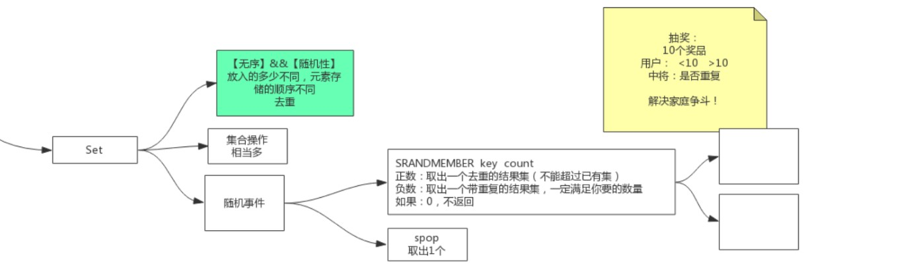

# Sets




### SADD  key  member [member...]

#### 描述

添加一个或多个指定的member元素到集合的 key中.指定的一个或者多个元素member 如果已经在集合key中存在则忽略.如果集合key 不存在，则新建集合key,并添加member元素到集合key中.

如果key 的类型不是集合则返回错误.

#### 返回值

返回新成功添加到集合里元素的数量，不包括已经存在于集合中的元素.

#### 例子

```shell
redis> SADD myset "Hello"
(integer) 1
redis> SADD myset "World"
(integer) 1
redis> SADD myset "World"
(integer) 0
redis> SMEMBERS myset
1) "World"
2) "Hello"
redis> 
```

### SMEMBERS  key

#### 描述

返回key集合所有的元素

该命令的作用与使用一个参数的[SINTER](http://redis.cn/commands/sinter.html) 命令作用相同

#### 返回值

集合中的所有元素

#### 例子

```shell
redis> SADD myset "Hello"
(integer) 1
redis> SADD myset "World"
(integer) 1
redis> SMEMBERS myset
1) "World"
2) "Hello"
redis>
```

### SISMEMBER  key  member

#### 描述

返回成员 member 是否是存储的集合 key的成员

#### 返回值

- 如果member元素是集合key的成员，则返回1
- 如果member元素不是key的成员，或者集合key不存在，则返回0

#### 例子

```shell
redis> SADD myset "one"
(integer) 1
redis> SISMEMBER myset "one"
(integer) 1
redis> SISMEMBER myset "two"
(integer) 0
redis>
```

### SCARD  key

#### 描述

返回集合存储的key的基数 (集合元素的数量).

#### 返回值

集合的基数(元素的数量),如果key不存在,则返回 0.

#### 例子

```shell
redis> SADD myset "Hello"
(integer) 1
redis> SADD myset "World"
(integer) 1
redis> SCARD myset
(integer) 2
redis> 
```

### SMOVE  source  destination  member

#### 描述

将member从source集合移动到destination集合中. 对于其他的客户端,在特定的时间元素将会作为source或者destination集合的成员出现.

如果source 集合不存在或者不包含指定的元素,这smove命令不执行任何操作并且返回0.否则对象将会从source集合中移除，并添加到destination集合中去，如果destination集合已经存在该元素，则smove命令仅将该元素充source集合中移除. 如果source 和destination不是集合类型,则返回错误.

#### 返回值

- 如果该元素成功移除,返回1
- 如果该元素不是 source集合成员,无任何操作,则返回0.

#### 例子

```shell
redis> SADD myset "one"
(integer) 1
redis> SADD myset "two"
(integer) 1
redis> SADD myotherset "three"
(integer) 1
redis> SMOVE myset myotherset "two"
(integer) 1
redis> SMEMBERS myset
1) "one"
redis> SMEMBERS myotherset
1) "three"
2) "two"
redis> 
```

### SPOP  key [count]

#### 描述

从存储在`key`的集合中移除并返回一个或多个随机元素。

此操作与`SRANDMEMBER`类似，它从一个集合中返回一个或多个随机元素，但不删除元素。

#### 返回值

被删除的元素，或者当`key`不存在时返回`nil`。

#### 例子

```shell
SADD myset "one"
SADD myset "two"
SADD myset "three"
SPOP myset
SMEMBERS myset
SADD myset "four"
SADD myset "five"
SPOP myset 3
SMEMBERS myset
```

**传递count时的行为规范**

如果count大于集合内部的元素数量，此命令将会返回整个集合，不会有额外的元素。

### SRANDMEMBER  key [count]

#### 描述

仅提供key参数，那么随机返回key集合中的一个元素

Redis 2.6开始，可以接受 count 参数，如果count是整数且小于元素的个数，返回含有 count 个不同的元素的数组，如果count是个整数且大于集合中元素的个数时，仅返回整个集合的所有元素，当count是负数，则会返回一个包含count的绝对值的个数元素的数组，如果count的绝对值大于元素的个数，则返回的结果集里会出现一个元素出现多次的情况.

仅提供key参数时，该命令作用类似于SPOP命令，不同的是SPOP命令会将被选择的随机元素从集合中移除，而SRANDMEMBER仅仅是返回该随记元素，而不做任何操作.

#### 返回值

不使用count 参数的情况下该命令返回随机的元素，如果key不存在则返回nil。

使用count参数,则返回一个随机的元素数组，如果key不存在则返回一个空的数组。

#### 例子

```shell
redis> SADD myset one two three
(integer) 3
redis> SRANDMEMBER myset
"one"
redis> SRANDMEMBER myset 2
1) "three"
2) "one"
redis> SRANDMEMBER myset -5
1) "one"
2) "one"
3) "one"
4) "one"
5) "one"
redis> 
```

**传递count参数时的行为规范**

当传递了一个值为正数的count参数，返回的元素就好像从集合中移除了每个选中的元素一样（就像在宾果游戏中提取数字一样）。但是**元素不会从集合中移除**。所以基本上：

- 不会返回重复的元素。
- 如果count参数的值大于集合内的元素数量，此命令将会仅返回整个集合，没有额外的元素。

相反，当count参数的值为负数时，此命令的行为将发生改变，并且提取操作就像在每次提取后，重新将取出的元素放回包里一样，因此，可能返回重复的元素，以及总是会返回我们请求的数量的元素，因为我们可以一次又一次地重复相同的元素，除了当集合为空（或者不存在key）的时候，将总是会返回一个空数组。

### SREM  key  member [member]

#### 描述

在key集合中移除指定的元素. 如果指定的元素不是key集合中的元素则忽略 如果key集合不存在则被视为一个空的集合，该命令返回0.

如果key的类型不是一个集合,则返回错误

#### 返回值

从集合中移除元素的个数，不包括不存在的成员.

#### 例子

```shell
redis> SADD myset "one"
(integer) 1
redis> SADD myset "two"
(integer) 1
redis> SADD myset "three"
(integer) 1
redis> SREM myset "one"
(integer) 1
redis> SREM myset "four"
(integer) 0
redis> SMEMBERS myset
1) "three"
2) "two"
redis>
```

### SUNION key  [key...]

#### 描述

返回给定的多个集合的并集中的所有成员.

例如:

```
key1 = {a,b,c,d}
key2 = {c}
key3 = {a,c,e}
SUNION key1 key2 key3 = {a,b,c,d,e}
```

不存在的key可以认为是空的集合.

#### 返回值

并集的成员列表

#### 例子

```shell
redis> SADD key1 "a"
(integer) 1
redis> SADD key1 "b"
(integer) 1
redis> SADD key1 "c"
(integer) 1
redis> SADD key2 "c"
(integer) 1
redis> SADD key2 "d"
(integer) 1
redis> SADD key2 "e"
(integer) 1
redis> SUNION key1 key2
1) "a"
2) "b"
3) "c"
4) "d"
5) "e"
redis> 
```

### SUNIONSTORE destination key  [key...]

#### 描述

该命令作用类似于[SUNION](http://redis.cn/commands/sunion.html)命令,不同的是它并不返回结果集,而是将结果存储在destination集合中.

如果destination 已经存在,则将其覆盖

#### 返回值

结果集中元素的个数.

#### 例子

```shell
redis> SADD key1 "a"
(integer) 1
redis> SADD key1 "b"
(integer) 1
redis> SADD key1 "c"
(integer) 1
redis> SADD key2 "c"
(integer) 1
redis> SADD key2 "d"
(integer) 1
redis> SADD key2 "e"
(integer) 1
redis> SUNIONSTORE key key1 key2
(integer) 5
redis> SMEMBERS key
1) "c"
2) "e"
3) "b"
4) "a"
5) "d"
redis>
```

### SDIFF  key  [key...]

#### 描述

返回一个集合与给定集合的差集的元素.

例如:

```
key1 = {a,b,c,d}
key2 = {c}
key3 = {a,c,e}
SDIFF key1 key2 key3 = {b,d}
```

不存在的key可以认为是空的集合.

#### 返回值

结果集的元素.

#### 例子

```shell
redis> SADD key1 "a"
(integer) 1
redis> SADD key1 "b"
(integer) 1
redis> SADD key1 "c"
(integer) 1
redis> SADD key2 "c"
(integer) 1
redis> SADD key2 "d"
(integer) 1
redis> SADD key2 "e"
(integer) 1
redis> SDIFF key1 key2
1) "a"
2) "b"
redis> 
```

### SDIFFSTORE destination key  [key...]

#### 描述

该命令类似于 [SDIFF](http://redis.cn/commands/sdiff.html), 不同之处在于该命令不返回结果集，而是将结果存放在`destination`集合中.

如果destination 已经存在,则将其覆盖

#### 返回值

结果集中元素的个数.

#### 例子

```shell
redis> SADD key1 "a"
(integer) 1
redis> SADD key1 "b"
(integer) 1
redis> SADD key1 "c"
(integer) 1
redis> SADD key2 "c"
(integer) 1
redis> SADD key2 "d"
(integer) 1
redis> SADD key2 "e"
(integer) 1
redis> SDIFFSTORE key key1 key2
(integer) 2
redis> SMEMBERS key
1) "b"
2) "a"
redis> 
```

### SINTER  key  [key...]

#### 描述

返回指定所有的集合的成员的交集

例如:

```
key1 = {a,b,c,d}
key2 = {c}
key3 = {a,c,e}
SINTER key1 key2 key3 = {c}
```

如果key不存在则被认为是一个空的集合,当给定的集合为空的时候,结果也为空.(一个集合为空，结果一直为空).

#### 返回值

结果集成员的列表.

#### 例子

```shell
redis> SADD key1 "a"
(integer) 1
redis> SADD key1 "b"
(integer) 1
redis> SADD key1 "c"
(integer) 1
redis> SADD key2 "c"
(integer) 1
redis> SADD key2 "d"
(integer) 1
redis> SADD key2 "e"
(integer) 1
redis> SINTER key1 key2
1) "c"
redis> 
```

### SINTERSTORE  destination key  [key...]

#### 描述

这个命令与[SINTER](http://redis.cn/commands/sinter.html)命令类似, 但是它并不是直接返回结果集,而是将结果保存在 destination集合中.

如果destination 集合存在, 则会被重写.

#### 返回值

结果集中元素的个数.

#### 例子

```shell
redis> SADD key1 "a"
(integer) 1
redis> SADD key1 "b"
(integer) 1
redis> SADD key1 "c"
(integer) 1
redis> SADD key2 "c"
(integer) 1
redis> SADD key2 "d"
(integer) 1
redis> SADD key2 "e"
(integer) 1
redis> SINTERSTORE key key1 key2
(integer) 1
redis> SMEMBERS key
1) "c"
redis> 
```

### SSCAN key cursor [MATCH pattern] [COUNT count]

//TODO 

请参考[SCAN](http://redis.cn/commands/scan.html)