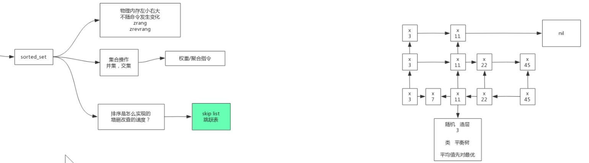
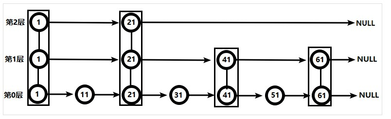

# Zset



## 简介

Redis的有序集合`zset`与普通集合`set`非常相似，是一个没有重复元素的字符串集合。不同之处是有序集合的每个成员都关联了一个评分（score）,这个评分（score）被用来按照从最低分到最高分的方式排序集合中的成员。集合的成员是唯一的，但是评分可以是重复的。因为元素是有序的，所以可以很快的根据评分（score）或者次序（position）来获取一个范围的元素。访问有序集合的中间元素也是非常快的，因此能够使用有序集合作为一个没有重复成员的智能列表。

## 数据结构

1. `hash`：`hash`的作用就是关联元素`value`和权重`score`，保障元素`value`的唯一性，可以通过元素`value`找到相应的`score`值。
2. `跳跃表`：`跳跃表`的目的在于给元素`value`排序，根据`score`的范围获取元素列表。

### 跳表



1. 从第2层开始，1节点比51节点小，向后比较。21节点比51节点小，继续向后比较，后面就是NULL了，所以从21节点向下到第1层
2. 在第1层，41节点比51节点小，继续向后，61节点比51节点大，所以从41向下
3. 在第0层，51节点为要查找的节点，节点被找到，共查找4次。

## 命令

### ZADD key [NX|XX] [CH] [INCR] score member [score member ...]

#### 描述

将所有指定成员添加到键为`key`有序集合（sorted set）里面。 添加时可以指定多个分数/成员（score/member）对。 如果指定添加的成员已经是有序集合里面的成员，则会更新改成员的分数（scrore）并更新到正确的排序位置。

如果`key`不存在，将会创建一个新的有序集合（sorted set）并将分数/成员（score/member）对添加到有序集合，就像原来存在一个空的有序集合一样。如果`key`存在，但是类型不是有序集合，将会返回一个错误应答。

分数值是一个双精度的浮点型数字字符串。`+inf`和`-inf`都是有效值。

#### ZADD 参数

ZADD 命令在`key`后面分数/成员（score/member）对前面支持一些参数，他们是：

- **XX**: 仅仅更新存在的成员，不添加新成员。
- **NX**: 不更新存在的成员。只添加新成员。
- **CH**: 修改返回值为发生变化的成员总数，原始是返回新添加成员的总数 (CH 是 *changed* 的意思)。更改的元素是**新添加的成员**，已经存在的成员**更新分数**。 所以在命令中指定的成员有相同的分数将不被计算在内。注：在通常情况下，`ZADD`返回值只计算新添加成员的数量。
- **INCR**: 当`ZADD`指定这个选项时，成员的操作就等同[ZINCRBY](http://redis.cn/commands/zincrby.html)命令，对成员的分数进行递增操作。

#### 分数可以精确的表示的整数的范围

Redis 有序集合的分数使用*双精度64位浮点数*。我们支持所有的架构，这表示为一个**IEEE 754 floating point number**，它能包括的整数范围是`-(2^53)` 到 `+(2^53)`。或者说是-9007199254740992 到 9007199254740992。更大的整数在内部用指数形式表示，所以，如果为分数设置一个非常大的整数，你得到的是一个近似的十进制数。

#### Sorted sets 101

有序集合按照分数以递增的方式进行排序。相同的成员（member）只存在一次，有序集合不允许存在重复的成员。 分数可以通过`ZADD`命令进行更新或者也可以通过`ZINCRBY`命令递增来修改之前的值，相应的他们的排序位置也会随着分数变化而改变。

获取一个成员当前的分数可以使用[ZSCORE](http://redis.cn/commands/zscore.html)命令，也可以用它来验证成员是否存在。

更多关于有序集合的信息请参考[数据类型-有序集合](http://redis.cn/topics/data-types.html#sorted-sets)。

#### 相同分数的成员

有序集合里面的成员是不能重复的都是唯一的，但是，不同成员间有可能*有相同的分数*。当多个成员有相同的分数时，他们将是*有序的字典*（ordered lexicographically）（仍由分数作为第一排序条件，然后，相同分数的成员按照字典规则相对排序）。

字典顺序排序用的是二进制，它比较的是字符串的字节数组。

如果用户将所有元素设置相同分数（例如0），有序集合里面的所有元素将按照字典顺序进行排序，范围查询元素可以使用[ZRANGEBYLEX](http://redis.cn/commands/zrangebylex.html)命令（注：范围查询分数可以使用[ZRANGEBYSCORE](http://redis.cn/commands/zrangebyscore.html)命令）。

#### 返回值

- 添加到有序集合的成员数量，不包括已经存在更新分数的成员。

如果指定`INCR`参数, 返回将会变成[bulk-string-reply](http://redis.cn/topics/protocol.html#bulk-string-reply) ：

- 成员的新分数（双精度的浮点型数字）字符串。

#### 例子

```shell
redis> ZADD myzset 1 "one"
(integer) 1
redis> ZADD myzset 1 "uno"
(integer) 1
redis> ZADD myzset 2 "two" 3 "three"
(integer) 2
redis> ZRANGE myzset 0 -1 WITHSCORES
1) "one"
2) "1"
3) "uno"
4) "1"
5) "two"
6) "2"
7) "three"
8) "3"
redis> 
```

### ZRANGE  key  start  stop  [WITHSCORES]

#### 描述

返回存储在有序集合`key`中的指定范围的元素。 返回的元素可以认为是按得分从最低到最高排列。 如果得分相同，将按字典排序。

当你需要元素从最高分到最低分排列时，请参阅`ZREVRANGE`（相同的得分将使用字典倒序排序）

参数`start`和`stop`都是基于零的索引，即`0`是第一个元素，`1`是第二个元素，以此类推。 它们也可以是负数，表示从有序集合的末尾的偏移量，其中`-1`是有序集合的最后一个元素，`-2`是倒数第二个元素，等等。

`start`和`stop`都是**全包含的区间**，因此例如`ZRANGE myzset 0 1`将会返回有序集合的第一个和第二个元素。

超出范围的索引不会产生错误。 如果`start`参数的值大于有序集合中的最大索引，或者`start > stop`，将会返回一个空列表。 如果`stop`的值大于有序集合的末尾，Redis会将其视为有序集合的最后一个元素。

可以传递`WITHSCORES`选项，以便将元素的分数与元素一起返回。这样，返回的列表将包含`value1,score1,...,valueN,scoreN`，而不是`value1,...,valueN`。 客户端类库可以自由地返回更合适的数据类型（建议：具有值和得分的数组或记录）。

#### 返回值

给定范围内的元素列表（如果指定了`WITHSCORES`选项，将同时返回它们的得分）。

#### 例子

```shell
ZADD myzset 1 "one"
ZADD myzset 2 "two"
ZADD myzset 3 "three"
ZRANGE myzset 0 -1
ZRANGE myzset 2 3
ZRANGE myzset -2 -1
```

### ZRANGEBYLEX key min max [LIMIT offset count]

#### 描述

ZRANGEBYLEX 返回指定成员区间内的成员，按成员字典正序排序, 分数必须相同。 在某些业务场景中,需要对一个字符串数组按名称的字典顺序进行排序时,可以使用Redis中SortSet这种数据结构来处理。

| 指令        | 是否必须 | 说明                                                         |
| ----------- | -------- | ------------------------------------------------------------ |
| ZRANGEBYLEX | 是       | 指令                                                         |
| key         | 是       | 有序集合键名称                                               |
| min         | 是       | 字典中排序位置较小的成员,必须以"["开头,或者以"("开头,可使用"-"代替 |
| max         | 是       | 字典中排序位置较大的成员,必须以"["开头,或者以"("开头,可使用"+"代替 |
| LIMIT       | 否       | 返回结果是否分页,指令中包含LIMIT后offset、count必须输入      |
| offset      | 否       | 返回结果起始位置                                             |
| count       | 否       | 返回结果数量                                                 |

#### 返回值

给定范围内的元素列表（如果指定了`WITHSCORES`选项，将同时返回它们的得分）。

#### 例子

```shell
ZADD myzset 1 "one"
ZADD myzset 2 "two"
ZADD myzset 3 "three"
ZRANGE myzset 0 -1
ZRANGE myzset 2 3
ZRANGE myzset -2 -1
```

**提示:**

- 分数必须相同! 如果有序集合中的成员分数有不一致的,返回的结果就不准。
- 成员字符串作为二进制数组的字节数进行比较。
- 默认是以ASCII字符集的顺序进行排列。如果成员字符串包含utf-8这类字符集的内容,就会影响返回结果,所以建议不要使用。
- 默认情况下, “max” 和 “min” 参数前必须加 “[” 符号作为开头。”[” 符号与成员之间不能有空格, 返回成员结果集会包含参数 “min” 和 “max” 。
- “max” 和 “min” 参数前可以加 “(“ 符号作为开头表示小于, “(“ 符号与成员之间不能有空格。返回成员结果集不会包含 “max” 和 “min” 成员。
- 可以使用 “-“ 和 “+” 表示得分最小值和最大值
- “min” 和 “max” 不能反, “max” 放前面 “min”放后面会导致返回结果为空
- 与ZRANGEBYLEX获取顺序相反的指令是[ZREVRANGEBYLEX](http://redis.cn/commands/zrevrangebylex.html)。
- 源码中采用C语言中` memcmp() `函数, 从字符的第0位到最后一位进行排序,如果前面部分相同,那么较长的字符串比较短的字符串排序靠后。

#### 例子

**不要在分数不一致的SortSet集合中去使用 ZRANGEBYLEX 指令,因为获取的结果并不准确。**

**可以使用 “-“ 和 “+” 表示得分最小值和最大值**

```shell
redis> zadd zset 0 a 0 aa 0 abc 0 apple 0 b 0 c 0 d 0 d1 0 dd 0 dobble 0 z 0 z1
(integer) 12
redis> ZRANGEBYLEX zset - +
 1) "a"
 2) "aa"
 3) "abc"
 4) "apple"
 5) "b"
 6) "c"
 7) "d"
 8) "d1"
 9) "dd"
10) "dobble"
11) "z"
12) "z1"
```

**获取分页数据**

```shell
redis> ZRANGEBYLEX zset - + LIMIT 0 3
1) "a"
2) "aa"
3) "abc"
redis> ZRANGEBYLEX zset - + LIMIT 3 3
1) "apple"
2) "b"
3) "c"
```

**获取成员之间的元素**

默认情况下, “max” 和 “min” 参数前必须加 “[” 符号作为开头。
“[” 符号与成员之间不能有空格, 返回成员结果集会包含参数 “min” 和 “max” 。

```shell
redis> ZRANGEBYLEX zset [aa [c
1) "aa"
2) "abc"
3) "apple"
4) "b"
5) "c"
```

“min” 和 “max” 不能反, “max” 放前面 “min”放后面会导致返回结果为空

```
redis> ZRANGEBYLEX zset [c [aa
(empty list or set)
```

**使用 “(“ 小于号获取成员之间的元素**

“max” 和 “min” 参数前可以加 “(“ 符号作为开头表示小于, “(“ 符号与成员之间不能有空格。
返回成员结果集不会包含 “max” 和 “min” 成员。

```shell
redis> ZRANGEBYLEX zset [aa (c
1) "aa"
2) "abc"
3) "apple"
4) "b"
```

**ASCII码的影响**

成员字符串作为二进制数组的字节数进行比较。
默认是以ASCII字符集的顺序进行排列。
如果成员字符串包含utf-8这类字符集的内容,就会影响返回结果,所以建议不要使用。

```shell
redis> zadd zset 0 aBc
(integer) 1
redis> ZRANGEBYLEX zset - +
 1) "a"
 2) "aBc"
 3) "aa"
 4) "abc"
 5) "apple"
 6) "b"
 7) "c"
 8) "d"
 9) "d1"
10) "dd"
11) "dobble"
12) "z"
13) "z1"
redis> ZRANGEBYLEX zset - + LIMIT 0 3
1) "a"
2) "aBc"
3) "aa"
```

### ZRANGEBYSCORE key min max [WITHSCORES] [LIMIT offset count]

#### 描述

如果M是常量（比如，用limit总是请求前10个元素），你可以认为是O(log(N))。

返回key的有序集合中的分数在min和max之间的所有元素（包括分数等于max或者min的元素）。元素被认为是从低分到高分排序的。

具有相同分数的元素按字典序排列（这个根据redis对有序集合实现的情况而定，并不需要进一步计算）。

可选的LIMIT参数指定返回结果的数量及区间（类似SQL中SELECT LIMIT offset, count）。注意，如果offset太大，定位offset就可能遍历整个有序集合，这会增加O(N)的复杂度。

可选参数WITHSCORES会返回元素和其分数，而不只是元素。这个选项在redis2.0之后的版本都可用。

\##区间及无限

min和max可以是-inf和+inf，这样一来，你就可以在不知道有序集的最低和最高score值的情况下，使用ZRANGEBYSCORE这类命令。

默认情况下，区间的取值使用闭区间(小于等于或大于等于)，你也可以通过给参数前增加(符号来使用可选的开区间(小于或大于)。

举个例子：

```
ZRANGEBYSCORE zset (1 5
```

返回所有符合条件1 < score <= 5的成员；

```
ZRANGEBYSCORE zset (5 (10
```

返回所有符合条件5 < score < 10 的成员。

#### 返回值

指定分数范围的元素列表(也可以返回他们的分数)。

#### 例子

```
redis> ZADD myzset 1 "one"
(integer) 1
redis> ZADD myzset 2 "two"
(integer) 1
redis> ZADD myzset 3 "three"
(integer) 1
redis> ZRANGEBYSCORE myzset -inf +inf
1) "one"
2) "two"
3) "three"
redis> ZRANGEBYSCORE myzset 1 2
1) "one"
2) "two"
redis> ZRANGEBYSCORE myzset (1 2
1) "two"
redis> ZRANGEBYSCORE myzset (1 (2
(empty list or set)
redis> 
```

### ZRANK key member

#### 描述

返回有序集key中成员member的排名。其中有序集成员按score值递增(从小到大)顺序排列。排名以0为底，也就是说，score值最小的成员排名为0。

使用ZREVRANK命令可以获得成员按score值递减(从大到小)排列的排名。

#### 返回值

- 如果member是有序集key的成员，返回[integer-reply](http://redis.cn/topics/protocol#integer-reply)：member的排名。
- 如果member不是有序集key的成员，返回[bulk-string-reply](http://redis.cn/topics/protocol#bulk-string-reply): `nil`。

#### 例子

```
redis> ZADD myzset 1 "one"
(integer) 1
redis> ZADD myzset 2 "two"
(integer) 1
redis> ZADD myzset 3 "three"
(integer) 1
redis> ZRANK myzset "three"
(integer) 2
redis> ZRANK myzset "four"
(nil)
redis> 
```

### ZREM  key  member [member...]

#### 描述

删除member，当key存在，但是其不是有序集合类型，就返回一个错误。

#### 返回值

返回的是从有序集合中删除的成员个数，不包括不存在的成员。

#### 例子

```
redis> ZADD myzset 1 "one"
(integer) 1
redis> ZADD myzset 2 "two"
(integer) 1
redis> ZADD myzset 3 "three"
(integer) 1
redis> ZREM myzset "two"
(integer) 1
redis> ZRANGE myzset 0 -1 WITHSCORES
1) "one"
2) "1"
3) "three"
4) "3"
redis> 
```

### ZCARD key  

#### 描述

返回key的有序集元素个数。

#### 返回值

key存在的时候，返回有序集的元素个数，否则返回0。

#### 例子

```
redis> ZADD myzset 1 "one"
(integer) 1
redis> ZADD myzset 2 "two"
(integer) 1
redis> ZCARD myzset
(integer) 2
redis>
```

### ZCOUNT  key  min max

#### 描述

返回有序集key中，score值在min和max之间(默认包括score值等于min或max)的成员。 关于参数min和max的详细使用方法，请参考[ZRANGEBYSCORE](http://redis.cn/commands/zrangebyscore.html)命令。

#### 返回值

指定分数范围的元素个数。

#### 例子

```
redis> ZADD myzset 1 "one"
(integer) 1
redis> ZADD myzset 2 "two"
(integer) 1
redis> ZADD myzset 3 "three"
(integer) 1
redis> ZCOUNT myzset -inf +inf
(integer) 3
redis> ZCOUNT myzset (1 3
(integer) 2
redis>
```

### ZINCRBY key increment member

#### 描述

为有序集key的成员member的score值加上增量increment。如果key中不存在member，就在key中添加一个member，score是increment（就好像它之前的score是0.0）。如果key不存在，就创建一个只含有指定member成员的有序集合。

当key不是有序集类型时，返回一个错误。

score值必须是字符串表示的整数值或双精度浮点数，并且能接受double精度的浮点数。也有可能给一个负数来减少score的值。

#### 返回值

member成员的新score值，以字符串形式表示。

#### 例子

```
redis> ZADD myzset 1 "one"
(integer) 1
redis> ZADD myzset 2 "two"
(integer) 1
redis> ZINCRBY myzset 2 "one"
"3"
redis> ZRANGE myzset 0 -1 WITHSCORES
1) "two"
2) "2"
3) "one"
4) "3"
redis> 
```

### ZINTERSTORE destination numkeys key [key ...] [WEIGHTS weight] [SUM|MIN|MAX]

#### 描述

计算给定的numkeys个有序集合的交集，并且把结果放到destination中。 在给定要计算的key和其它参数之前，必须先给定key个数(numberkeys)。

默认情况下，结果中一个元素的分数是有序集合中该元素分数之和，前提是该元素在这些有序集合中都存在。因为交集要求其成员必须是给定的每个有序集合中的成员，结果集中的每个元素的分数和输入的有序集合个数相等。

对于WEIGHTS和AGGREGATE参数的描述，参见命令[ZUNIONSTORE](http://redis.cn/commands/zunionstore.html)。

如果destination存在，就把它覆盖。

#### 返回值

[integer-reply](http://redis.cn/topics/protocol#integer-reply): 结果有序集合destination中元素个数。

#### 例子

```
redis> ZADD zset1 1 "one"
(integer) 1
redis> ZADD zset1 2 "two"
(integer) 1
redis> ZADD zset2 1 "one"
(integer) 1
redis> ZADD zset2 2 "two"
(integer) 1
redis> ZADD zset2 3 "three"
(integer) 1
redis> ZINTERSTORE out 2 zset1 zset2 WEIGHTS 2 3
(integer) 2
redis> ZRANGE out 0 -1 WITHSCORES
1) "one"
2) "5"
3) "two"
4) "10"
redis> 
```

### ZLEXCOUNT key min max

#### 描述

`ZLEXCOUNT` 命令用于计算有序集合中指定成员之间的成员数量。

#### **2 语法**

**2.1 完整示例**

```
zlexcount zset [member1 [member5
```

**2.2 说明**

| 指令      | 是否必须 | 说明                           |
| --------- | -------- | ------------------------------ |
| zlexcount | 是       | 指令                           |
| key       | 是       | 有序集合键名称                 |
| min       | 是       | 在有序集合中分数排名较小的成员 |
| max       | 是       | 在有序集合中分数排名较大的成员 |

**提示:**

- 成员名称前需要加 `[` 符号作为开头, `[` 符号与成员之间不能有空格
- 可以使用 `-` 和 `+` 表示得分最小值和最大值
- `min` 和 `max` 不能反, `max` 放前面 `min`放后面会导致返回结果为0
- 计算成员之间的成员数量时,参数 `min` 和 `max` 的位置也计算在内。
- `min` 和 `max` 参数的含义与 `zrangebylex` 命令中所描述的相同

**3 返回值**

有序集合中成员名称 min 和 max 之间的成员数量; Integer类型。

**4 示例**

**4.1 计算成员之间成员数量**

```
redis> ZADD myzset 0 a 0 b 0 c 0 d 0 e
(integer) 5
redis> ZADD myzset 0 f 0 g
(integer) 2
redis> ZLEXCOUNT myzset - +
(integer) 7
redis> ZLEXCOUNT myzset [b [f
(integer) 5
redis> 
```

**4.2 计算某个成员之前或者之后的成员数量**

`-` 表示得分最小值的成员 `+` 表示得分最大值的成员

```
redis> ZADD myzset 1 a 2 b 3 c 4 d 5 e 6 f 7 g
(integer) 7
redis> zrange myzset 0 -1
1) "a"
2) "b"
3) "c"
4) "d"
5) "e"
6) "f"
7) "g"
redis> ZLEXCOUNT myzset - +
(integer) 7
redis> ZLEXCOUNT myzset [c +
(integer) 5
redis> ZLEXCOUNT myzset - [c
(integer) 3
redis> 
```

**4.3 分数值位置的重要性**

```
redis> del myzset
(integer) 1
redis> ZADD myzset 1 a 2 b 3 c 4 d 5 e 6 f 7 g
(integer) 7
redis> zrange myzset 0 -1
1) "a"
2) "b"
3) "c"
4) "d"
5) "e"
6) "f"
7) "g"
redis> ZLEXCOUNT myzset [c [f
(integer) 4
redis> ZLEXCOUNT myzset [f [c
(integer) 0
redis> 
```

### ZPOPMAX  key [count]

#### 描述

删除并返回有序集合`key`中的最多`count`个具有最高得分的成员。

如未指定，`count`的默认值为1。指定一个大于有序集合的基数的`count`不会产生错误。 当返回多个元素时候，得分最高的元素将是第一个元素，然后是分数较低的元素。

#### 返回值

弹出的元素和分数列表。

#### 例子

```
redis> ZADD myzset 1 "one"
(integer) 1
redis> ZADD myzset 2 "two"
(integer) 1
redis> ZADD myzset 3 "three"
(integer) 1
redis> ZPOPMAX myzset
1) "3"
2) "three"
redis> 
```

### ZPOPMIN  key [count]

#### 描述

删除并返回有序集合`key`中的最多`count`个具有最低得分的成员。

如未指定，`count`的默认值为1。指定一个大于有序集合的基数的`count`不会产生错误。 当返回多个元素时候，得分最低的元素将是第一个元素，然后是分数较高的元素。

#### 返回值

弹出的元素和分数列表。

#### 例子

```
redis> ZADD myzset 1 "one"
(integer) 1
redis> ZADD myzset 2 "two"
(integer) 1
redis> ZADD myzset 3 "three"
(integer) 1
redis> ZPOPMIN myzset
1) "1"
2) "one"
redis> 
```

### BZPOPMAX key [key ...] timeout

#### 描述

`BZPOPMAX` 是有序集合命令 `ZPOPMAX`带有阻塞功能的版本。

在参数中的所有有序集合均为空的情况下，阻塞连接。参数中包含多个有序集合时，按照参数中key的顺序，返回第一个非空key中分数最大的成员和对应的分数

参数 `timeout` 可以理解为客户端被阻塞的最大秒数值，0 表示永久阻塞。

详细说明请参照[BZPOPMIN 说明文档](http://redis.cn/commands/bzpopmin.html)，`BZPOPMAX`返回非空有序集合 key中分数最大的成员，而`BZPOPMIN`返回该key中分数最小的成员，除此之外，两条命令无其他差别。

#### 返回值

当有序集合无结果返回且超时设置过期时返回 `nil`

返回三元素multi-bulk结果，第一元素key名称，第二元素成员名称，第三元素分数

#### 例子

```
redis> DEL zset1 zset2
(integer) 0
redis> ZADD zset1 0 a 1 b 2 c
(integer) 3
redis> BZPOPMAX zset1 zset2 0
1) "zet1"
2) "2"
2) "c"
```

### BZPOPMIN key [key ...] timeout

#### 描述

`BZPOPMIN` 是有序集合命令 `ZPOPMIN`带有阻塞功能的版本。

在参数中的所有有序集合均为空的情况下，阻塞连接。参数中包含多个有序集合时，按照参数中key的顺序，返回第一个非空key中分数最小的成员和对应的分数

参数 `timeout` 可以理解为客户端被阻塞的最大秒数值，0 表示永久阻塞。

详细说明请参照[BLPOP 说明文档](http://redis.cn/commands/blpop.html)，`BZPOPMIN`适用有序集合类型的key，BLPOP适用列表类型的key，除此之外，两条命令无其他差别。小的成员，除此之外，两条命令无其他差别。

#### 返回值

当有序集合无结果返回且超时设置过期时返回 `nil`

返回三元素multi-bulk结果，第一元素key名称，第二元素成员名称，第三元素分数

#### 例子

```
redis> DEL zset1 zset2
(integer) 0
redis> ZADD zset1 0 a 1 b 2 c
(integer) 3
redis> BZPOPMIN zset1 zset2 0
1) "zet1"
2) "0"
2) "a"
```

### ZREMRANGEBYLEX key min max

#### 描述

ZREMRANGEBYLEX 删除名称按字典由低到高排序成员之间所有成员。
不要在成员分数不同的有序集合中使用此命令, 因为它是基于分数一致的有序集合设计的,如果使用,会导致删除的结果不正确。
待删除的有序集合中,分数最好相同,否则删除结果会不正常。

#### **2 语法**

**2.1 完整示例**

```
ZREMRANGEBYLEX key min max
```

**2.2 说明**

| 指令           | 是否必须 | 说明                                                         |
| -------------- | -------- | ------------------------------------------------------------ |
| ZREMRANGEBYLEX | 是       | 指令                                                         |
| key            | 是       | 有序集合键名称                                               |
| min            | 是       | 字典中排序位置较小的成员,必须以"["开头,或者以"("开头,可使用"-"代替 |
| max            | 是       | 字典中排序位置较大的成员,必须以"["开头,或者以"("开头,可使用"+"代替 |

**提示:**

- 有序集合中分数必须相同! 如果有序集合中的成员分数有不一致的,结果就不准。
- 成员顺序是按成员字符串作为二进制数组的字节数进行比较。
- 默认是以ASCII字符集的顺序进行排列。如果成员字符串包含utf-8这类字符集的内容,就会影响返回结果,所以建议不要使用。
- 源码中采用C语言中` memcmp() `函数, 从字符的第0位到最后一位进行排序,如果前面部分相同,那么较长的字符串比较短的字符串排序靠后。
- 默认情况下, “max” 和 “min” 参数前必须加 “[” 符号作为开头。”[” 符号与成员之间不能有空格, 返回成员结果集会包含参数 “max”和 “min”
- “max” 和 “min” 参数前可以加 “(“ 符号作为开头表示小于, “(“ 符号与成员之间不能有空格。返回成员结果集不会包含 “max” 和 “min” 成员。
- 可以使用 “-“ 和 “+” 表示得分最小值和最大值
- “max”和 “min” 不能反, “max” 放后面 “min”放前面会删除不了元素

**3 返回值**

删除元素的个数。

**4 示例**

不要在分数不一致的SortSet集合中去使用 ZREMRANGEBYLEX 指令,因为获取的结果并不准确。

**4.1 删除所有元素**

可以使用 “-“ 和 “+” 表示最小值和最大值

```
redis> zadd zset 0 a 0 aa 0 abc 0 apple 0 b 0 c 0 d 0 d1 0 dd 0 dobble 0 z 0 z1
(integer) 12
redis> ZRANGEBYLEX zset + -
 1) "a"
 2) "aa"
 3) "abc"
 4) "apple"
 5) "b"
 6) "c"
 7) "d"
 8) "d1"
 9) "dd"
10) "dobble"
11) "z"
12) "z1"
redis> ZREMRANGEBYLEX zset - +
(integer) 7
redis> ZRANGEBYLEX zset - +
(empty list or set)
```

**4.2 按名称删除某个元素**

下面是删除d1这个元素

```
redis> zadd zset 0 a 0 aa 0 abc 0 apple 0 b 0 c 0 d 0 d1 0 dd 0 dobble 0 z 0 z1
(integer) 12
redis> ZRANGEBYLEX zset - +
 1) "a"
 2) "aa"
 3) "abc"
 4) "apple"
 5) "b"
 6) "c"
 7) "d"
 8) "d1"
 9) "dd"
10) "dobble"
11) "z"
12) "z1"
redis> ZREMRANGEBYLEX zset [d1 (dd
(integer) 1
redis> ZRANGEBYLEX zset - +
 1) "a"
 2) "aa"
 3) "abc"
 4) "apple"
 5) "b"
 6) "c"
 7) "d"
 8) "dd"
 9) "dobble"
10) "z"
11) "z1"
```

**4.3 按名称删除成员之间的元素,包含”max” 和 “min”成员**

默认情况下, “max” 和 “min” 参数前必须加 “[” 符号作为开头。
“[” 符号与成员之间不能有空格, 删除成员包含参数 “min” 和 “max” 。

```
redis> ZRANGEBYLEX zset - +
 1) "a"
 2) "aa"
 3) "abc"
 4) "apple"
 5) "b"
 6) "c"
 7) "d"
 8) "dd"
 9) "dobble"
10) "z"
11) "z1"
redis> ZREMRANGEBYLEX zset [a [apple
(integer) 4
redis> ZRANGEBYLEX zset - +
1) "b"
2) "c"
3) "d"
4) "dd"
5) "dobble"
6) "z"
7) "z1"
```

“min” 和 “max” 不能反, “min” 放前面 “max”放后面会导致无法删除元素

```
redis> ZREMRANGEBYLEX zset [dobble [d
(integer) 0
```

**4.4 按名称删除成员之间的元素,不包含”max” 和 “min”成员**

“max” 和 “min” 参数前可以加 “(“ 符号作为开头表示小于, “(“ 符号与成员之间不能有空格。
删除成员不会包含 “max” 和 “min” 成员。

```
redis> ZRANGEBYLEX zset - +
1) "b"
2) "c"
3) "d"
4) "dd"
5) "dobble"
6) "z"
7) "z1"     
redis> ZREMRANGEBYLEX zset (d (dobble
(integer) 1
redis> ZRANGEBYLEX zset - +
1) "b"
2) "c"
3) "d"
4) "dobble"
5) "z"
6) "z1"
```

### ZREMRANGEBYRANK key start stop

#### 描述

移除有序集key中，指定排名(rank)区间内的所有成员。下标参数start和stop都以0为底，0处是分数最小的那个元素。这些索引也可是负数，表示位移从最高分处开始数。例如，-1是分数最高的元素，-2是分数第二高的，依次类推。

#### 返回值

被移除成员的数量。

#### 例子

```
redis> ZADD myzset 1 "one"
(integer) 1
redis> ZADD myzset 2 "two"
(integer) 1
redis> ZADD myzset 3 "three"
(integer) 1
redis> ZREMRANGEBYRANK myzset 0 1
(integer) 2
redis> ZRANGE myzset 0 -1 WITHSCORES
1) "three"
2) "3"
redis> 
```

### ZREMRANGEBYSCORE key min max

#### 描述

移除有序集key中，所有score值介于min和max之间(包括等于min或max)的成员。 自版本2.1.6开始，score值等于min或max的成员也可以不包括在内，语法请参见[ZRANGEBYSCORE](http://redis.cn/commands/zrangebyscore.html)命令。

#### 返回值

删除的元素的个数。

#### 例子

```
redis> ZADD myzset 1 "one"
(integer) 1
redis> ZADD myzset 2 "two"
(integer) 1
redis> ZADD myzset 3 "three"
(integer) 1
redis> ZREMRANGEBYSCORE myzset -inf (2
(integer) 1
redis> ZRANGE myzset 0 -1 WITHSCORES
1) "two"
2) "2"
3) "three"
4) "3"
redis> 
```

### ZREVRANGE key start stop [WITHSCORES]

#### 描述

返回有序集key中，指定区间内的成员。其中成员的位置按score值递减(从大到小)来排列。具有相同score值的成员按字典序的反序排列。 除了成员按score值递减的次序排列这一点外，[ZREVRANGE](http://redis.cn/commands/zrevrange.html)命令的其他方面和[ZRANGE](http://redis.cn/commands/zrange.html)命令一样。

#### 返回值

指定范围的元素列表(可选是否含有分数)。。

#### 例子

```
redis> ZADD myzset 1 "one"
(integer) 1
redis> ZADD myzset 2 "two"
(integer) 1
redis> ZADD myzset 3 "three"
(integer) 1
redis> ZREVRANGE myzset 0 -1
1) "three"
2) "two"
3) "one"
redis> ZREVRANGE myzset 2 3
1) "one"
redis> ZREVRANGE myzset -2 -1
1) "two"
2) "one"
redis> 
```

### ZREVRANGEBYLEX key max min [LIMIT offset count]

#### 描述

#### **1 简介**

ZREVRANGEBYLEX 返回指定成员区间内的成员，按成员字典倒序排序, 分数必须相同。
在某些业务场景中,需要对一个字符串数组按名称的字典顺序进行倒序排列时,可以使用Redis中SortSet这种数据结构来处理。

#### **2 语法**

**2.1 完整示例**

```
ZREVRANGEBYLEX key max min [LIMIT offset count]
```

**2.2 说明**

| 指令           | 是否必须 | 说明                                                         |
| -------------- | -------- | ------------------------------------------------------------ |
| ZREVRANGEBYLEX | 是       | 指令                                                         |
| key            | 是       | 有序集合键名称                                               |
| max            | 是       | 字典中排序位置较大的成员,必须以"["开头,或者以"("开头,可使用"+"代替 |
| min            | 是       | 字典中排序位置较小的成员,必须以"["开头,或者以"("开头,可使用"-"代替 |
| LIMIT          | 否       | 返回结果是否分页,指令中包含LIMIT后offset、count必须输入      |
| offset         | 否       | 返回结果起始位置                                             |
| count          | 否       | 返回结果数量                                                 |

**提示:**

- 分数必须相同! 如果有序集合中的成员分数有不一致的,返回的结果就不准。
- 成员字符串作为二进制数组的字节数进行比较。
- 默认是以ASCII字符集的顺序进行排列。如果成员字符串包含utf-8这类字符集的内容,就会影响返回结果,所以建议不要使用。
- 源码中采用C语言中` memcmp() `函数, 从字符的第0位到最后一位进行排序,如果前面部分相同,那么较长的字符串比较短的字符串排序靠前。
- 默认情况下, “max” 和 “min” 参数前必须加 “[” 符号作为开头。”[” 符号与成员之间不能有空格, 返回成员结果集会包含参数 “max”和 “min”
- “max” 和 “min” 参数前可以加 “(“ 符号作为开头表示小于, “(“ 符号与成员之间不能有空格。返回成员结果集不会包含 “max” 和 “min” 成员。
- 可以使用 “-“ 和 “+” 表示得分最小值和最大值
- “max”和 “min” 不能反, “max” 放后面 “min”放前面会导致返回结果为空
- 与ZREVRANGEBYLEX获取顺序相反的指令是[ZREVRANGEBYLEX](http://redis.cn/commands/zrangebylex.html)。

#### **3 返回值**

指定成员范围的元素列表。

#### **4 示例**

不要在分数不一致的SortSet集合中去使用 ZREVRANGEBYLEX 指令,因为获取的结果并不准确。

#### **4.1 获取所有值**

可以使用 “-“ 和 “+” 表示最小值和最大值

```
redis> zadd zset 0 a 0 aa 0 abc 0 apple 0 b 0 c 0 d 0 d1 0 dd 0 dobble 0 z 0 z1
(integer) 12
redis> ZREVRANGEBYLEX zset + -
 1) "z1"
 2) "z"
 3) "dobble"
 4) "dd"
 5) "d1"
 6) "d"
 7) "c"
 8) "b"
 9) "apple"
10) "abc"
11) "aa"
12) "a"
```

#### **4.2 获取分页数据**

```
redis> ZREVRANGEBYLEX zset + - LIMIT 0 3
1) "z1"
2) "z"
3) "dobble"
redis> ZREVRANGEBYLEX zset + - LIMIT 3 3
1) "dd"
2) "d1"
3) "d"
```

#### **4.3 获取成员之间的元素**

默认情况下, “max” 和 “min” 参数前必须加 “[” 符号作为开头。
“[” 符号与成员之间不能有空格, 返回成员结果集会包含参数 “min” 和 “max” 。

```
redis> ZREVRANGEBYLEX zset [c [aa
1) "c"
2) "b"
3) "apple"
4) "abc"
5) "aa"
```

“min” 和 “max” 不能反, “min” 放前面 “max”放后面会导致返回结果为空

```
redis> ZREVRANGEBYLEX zset [aa [c
(empty list or set)
```

#### **4.4 使用 “(“ 小于号获取成员之间的元素**

“max” 和 “min” 参数前可以加 “(“ 符号作为开头表示小于, “(“ 符号与成员之间不能有空格。
返回成员结果集不会包含 “max” 和 “min” 成员。

```
redis> ZREVRANGEBYLEX zset (c [aa
1) "b"
2) "apple"
3) "abc"
4) "aa"
```

#### **4.5 ASCII码的影响**

成员字符串作为二进制数组的字节数进行比较。
默认是以ASCII字符集的顺序进行排列。
如果成员字符串包含utf-8这类字符集的内容,就会影响返回结果,所以建议不要使用。

```
redis> zadd zset 0 dB
(integer) 1
redis> ZREVRANGEBYLEX zset + -
 1) "z1"
 2) "z"
 3) "dobble"
 4) "dd"
 5) "dB"
 6) "d1"
 7) "d"
 8) "c"
 9) "b"
10) "apple"
11) "abc"
12) "aa"
13) "a"
redis> ZREVRANGEBYLEX zset + - limit 0 3
1) "z1"
2) "z"
3) "dobble"
redis> ZREVRANGEBYLEX zset + - limit 3 3
1) "dd"
2) "dB"
3) "d1"
```

#### 5 使用场景示例

**5.1 电话号码排序**

我们可以将电话号码存储到SortSet中,然后根据需要来获取号段:

```
redis> zadd phone 0 13100111100 0 13110114300 0 13132110901 
(integer) 3
redis> zadd phone 0 13200111100 0 13210414300 0 13252110901 
(integer) 3
redis> zadd phone 0 13300111100 0 13310414300 0 13352110901 
(integer) 3
```

从大到小获取所有号码:

```
redis> ZREVRANGEBYLEX phone + -
1) "13352110901"
2) "13310414300"
3) "13300111100"
4) "13252110901"
5) "13210414300"
6) "13200111100"
7) "13132110901"
8) "13110114300"
9) "13100111100"
```

获取132号段:

```
redis> ZREVRANGEBYLEX phone (133 [132
1) "13252110901"
2) "13210414300"
3) "13200111100"
```

获取132、133号段:

```
redis> ZREVRANGEBYLEX phone (134 [132
1) "13352110901"
2) "13310414300"
3) "13300111100"
4) "13252110901"
5) "13210414300"
6) "13200111100"
```

**5.2 姓名排序**

将名称存储到SortSet中:

```
redis> zadd names 0 Toumas 0 Jake 0 Bluetuo 0 Gaodeng 0 Aimini 0 Aidehua 
(integer) 6
```

获取所有人的名字倒序排列:

```
redis> ZREVRANGEBYLEX names + -
1) "Toumas"
2) "Jake"
3) "Gaodeng"
4) "Bluetuo"
5) "Aimini"
6) "Aidehua"
```

获取名字中大写字母A开头的所有人:

```
redis> ZREVRANGEBYLEX names (B [A
1) "Aimini"
2) "Aidehua"
```

获取名字中大写字母C到Z的所有人:

```
redis> ZREVRANGEBYLEX names [Z [C
1) "Toumas"
2) "Jake"
3) "Gaodeng"
```

### ZREVRANGEBYSCORE key max min [WITHSCORES] [LIMIT offset count]

####  **简介**

`ZREVRANGEBYSCORE` 返回有序集合中指定分数区间内的成员，分数由高到低排序。

#### **2 语法**

**2.1 完整示例**

```
ZREVRANGEBYSCORE key max min WITHSCORES LIMIT offset count
```

**2.2 说明**

| 指令             | 是否必须 | 说明                                                    |
| ---------------- | -------- | ------------------------------------------------------- |
| ZREVRANGEBYSCORE | 是       | 指令                                                    |
| key              | 是       | 有序集合键名称                                          |
| max              | 是       | 最大分数值,可使用"+inf"代替                             |
| min              | 是       | 最小分数值,可使用"-inf"代替                             |
| WITHSCORES       | 否       | 将成员分数一并返回                                      |
| LIMIT            | 否       | 返回结果是否分页,指令中包含LIMIT后offset、count必须输入 |
| offset           | 否       | 返回结果起始位置                                        |
| count            | 否       | 返回结果数量                                            |

**提示:**

- `"max"` 和 `"min"`参数前可以加 `"("` 符号作为开头表示小于, `"("` 符号与成员之间不能有空格
- 可以使用 `"+inf"` 和 `"-inf"` 表示得分最大值和最小值
- `"max"` 和 `"min"` 不能反, `"max"` 放后面 `"min"`放前面会导致返回结果为空
- 计算成员之间的成员数量不加 `"("` 符号时,参数 `"min"` 和 `"max"` 的位置也计算在内。
- [ZREVRANGEBYSCORE](http://redis.cn/commands/zrevrangebyscore.html)集合中按得分从高到底排序,所以`"max"`在前面,`"min"`在后面, [ZRANGEBYSCORE](http://redis.cn/commands/zrangebyscore.html)集合中按得分从底到高排序,所以`"min"`在前面,`"max"`在后面。

#### **3 返回值**

指定分数范围的元素列表。

### ZREVRANK key member

#### 描述

返回有序集key中成员member的排名，其中有序集成员按score值从大到小排列。排名以0为底，也就是说，score值最大的成员排名为0。

使用[ZRANK](http://redis.cn/commands/zrank.html)命令可以获得成员按score值递增(从小到大)排列的排名。

#### 返回值

- 如果member是有序集key的成员，返回[integer-reply](http://redis.cn/topics/protocol#integer-reply):member的排名。
- 如果member不是有序集key的成员，返回[bulk-string-reply](http://redis.cn/topics/protocol#bulk-string-reply): `nil`。

#### 例子

```shell
redis> ZADD myzset 1 "one"
(integer) 1
redis> ZADD myzset 2 "two"
(integer) 1
redis> ZADD myzset 3 "three"
(integer) 1
redis> ZREVRANK myzset "one"
(integer) 2
redis> ZREVRANK myzset "four"
(nil)
redis> 
```

### ZSOCRE key member

#### 描述

返回有序集key中，成员member的score值。

如果member元素不是有序集key的成员，或key不存在，返回nil。

#### 返回值

member成员的score值（double型浮点数），以字符串形式表示。

#### 例子

```shell
redis> ZADD myzset 1 "one"
(integer) 1
redis> ZSCORE myzset "one"
"1"
redis> 
```

### ZUNIONSTORE destination numkeys key [key ...] [WEIGHTS weight] [SUM|MIN|MAX]

#### 描述

计算给定的numkeys个有序集合的并集，并且把结果放到destination中。在给定要计算的key和其它参数之前，必须先给定key个数(numberkeys)。 默认情况下，结果集中某个成员的score值是所有给定集下该成员score值之和。

使用WEIGHTS选项，你可以为每个给定的有序集指定一个乘法因子，意思就是，每个给定有序集的所有成员的score值在传递给聚合函数之前都要先乘以该因子。如果WEIGHTS没有给定，默认就是1。

使用AGGREGATE选项，你可以指定并集的结果集的聚合方式。默认使用的参数SUM，可以将所有集合中某个成员的score值之和作为结果集中该成员的score值。如果使用参数MIN或者MAX，结果集就是所有集合中元素最小或最大的元素。

如果key destination存在，就被覆盖。

#### 返回值

结果有序集合destination中元素个数。

#### 例子

```shell
redis> ZADD zset1 1 "one"
(integer) 1
redis> ZADD zset1 2 "two"
(integer) 1
redis> ZADD zset2 1 "one"
(integer) 1
redis> ZADD zset2 2 "two"
(integer) 1
redis> ZADD zset2 3 "three"
(integer) 1
redis> ZUNIONSTORE out 2 zset1 zset2 WEIGHTS 2 3
(integer) 3
redis> ZRANGE out 0 -1 WITHSCORES
1) "one"
2) "5"
3) "three"
4) "9"
5) "two"
6) "10"
redis> 
```

