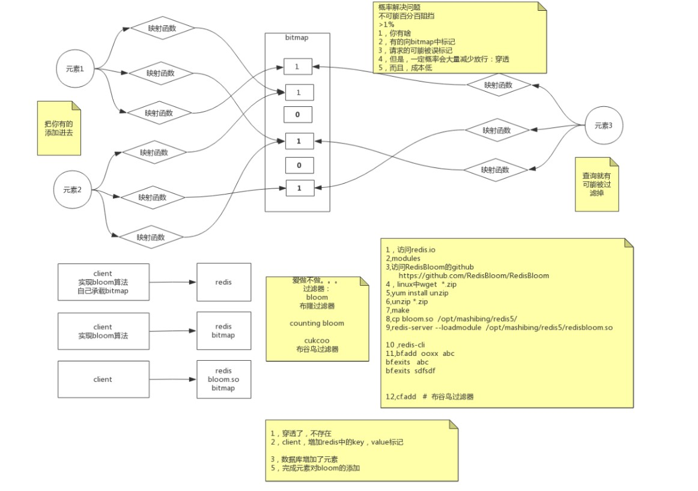
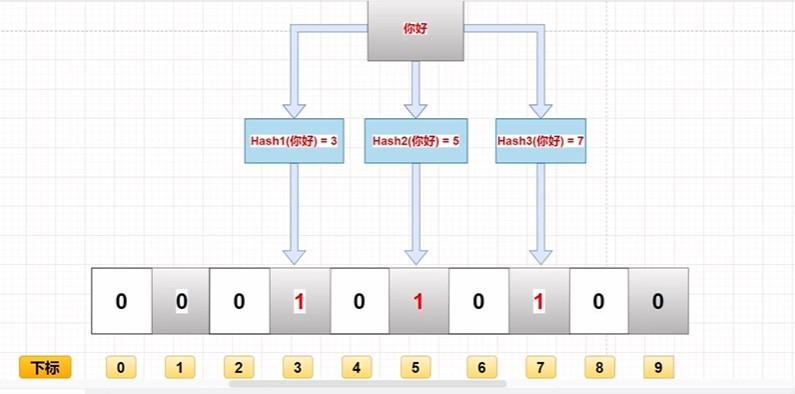

# 布隆过滤器



# 安装

1. Github上下载配置源码(选择自己版本)https://github.com/RedisBloom/RedisBloom/tree/v2.2.5#building-and-loading-redisbloom

2. linux上安装解压软件

   ```shell
   yum install unzip
   ```

3. 编译会生成redisbloom.so文件

   ```shell
   make
   ```

4. 启动(要写绝对路径)

   ```shell
   redis-server  --loadmodule /opt/software/redisbloom.so
   ```

5. 测试

   ```
   bf.add
   bd.exists
   ```

# 原理

### 描述

布隆过滤器本质是一个**位数组**,可以看成Redis上的BitMap(位图)，位数组就是数组的每个元素都只占用 1 bit 。每个元素只能是 0 或者 1。这样申请一个 10000 个元素的位数组只占用 10000 / 8 = 1250 B 的空间。布隆过滤器除了一个位数组，还有 K 个哈希函数。当一个元素加入布隆过滤器中的时候，会进行如下操作：

- 使用 K 个哈希函数对元素值进行 K 次计算，得到 K 个哈希值
- 根据得到的哈希值，在位数组中把对应下标的值置为 1

### 实例

假设布隆过滤器有 3 个哈希函数：f1, f2, f3 和一个位数组 `arr`。现在要把 `https://damoncai.top` 插入布隆过滤器中：

> **第一步**

使用f1,f2,f3对网站进行哈希，得到三个整数

> **第二步**

把数组中的元素置为1， arr[n1], arr[n2], arr[3] 置为 1。

当要判断一个值是否在布隆过滤器中，对元素再次进行哈希计算，得到值之后判断位数组中的每个元素是否都为 1，如果值都为 1，那么说明这个值在布隆过滤器中，如果存在一个值不为 1，说明该元素不在布隆过滤器中

