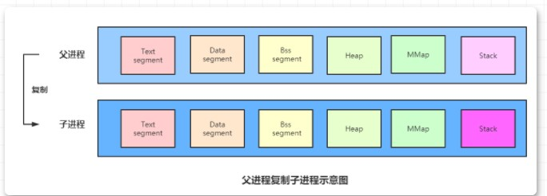
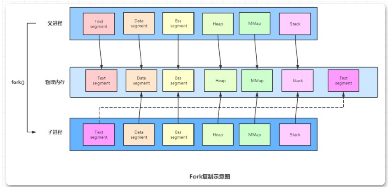
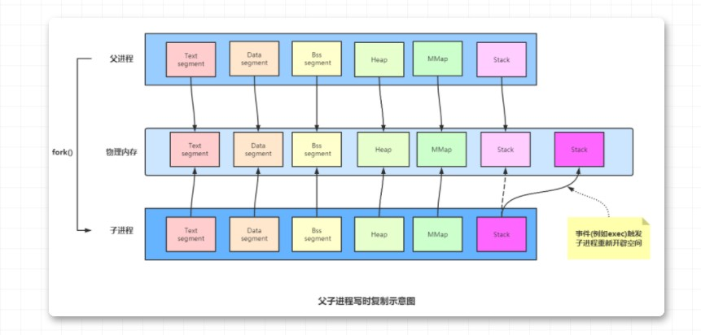

# 写时复制 - Redis

### 思考

Redis进行RDB持久化时,`BGSAVE`(后面称之为"后台保存")会开辟一个子进程,将数据从内存写进磁盘,这儿我产生了一个疑惑,就当这篇文章的引入场景:

1. 如果我们内存中有4G数据,现在8:00执行后台保存,由于数据写会磁盘需要时间,假设8:05数据才写完毕,但是这中间的5分钟,服务器一直对外提供服务,如果很多数据在这期间遭受到了更改,那么写回磁盘的数据是8:00之前的数据还是保存了8:00~8:05这段时间变化的数据呢?
2. 如果保存的是变化后的数据,那么有一些问题需要继续思考,数据写回磁盘,势必要经过buffer,那么对于内存来说,完全写完的时间是不太确定的,因为这中间数据一直在变化,没法确定数据的边界。
3. 如果是保存8:00那个时间片的数据快照,那也就是要将数据复制一份,避免服务器提供服务时干扰到需要保存的数据,这儿又有一个新问题,这么整的话会不会内存溢出?毕竟内存是有限的,这样简单的复制就是double一下怀着这种疑问发现了Redis的bgsave命令底层其实是Linux的写时复制技术

### **进程复制**

在Linux程序中，`fork()`会产生一个和父进程完全相同的子进程，但子进程在此后多会`exec`系统调用，出于效率考虑，linux中引入了“写时复制(**Copy-On-Write**)“技术，也就是只有进程空间的各段的内容要发生变化时，才会将父进程的内容复制一份给子进程。

那么子进程的物理空间没有代码，怎么去取指令执行exec系统调用呢？

在`fork`之后`exec`之前两个进程用的是相同的物理空间（内存区），子进程的代码段、数据段、堆栈都是指向父进程的物理空间，也就是说，两者的虚拟空间不同，但其对应的物理空间是同一个。

当父子进程中有更改相应段的行为发生时，再为子进程相应的段分配物理空间，如果不是因为`exec`，内核会给子进程的数据段、堆栈段分配相应的物理空间（至此两者有各自的进程空间，互不影响），而代码段继续共享父进程的物理空间（两者的代码完全相同）。而如果是因为`exec`，由于两者执行的代码不同，子进程的代码段也会分配单独的物理空间。

还有个细节问题就是，`fork`之后内核会通过将子进程放在队列的前面，以让子进程先执行，以免父进程执行导致写时复制，而后子进程执行`exec`系统调用，因无意义的复制而造成效率的下降。

> **进程空间结构**

现在有一个父进程P1，这是一个主体，现在在其虚拟地址空间（有相应的数据结构表示）上有：正文段，数据段，堆，栈这四个部分(还有BSS、MMap等)，相应的，内核要为这四个部分分配各自的物理块。即：正文段块，数据段块，堆块，栈块。至于如何分配，这是内核去做的事，在此不详述。

### fock()

现在P1用fork()函数为进程创建一个子进程P2，内核操作:

复制P1的正文段，数据段，堆，栈这四个部分，注意是其内容相同。

为这四个部分分配物理块，P2的：正文段－＞P1的正文段的物理块，**「其实区别就是不为P2分配正文段块」**，让P2的正文段指向P1的正文段块，数据段－＞P2自己的数据段块（为其分配对应的块），堆－＞P2自己的堆块，栈－＞P2自己的栈块。如下图所示：同左到右大的方向箭头表示复制内容。

P2：正文段===＞PI的正文段的物理块，其实就是不为P2分配正文段块

P2的正文段===＞**「P1」**的正文段块

数据段===＞P2自己的数据段块（为其分配对应的块）

堆===＞P2自己的堆块

栈===＞P2自己的栈块

如下图所示：上面为父进程,下面为fork出来的子进程,可以看出只有子进程的正文段(Text Segment)是在物理内存重新分配的

###  写时复制

写时复制(Copy-On-Write),由前文可知,Linux复制子进程时,并不会为所有程序空间的块都分配物理块，写时复制技术在Fork技术上有了进一步的优化,Text段也不重新分配物理内存,也就是刚分配时是下面这种形式:

写时复制：内核只为新生成的子进程创建虚拟空间结构，它们来复制于父进程的虚拟究竟结构，但是不为这些段分配物理内存，任何段都不分配,它们共享父进程的物理空间，当父子进程中有更改相应段的行为发生时，再为子进程相应的段分配物理空间,例如途中的Stack块,注意重新分配是以内存页,也就是pagecache(4k)为基本单位的