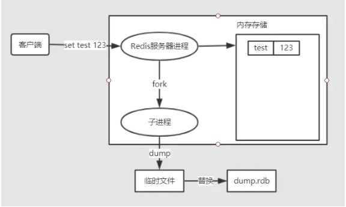

# Redis持久化机制 RDB和AOF

 Redis作为一个**内存**数据库，数据是以内存为载体存储的，那么一旦Redis服务器进程退出，服务器中的数据也会消失。为了解决这个问题，Redis提供了持久化机制，也就是把内存中的数据保存到磁盘当中，避免数据意外丢失。

Redis提供了两种持久化方案：**RDB持久化**和**AOF持久化**，一个是快照的方式，一个是类似日志追加的方式

# RDB持久化

RDB持久化是通过**快照**的方式，即在指定的时间间隔内将内存中的数据集快照写入磁盘。在创建快照之后，用户可以备份该快照，可以将快照复制到其他服务器以创建相同数据的服务器副本，或者在重启服务器后恢复数据。RDB是Redis默认的持久化方式

## 快照持久化

RDB持久化会生成RDB文件，该文件是一个**压缩**过的**二进制文件**，可以通过该文件还原快照时的数据库状态，即生成该RDB文件时的服务器数据。RDB文件默认为当前工作目录下的`dump.rdb`，可以根据配置文件中的`dbfilename`和`dir`设置RDB的文件名和文件位置。

```shell
# 设置 dump 的文件名
dbfilename dump.rdb

# 工作目录
# 例如上面的 dbfilename 只指定了文件名，
# 但是它会写入到这个目录下。这个配置项一定是个目录，而不能是文件名。
dir ./
```

### 触发快照的时机

- 执行`save`和`bgsave`命令

- 配置文件设置`save <seconds> <changes>`规则，自动间隔性执行`bgsave`命令

- 主从复制时，从库全量复制同步主库数据，主库会执行`bgsave`

- 执行`flushall`命令清空服务器数据

- 执行`shutdown`命令关闭Redis时，会执行`save`命令

### save和bgsave命令

执行`save`和`bgsave`命令，可以手动触发快照，生成RDB文件，两者的区别如下

使用`save`命令会阻塞Redis服务器进程，服务器进程在RDB文件创建完成之前是不能处理任何的命令请求

而使用`bgsave`命令不同的是，`basave`命令会`fork`一个子进程，然后该子进程会负责创建RDB文件，而服务器进程会继续处理命令请求

> `fork()`是由操作系统提供的函数，作用是创建当前进程的一个副本作为子进程




>`fork`一个子进程，子进程会把数据集先写入临时文件，写入成功之后，再替换之前的RDB文件，用二进制压缩存储，这样可以保证RDB文件始终存储的是完整的持久化内容

### 自动间隔触发

在配置文件中设置`save <seconds> <changes>`规则，可以自动间隔性执行`bgsave`命令

```shell
################################ SNAPSHOTTING  ################################
#
# Save the DB on disk:
#
#   save <seconds> <changes>
#
#   Will save the DB if both the given number of seconds and the given
#   number of write operations against the DB occurred.
#
#   In the example below the behaviour will be to save:
#   after 900 sec (15 min) if at least 1 key changed
#   after 300 sec (5 min) if at least 10 keys changed
#   after 60 sec if at least 10000 keys changed
#
#   Note: you can disable saving completely by commenting out all "save" lines.
#
#   It is also possible to remove all the previously configured save
#   points by adding a save directive with a single empty string argument
#   like in the following example:
#
#   save ""

save 900 1
save 300 10
save 60 10000
```

- `save <seconds> <changes>`表示在seconds秒内，至少有changes次变化，就会自动触发`gbsave`命令

- ` save 900 1`  当时间到900秒时，如果至少有1个key发生变化，就会自动触发`bgsave`命令创建快照

- `save 300 10`  当时间到300秒时，如果至少有10个key发生变化，就会自动触发`bgsave`命令创建快照

- `save 60 10000`    当时间到60秒时，如果至少有10000个key发生变化，就会自动触发`bgsave`命令创建快照

# AOF持久化

除了RDB持久化，Redis还提供了AOF（Append Only File）持久化功能，AOF持久化会把被执行的写命令写到AOF文件的末尾，记录数据的变化。默认情况下，Redis是没有开启AOF持久化的，开启后，每执行一条更改Redis数据的命令，都会把该命令追加到AOF文件中，这是会降低Redis的性能，但大部分情况下这个影响是能够接受的，另外使用较快的硬盘可以提高AOF的性能

可以通过配置`redis.conf`文件开启AOF持久化，关于AOF的配置如下

```shell
# appendonly参数开启AOF持久化
appendonly no

# AOF持久化的文件名，默认是appendonly.aof
appendfilename "appendonly.aof"

# AOF文件的保存位置和RDB文件的位置相同，都是通过dir参数设置的
dir ./

# 同步策略
# appendfsync always
appendfsync everysec
# appendfsync no

# aof重写期间是否同步
no-appendfsync-on-rewrite no

# 重写触发配置
auto-aof-rewrite-percentage 100
auto-aof-rewrite-min-size 64mb

# 加载aof出错如何处理
aof-load-truncated yes

# 文件重写策略
aof-rewrite-incremental-fsync yes
```

## AOF的实现

AOF需要记录Redis的每个写命令，步骤为：命令追加（append）、文件写入（write）和文件同步（sync）

### 命令追加(append)

开启AOF持久化功能后，服务器每执行一个写命令，都会把该命令以协议格式先追加到`aof_buf`缓存区的末尾，而不是直接写入文件，避免每次有命令都直接写入硬盘，减少硬盘IO次数

### 文件写入(write)和文件同步(sync)

对于何时把`aof_buf`缓冲区的内容写入保存在AOF文件中，Redis提供了多种策略

- `appendfsync always`：将`aof_buf`缓冲区的所有内容写入并同步到AOF文件，每个写命令同步写入磁盘
- `appendfsync everysec`：将`aof_buf`缓存区的内容写入AOF文件，每秒同步一次，该操作由一个线程专门负责
- `appendfsync no`：将`aof_buf`缓存区的内容写入AOF文件，什么时候同步由操作系统来决定

`appendfsync`选项的默认配置为`everysec`，即每秒执行一次同步

关于AOF的同步策略是涉及到操作系统的`write`函数和`fsync`函数的，在《Redis设计与实现》中是这样说明的


>为了提高文件写入效率，在现代操作系统中，当用户调用`write`函数，将一些数据写入文件时，操作系统通常会将数据暂存到一个内存缓冲区里，当缓冲区的空间被填满或超过了指定时限后，才真正将缓冲区的数据写入到磁盘里。
>
>这样的操作虽然提高了效率，但也为数据写入带来了安全问题：如果计算机停机，内存缓冲区中的数据会丢失。为此，系统提供了`fsync`、`fdatasync`同步函数，可以强制操作系统立刻将缓冲区中的数据写入到硬盘里，从而确保写入数据的安全性。

从上面的介绍我们知道，我们写入的数据，操作系统并不一定会马上同步到磁盘，所以Redis才提供了`appendfsync`的选项配置。当该选项时为`always`时，数据安全性是最高的，但是会对磁盘进行大量的写入，Redis处理命令的速度会受到磁盘性能的限制；`appendfsync everysec`选项则兼顾了数据安全和写入性能，以每秒一次的频率同步AOF文件，即便出现系统崩溃，最多只会丢失一秒内产生的数据；如果是`appendfsync no`选项，Redis不会对AOF文件执行同步操作，而是有操作系统决定何时同步，不会对Redis的性能带来影响，但假如系统崩溃，可能会丢失不定数量的数据

### AOF重写(rewrite)

在了解AOF重写之前，我们先来看看AOF文件中存储的内容是啥，先执行两个写操作

```shell
127.0.0.1:6379> set s1 hello
OK
127.0.0.1:6379> set s2 world
OK
```

然后我们打开`appendonly.aof`文件，可以看到如下内容

```shell
*3
$3
set
$2
s1
$5
hello
*3
$3
set
$2
s2
$5
world
```

> 该命令格式为Redis的序列化协议（RESP）。`*3`代表这个命令有三个参数，`$3`表示该参数长度为3

看了上面的AOP文件的内容，我们应该能想象，随着时间的推移，Redis执行的写命令会越来越多，AOF文件也会越来越大，过大的AOF文件可能会对Redis服务器造成影响，如果使用AOF文件来进行数据还原所需时间也会越长

时间长了，AOF文件中通常会有一些冗余命令，比如：过期数据的命令、无效的命令（重复设置、删除）、多个命令可合并为一个命令（批处理命令）。所以AOF文件是有精简压缩的空间的 

AOF重写的目的就是减小AOF文件的体积，不过值得注意的是：**AOF文件重写并不需要对现有的AOF文件进行任何读取、分享和写入操作，而是通过读取服务器当前的数据库状态来实现的**

文件重写可分为手动触发和自动触发，手动触发执行`bgrewriteaof`命令，该命令的执行跟`bgsave`触发快照时类似的，都是先`fork`一个子进程做具体的工作

```shell
127.0.0.1:6379> bgrewriteaof
Background append only file rewriting started
```

自动触发会根据`auto-aof-rewrite-percentage`和`auto-aof-rewrite-min-size 64mb`配置来自动执行`bgrewriteaof`命令

```shell
# 表示当AOF文件的体积大于64MB，且AOF文件的体积比上一次重写后的体积大了一倍（100%）时，会执行`bgrewriteaof`命令
auto-aof-rewrite-percentage 100
auto-aof-rewrite-min-size 64mb
```

下面看一下执行`bgrewriteaof`命令，重写的流程


- 重写会有大量的写入操作，所以服务器进程会`fork`一个子进程来创建一个新的AOF文件
- 在重写期间，服务器进程继续处理命令请求，如果有写入的命令，追加到`aof_buf`的同时，还会追加到`aof_rewrite_buf`AOF重写缓冲区
- 当子进程完成重写之后，会给父进程一个信号，然后父进程会把AOF重写缓冲区的内容写进新的AOF临时文件中，再对新的AOF文件改名完成替换，这样可以保证新的AOF文件与当前数据库数据的一致性

# 数据恢复

Redis4.0开始支持RDB和AOF的混合持久化（可以通过配置项 `aof-use-rdb-preamble` 开启）

- 如果是redis进程挂掉，那么重启redis进程即可，直接基于AOF日志文件恢复数据
- 如果是redis进程所在机器挂掉，那么重启机器后，尝试重启redis进程，尝试直接基于AOF日志文件进行数据恢复，如果AOF文件破损，那么用`redis-check-aof fix`命令修复
- 如果没有AOF文件，会去加载RDB文件
- 如果redis当前最新的AOF和RDB文件出现了丢失/损坏，那么可以尝试基于该机器上当前的某个最新的RDB数据副本进行数据恢复

# RDB vs AOF

## RDB和AOF优缺点

### **RDB**

优点：

- RDB快照是一个压缩过的非常紧凑的文件，保存着某个时间点的数据集，适合做数据的备份，灾难恢复
- 可以最大化Redis的性能，在保存RDB文件，服务器进程只需fork一个子进程来完成RDB文件的创建，父进程不需要做IO操作
- 与AOF相比，恢复大数据集的时候会更快

缺点：

- RDB的数据安全性是不如AOF的，保存整个数据集的过程是比繁重的，根据配置可能要几分钟才快照一次，如果服务器宕机，那么就可能丢失几分钟的数据
- Redis数据集较大时，fork的子进程要完成快照会比较耗CPU、耗时

### **AOF**

优点：

- 数据更完整，安全性更高，秒级数据丢失（取决fsync策略，如果是everysec，最多丢失1秒的数据）
- AOF文件是一个只进行追加的日志文件，且写入操作是以Redis协议的格式保存的，内容是可读的，适合误删紧急恢复

缺点：

- 对于相同的数据集，AOF文件的体积要大于RDB文件，数据恢复也会比较慢
- 根据所使用的 fsync 策略，AOF 的速度可能会慢于 RDB。 不过在一般情况下， 每秒 fsync 的性能依然非常高

