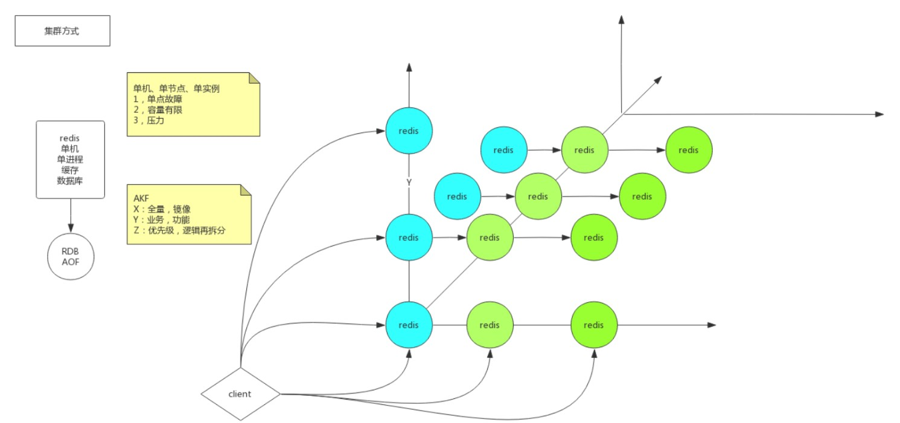
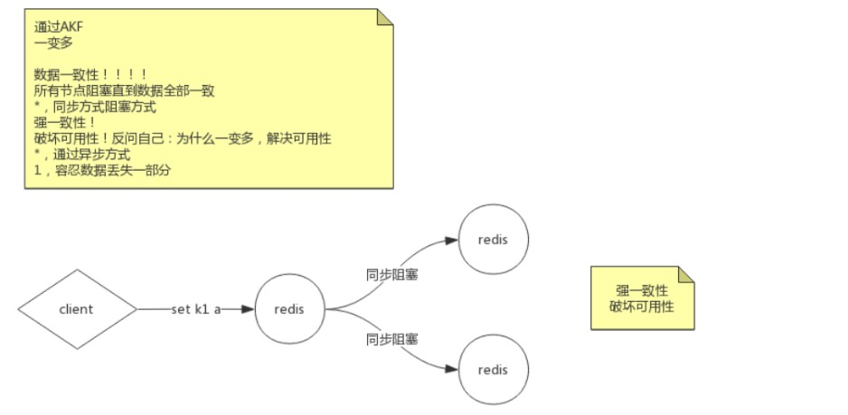
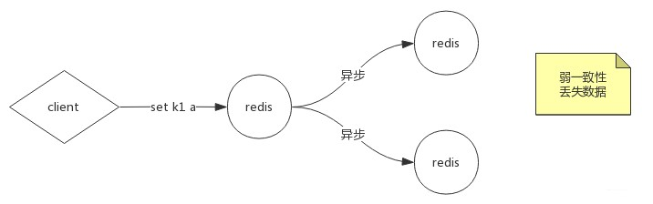
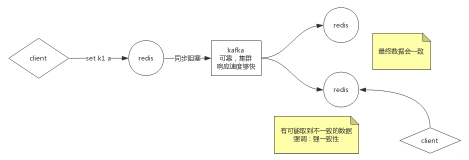
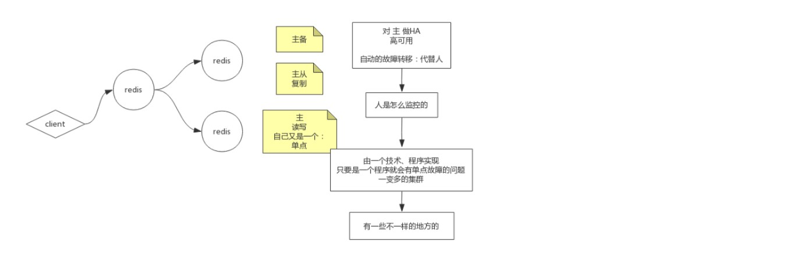
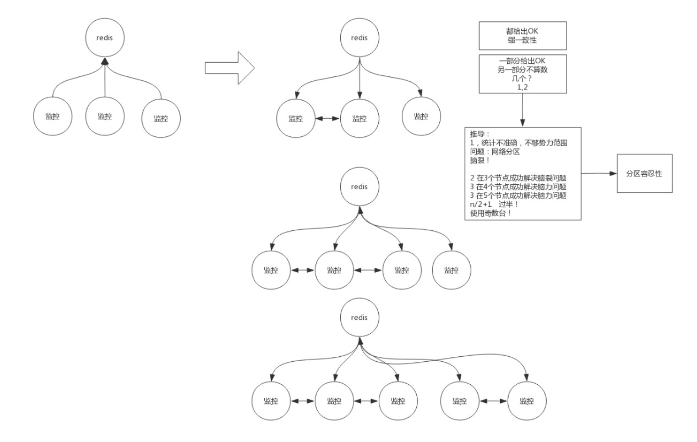

# Redis - AKF

### 单机、单节点和单实例存在的问题

- 单点故障(物理机挂了，要等很久才可使用)
- 容量有限
- 压力过大

### 解决方式

#### **AKF**

#### **有XYZ三个轴，可以只发生一个，可以多个维度一起发生**

X轴：Redis示例的副本，数据库的副本…读写分离，增加备用性，解决单点故障的问题，全量镜像，不能解决容量有限的问题
Y轴：对要存的数据按照不同的功能业务拆分，不同类别的数据分开存储，客户端实现指定查询哪个库，解决容量有限的问题
Z轴：在按照业务拆分的前提下，如果又存不下了，可以基于一定的规则，将一个业务将数据再拆分，存储到不同的库里。

#### 新问题(数据一致性)

通过AKF实现一边多，产生数据一致性的问题：

方案1：所有节点阻塞，直到数据全部一致 - 强一致性，成本极高，并且难以达到。如果有一个节点因为网络问题挂了，整体就写失败了，对外表现出的是整个服务不可用。**强一致性会破坏可用性**。而我们将单redis拆分成多redis，本来就是要解决可用性的问题。

方案2：容忍数据丢失一部分，主redis直接返回ok，通过异步方式让两个从库同步。存在的问题是，如果两个从库都写失败，别人在查询的时候，会发现丢失了这个数据。

方案3：使用足够可靠的kafka，达到数据的最终一致性。如果客户端要取数据的话，有多种可能：在达到最终一致性之前，可能会取到不一致的数据

#### **问题2：**

主备：客户端不参与业务，只作备用机
主从：主从复制，可以在从库取数据
这里面一定会有主的概念，主自己又是一个单点。如果主挂掉了，又导致整个服务不可用了。
因此我们一般对主做HA（高可用），如果主挂了，可以选择让一个备机顶上去。这件事情可以人工去做，也可以自动的故障转移。如何自动？要用一个程序实现。一个程序又会有单点故障的问题，因此监控程序自身应该也是一个一变多的集群。
多台监控程序：多台盯着一个主，如果redis挂了，可能有监控发现它挂了，有监控没发现它挂，因为有网络延时的存在。一个redis是好是坏，应该由多少台监控程序决定？这时不能使用强一致性，因为可能有的监控由于网络延迟卡住了。因此只要一部分给出ok，就立刻确定redis挂了。那么，一部分应该是几个？这时候我们推导一下：
假设我们有3个监控，有1个说redis挂了，就立刻把他踢掉，但可能是由于这个监控的连接有问题，这就误伤了。并且一个监控说话就能算数的话，三个监控之间会产生不同的结果，产生竞争。会产生一个问题：网络分区（脑裂），不同的客户端拿到的是不同的数据，对外表现为数据的不一致。
分区容忍性：有时候我们可能不需要全量数据的一致，比如一共有50台tomcat注册到注册中心，注册中心是一个集群，注册中心有的注册到了50台，有的注册到了40台，这时候不管注册了多少台，只要能用就行，不一致这个问题会被我们包容。这就是分区容忍性。
如果2个监控说redis挂了，1个监控说redis还活着，这2个监控的势力为2。势力为1的监控就没有决策权了。这时对外表现出的就不是一种模棱两可的状态了。
因此，当势力达到n/2+1，也就是过半的时候，就可以解决脑力问题。所以集群一般使用奇数台。
为什么是奇数台？
我们用3台和4台比较，它们都只允许挂一台。但4台比3台更容易挂一台，而且4台的价格更高。所以第4台是没有必要的。

