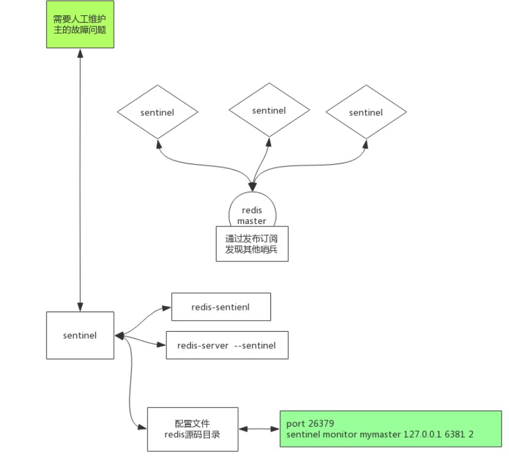

# Sentinel 使用

### sentinel.conf 配置文件

`Sentinel`在启动时需要一份`sentinel.conf`配置文件，在`Redis`的源码包内有一份`sentinel.conf`完整示例文档

```shell
sentinel monitor mymaster 127.0.0.1 6379 2
sentinel down-after-milliseconds mymaster 60000
sentinel failover-timeout mymaster 180000
sentinel parallel-syncs mymaster 1
sentinel monitor resque 192.168.1.3 6380 4
sentinel down-after-milliseconds resque 10000
sentinel failover-timeout resque 180000
sentinel parallel-syncs resque 5
```

只需要指定要监视的主库，为每个独立的主库(可能有任意数量的从库)指定不同的名称。不需要指定从库，从库是自动发现的。Sentinel将使用关于从库的附加信息自动更新配置(以便在重启时保留这些信息)。在故障转移期间，每次将一个从库提升为主库，以及每次发现一个新的Sentinel，配置都会被重写。上面的示例配置监视两组Redis主从复制实例，每个实例由一个主库和一个未定义数量的从库组成。一组实例称为mymaster，另一组称为resque。

主要设置说明：

```shell
sentinel monitor <master-group-name> <ip> <port> <quorum>
```

第一行用来告诉Redis监视一个名为mymaster的主机，它的地址是127.0.0.1，端口是6379，权势数是2。

- `quorum`是指哨兵的数量，他们需要就主机不可达的事实达成一致，以便真正标记主机故障，并在可能的情况下最终启动故障转移程序。
- 然而，仲裁仅用于检测故障。为了真正执行故障转移，其中一个哨兵需要被选举为故障转移的领导者并被授权进行。这只有在Sentinel进程的大多数投票时才会发生。

例如，如果你有5个Sentinel进程，并且给定master的quorum值为2，就会发生这样的情况：

- 如果两个哨兵同时同意主节点不可达，其中一个将尝试启动故障切换。
- 如果至少有三个哨兵可到达，故障转移将被授权，并将真正开始。

在实践中，这意味着在故障发生期间，如果大多数Sentinel进程无法交谈(也就是在少数分区中没有故障转移)，那么Sentinel永远不会启动故障转移。

其他设置说明：

其他选项都是如下格式：

```shell
sentinel <option_name> <master_name> <option_value>
```

常用设置如下：

- `sentinel down-after-milliseconds <master-name> <milliseconds>`：`Sentinel`检测`Redis`的超时时间（以毫秒为单位）默认30秒
- `sentinel parallel-syncs <master-name> <numreplicas>`：故障转移时，同时有多少个副本执行同步，建议1
- `sentinel auth-pass <master-name> <password>`：`Sentinel`：连接主机的密码（如果有）
- `sentinel auth-user <master-name> <username>`：`Sentinel`：连接主机的用户名（如果有）
- `sentinel failover-timeout <master-name> <milliseconds>`：故障转移超时时间（默认3分钟）
- `sentinel notification-script <master-name> <script-path>`：发生故障时需要执行的通知脚本

**其他信息设置**

- `port 26379`：`Sentinel`的端口
- `requirepass <password>`：`Sentinel`的密码（若设置了密码，则所有的`Sentinel`密码都要相同）
- `daemonize no`：是否为守护进程

# 实战

按上文步骤进行设置

- 配置时使用**配置文件**方式配置
- 主库也要配置`masterauth,masteruser`信息，防止主库宕机后切换为从库时无法连接其他主库
- 建议**一主多从**模式

在所有服务器上新建`sentinel.conf`配置文件，内容如下：

```shell
# 绑定地址
bind 0.0.0.0
# 关闭保护模式
protected-mode no
# 端口
port 26379
# 守护进程模式
daemonize yes
# pid文件位置
pidfile "/usr/local/redis/sentinel.pid"
# 日志文件
logfile "/usr/local/redis/sentinel.log"
# 工作文件位置
dir "/usr/local/redis"
# 主库地址
sentinel monitor master 192.168.220.101 6379 2
# Redis访问密码（如果有）
sentinel auth-pass master 123
# 访问用户（如果有）
# sentinel auth-pass master <password>
# Sentinel访问密码（建议设置）
requirepass "123"
# 其他配置
sentinel down-after-milliseconds master 15000
sentinel failover-timeout master 60000
```

依次在所有的服务器上执行以下命令启动哨兵：

```shell
redis-sentinel sentinel.conf
```

