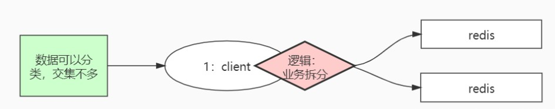
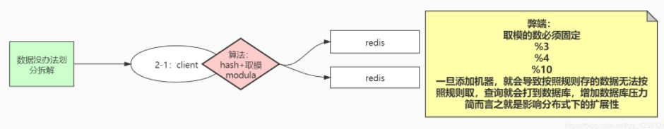
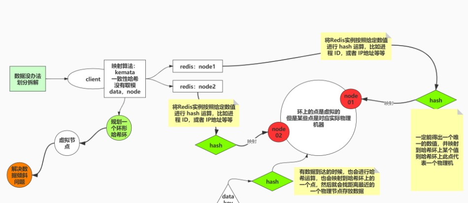
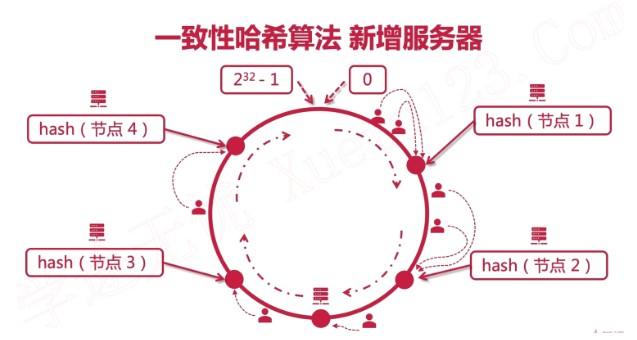
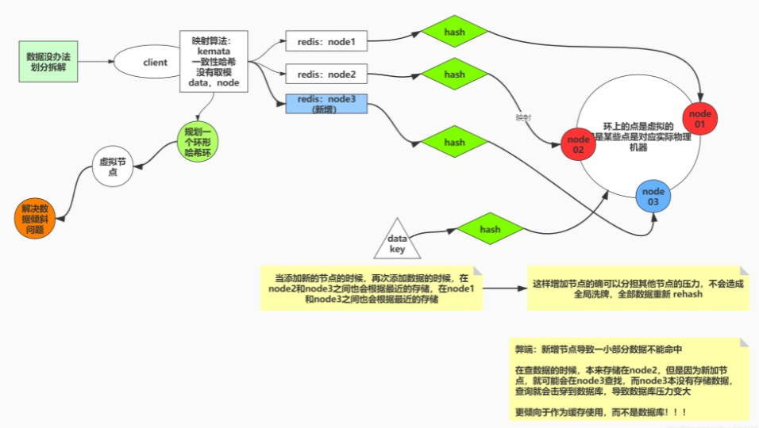
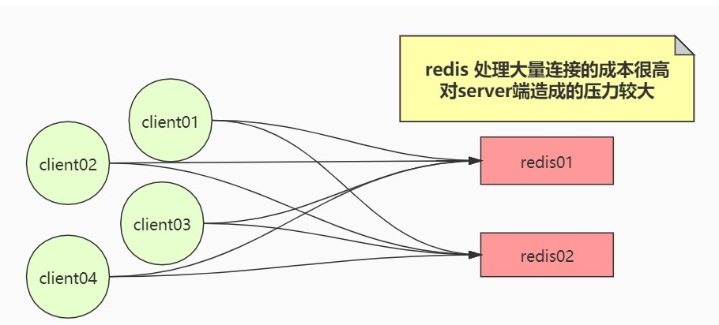
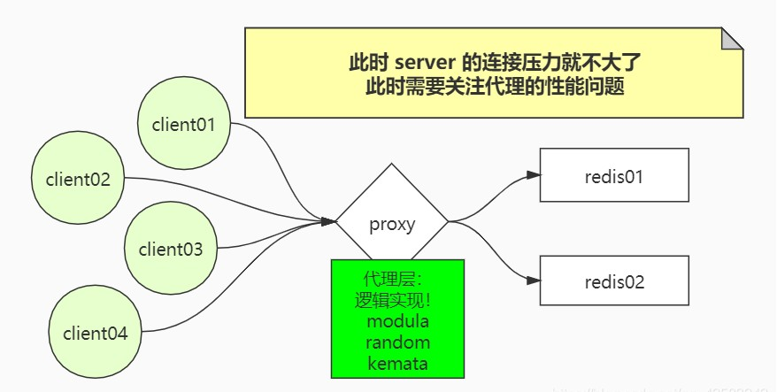
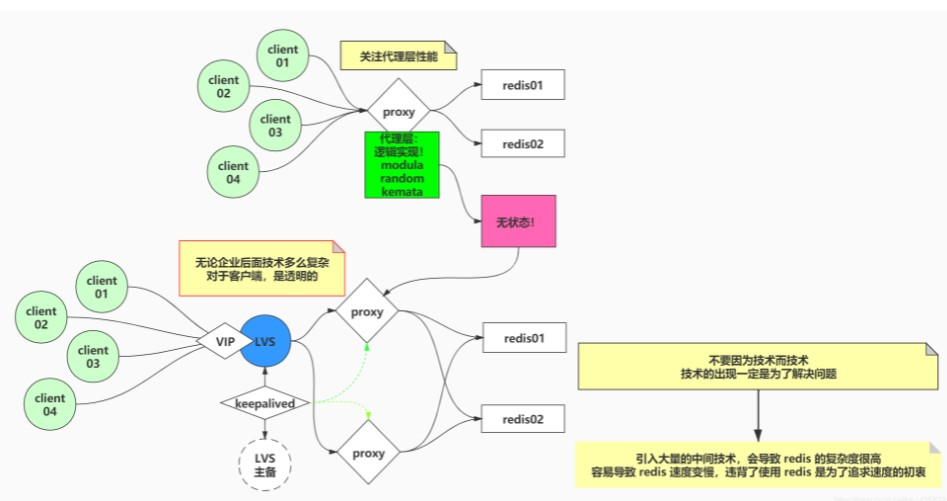
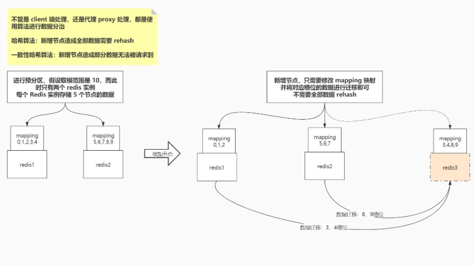
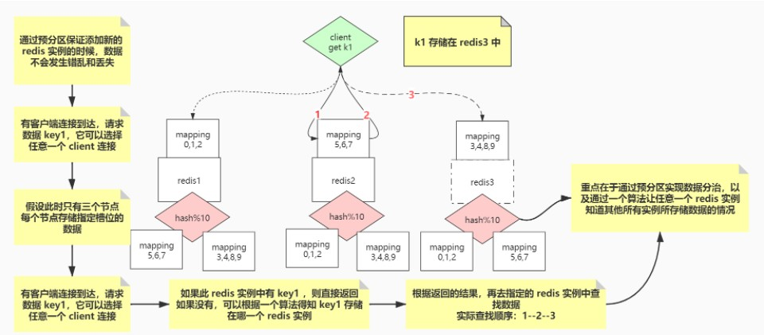

# Sharding

通过主从复制可以人为的搭建集群，也可以通过 Sentinel 管理多台 Redis 服务器，自动维护一个集群，都可以解决单机情况下 master 出现单点故障问题，实现服务的高可用。但是都属于在 X 轴方向上的水平扩展，每台机器都需要存储全量数据，所以没有解决单台机器容量有限的问题

既然有多个 Redis 实例对外提供服务，那么数据是怎么分区映射存储到不同的 Redis 实例？请求是怎么负载到不同的服务进程？

## 数据分治

数据分治可以在 Redis 服务下手，也可以在客户端下手，我们先来考虑一下在 client 端如何进行数据分治

### Client 端处理

#### 逻辑拆分

首先如果数据可以根据逻辑拆分，可以让不同逻辑的数据存储到不同的 Redis 服务实例

弊端：很多场景下，数据并不能简单的根据逻辑进行拆分，所以这种方案对数据特征有很大的要求，限制性较大

#### hash算法

如果数据不可以简单的根据逻辑拆分，我们可以使用各种**映射算法**，让数据按照一定的规则映射、保存在不同的 Redis 服务实例上。映射算法中我们最常用的就是 **hash 算法**

首先可以使用 hash 算法 + 取模，将数据模上 Redis 服务实例个数，让数据映射、存放到不同的服务实例

弊端：hash 算法有一个天生的缺陷——算法取模需要根据机器数进行取模，但是增加机器就会导致 hash 算法的取模混乱，无法在正确的 Redis 实例中取到数据。

此时需要进行全局洗牌，全部的数据都需要 rehash，数据需要重新计算和迁移，在目前数据量这么大的情况下，会造成整个系统响应速度变慢，甚至服务不可用，所以 hash 算法会限制整个系统的扩展性

#### 一致性hash

既然 hash 算法需要根据实际的物理机器取模，会限制系统的扩展性，那么我们想办法让它不进行取模不就行了？这样的算法有很多，主要思想就是**无论给出什么数据，算法都能把它映射成等宽的字符串（或者数字），与数据一一对应**

一致性哈希算法没有取模的过程，因为取模会受限于模数，模数限制了扩展性。一致性哈希算法要求数据（key）和设备（node）都是要参与 hash 运算的，一般把它抽象成一个环形，称之为**哈希环**。

Redis 进程实例会映射在哈希环上的某一个点，数据到达的时候也会映射到哈希环上的一个点，然后就会找到**最近的、代表 Redis 实例的一个点进行存储**

当添加新的 Redis 服务实例的时候，也会映射在哈希环上一个点，代表此物理进程实例，此时映射关系如下：

优点：新增节点不会造成全局洗牌，数据不需要全部 rehash，确实可以分担其他节点压力

弊端：一小部分数据不能命中，相当于缓存失效，查询击穿到数据库

解决：每次查的时候，不再是查最近的一个node，而是查最近的两个node

**特征：这种方案更倾向于作为缓存使用，而不是数据库用！！！**

### Server端处理

以上的这几种方案都是发生在客户端，客户端里面需要实现逻辑代码实现数据分治。我们来想一下客户端处理会产生什么问题

以上拓扑关系图中只有一个 client 进行数据请求，实际情况中不可能只有一个 client 连接，并发场景下，会有大量的 client 与 redis 实例进行连接，当 server 端需要处理大量的 socket 连接，压力就会很大

#### 代理——Proxy

既然由 server 端直接处理连接时的压力过大，此时就可以使用代理处理所有的连接请求，减少 server 端的压力

#### 负载均衡

代理层能够保证 server 端压力不要过大，此时需要关注的点就是代理层如何保证高性能，以及保证可用性，那我们就可以引入负载均衡来保证高性能，并使用主备关系来保证可用性

总结：以上讲了这么多数据分治方案，并没有很明显的优劣之分，每种方案有其独特的使用场景，应该根据具体的场景来选择合适的方案

**重点理解适用于缓存的一致性哈希算法和处理并发大量连接的代理概念**

## 预分区

以上的所有方案，redis 都适合当作缓存来用，而不能当作数据库使用，为了将 redis 用作分布式数据库，就需要理解预分区的概念

通过预分区保证，添加新节点的时候并不需要全部数据 rehash，也不会造成部分数据丢失，通过数据迁移保证数据一致性，保证数据不丢失

在上面我们讲为了减少 redis 的 server 服务处理大量的 client 并发请求，所以可以引入 proxy 代理，将请求进行处理，并分发给特定的 redis 实例

**其实 redis 自己内部的实现，要比这个方案更加优秀，甚至直接省略了代理层，使用预分区功能实现请求的处理**

- Redis 将数据进行预分区，每个 redis 实例存储指定槽位的数据，实现数据分治

- Redis 通过预分区保证添加节点时，会进行数据迁移，数据不会发生错乱

- 当有 client 连接请求到达时，也不需要代理来减轻 server 端连接压力，client 可以任意选择一个 redis 实例连接，由于每个实例中都知道其它所有实例存储数据的情况，所以最多只需要 3 步就可以找到数据
  

