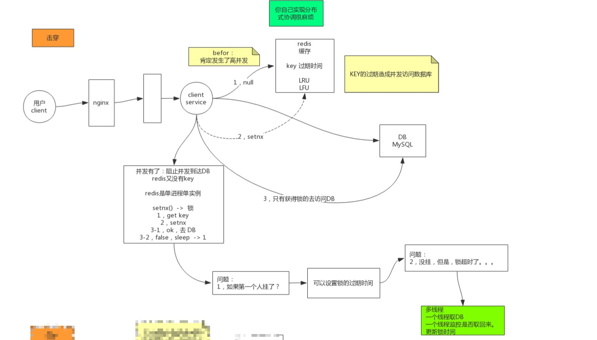
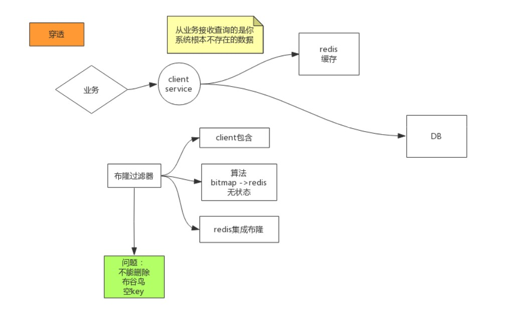
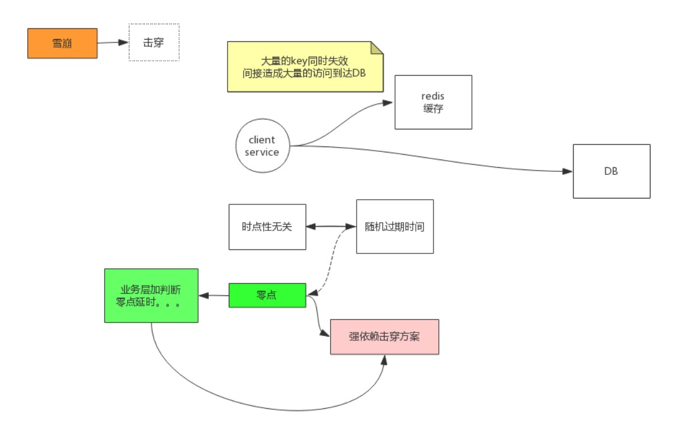

# 缓存击穿

## 发生场景 

1. 一定是发生在高并发情况下(如果不是高并发，最终打在数据库上获取数据其实压力也还好)
2. key 过期时间（key在过期后，突然有高并发请求过来，缓存中获取不到数据，都打在了数据库上）



### 解决方案

利用redis单进程单实例结合setnx()方法实现

```shell
1. get key
2. setnx
3-1. ok，去DB
3-2. false, sleep -> 1
4. 重复上面动作
```

**问题：**

1. 如果第一个人挂了？

   ```shell
   可以设置锁的时间
   ```

2. 没挂，但是，锁超时了...

   ```shell
   多线程
   一个线程取DB
   一个线程监控是否取回来
   更新锁时间
   
   #代码实现
   
   public String get(key) {
         String value = redis.get(key);
         if (value == null) { //代表缓存值过期
             //设置3min的超时，防止del操作失败的时候，下次缓存过期一直不能load db
   		  if (redis.setnx(key_mutex, 1, 3 * 60) == 1) {  //代表设置成功
                  value = db.get(key);
                         redis.set(key, value, expire_secs);
                         redis.del(key_mutex);
                 } else {  //这个时候代表同时候的其他线程已经load db并回设到缓存了，这时候重试获取缓存值即可
                         sleep(50);
                         get(key);  //重试
                 }
             } else {
                 return value;      
             }
   }
   ```

# 缓存穿透

1. 从业务上来看，查询的数据根本不存在



### 解决方案

1. 采用布隆过滤器，但是布隆过滤器不能删除
2. 采用布谷鸟过滤器，空key
3. 如果DB中数据也为空，可以将控制也缓存到redis中

# 缓存雪崩

## 发生场景

`大量的key同时失效`间接造成大量请求打在DB上



## 解决方案

可以在原有的失效时间基础上增加一个随机值，比如1-5分钟随机，这样每一个缓存的过期时间的重复率就会降低，就很难引发集体失效的事件