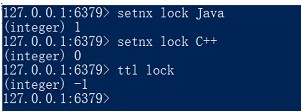
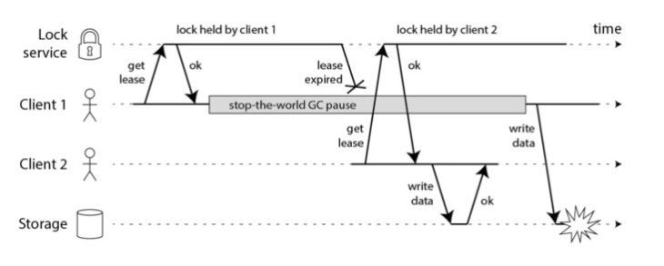

# Redis 分布式锁的实现

## 分布式锁特点

1. 互斥性：在任何时刻，对于同一条数据，只有一台应用可以获取到分布式锁
2. 高可用性：在分布式场景下，一小部分服务器宕机不影响正常使用，这种情况就需要将提供分布式锁的服务以集群的方式部署
3. 防止锁超时：如果客户端没有主动释放锁，服务器会在一段时间之后自动释放锁，防止客户端宕机或者网络不可达时产生死锁
4. 独占性：加锁解锁必须由同一台服务器进行，也就是锁的持有者才可以释放锁，不能出现你加的锁，别人给你解锁了

## 实现锁的命令(SETNX)

SETNX是『 SET if Not eXists』(如果不存在，则 SET)的简写，设置成功就返回1，否则返回0。



### 用法

可以看出，当把**key**为**lock**的值设置为"Java"后，再设置成别的值就会失败，看上去很简单，也好像独占了锁，但有个致命的问题，就是**key**没有过期时间，这样一来，除非手动删除key或者获取锁后设置过期时间，不然其他线程永远拿不到锁。

既然这样，我们给key加个过期时间总可以吧，直接让线程获取锁的时候执行两步操作：

```shell
`SETNX Key 1`
`EXPIRE Key Seconds`
```

### 问题

这个方案也有问题，因为获取锁和设置过期时间分成两步了，不是原子性操作，有可能 **获取锁成功但设置时间失败**

### 解决方案 - SETEX key seconds value、PSETEX key milliseconds value

#### SETEX key seconds value

Redis后续版本官方早为我们考虑到了，所以就引出了下面这个命令

将值 `value` 关联到 `key` ，并将 `key` 的生存时间设为 `seconds` (以秒为单位)。如果 `key` 已经存在，SETEX 命令将覆写旧值。

类似于以下连个命令

```shell
`SET key value`
`EXPIRE key seconds  # 设置生存时间`
```

这两步动作是原子性的，会在同一时间完成。

#### PSETEX key milliseconds value

这个命令和SETEX命令相似，但它以毫秒为单位设置 `key` 的生存时间，而不是像SETEX命令那样，以秒为单位。

不过，从Redis 2.6.12 版本开始，SET命令可以通过参数来实现和SETNX、SETEX、PSETEX 三个命令相同的效果。

就比如这条命令：

```shell
`SET key value NX EX seconds` 
```

## 怎么释放锁

释放锁的命令就简单了，直接删除key就行，但我们前面说了，因为分布式锁必须由锁的持有者自己释放，所以我们必须先确保当前释放锁的线程是持有者，没问题了再删除，这样一来，就变成两个步骤了，似乎又违背了原子性了，怎么办呢？

不慌，我们可以用lua脚本把两步操作做拼装，就好像这样：

```shell
`if redis.call("get",KEYS[1]) == ARGV[1]`
`then`
 `return redis.call("del",KEYS[1])`
`else`
 `return 0`
`end`
```

KEYS[1]是当前key的名称，ARGV[1]可以是当前线程的ID(或者其他不固定的值，能识别所属线程即可)，这样就可以防止持有过期锁的线程，或者其他线程误删现有锁的情况出现。

# 分布式锁缺陷

1. 客户端长时间阻塞导致锁失效问题

   客户端1得到了锁，因为网络问题或者GC等原因导致长时间阻塞，然后业务程序还没执行完锁就过期了，这时候客户端2也能正常拿到锁，可能会导致线程安全的问题。

   

   客户端长时间阻塞

2. redis服务器时钟漂移问题

   如果redis服务器的机器时钟发生了向前跳跃，就会导致这个key过早超时失效，比如说客户端1拿到锁后，key的过期时间是12:02分，但redis服务器本身的时钟比客户端快了2分钟，导致key在12:00的时候就失效了，这时候，如果客户端1还没有释放锁的话，就可能导致多个客户端同时持有同一把锁的问题。

3. 单点实例安全问题

   如果redis是单master模式的，当这台机宕机的时候，那么所有的客户端都获取不到锁了，为了提高可用性，可能就会给这个master加一个slave，但是因为redis的主从同步是异步进行的，可能会出现客户端1设置完锁后，master挂掉，slave提升为master，因为异步复制的特性，客户端1设置的锁丢失了，这时候客户端2设置锁也能够成功，导致客户端1和客户端2同时拥有锁。

为了解决Redis单点问题，redis的作者提出了**RedLock**算法。

# RedLock算法

该算法的实现前提在于Redis必须是多节点部署的，可以有效防止单点故障，具体的实现思路是这样的：

1、获取当前时间戳（ms）；

2、先设定key的有效时长（TTL），超出这个时间就会自动释放，然后client（客户端）尝试使用相同的key和value对所有redis实例进行设置，每次链接redis实例时设置一个比TTL短很多的超时时间，这是为了不要过长时间等待已经关闭的redis服务。并且试着获取下一个redis实例。

比如：TTL（也就是过期时间）为5s，那获取锁的超时时间就可以设置成50ms，所以如果50ms内无法获取锁，就放弃获取这个锁，从而尝试获取下个锁；

3、client通过获取所有能获取的锁后的时间减去第一步的时间，还有redis服务器的时钟漂移误差，然后这个时间差要小于TTL时间并且成功设置锁的实例数>= N/2 + 1（N为Redis实例的数量），那么加锁成功

比如TTL是5s，连接redis获取所有锁用了2s，然后再减去时钟漂移（假设误差是1s左右），那么锁的真正有效时长就只有2s了；

4、如果客户端由于某些原因获取锁失败，便会开始解锁所有redis实例。