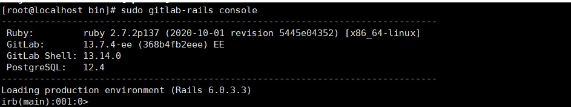
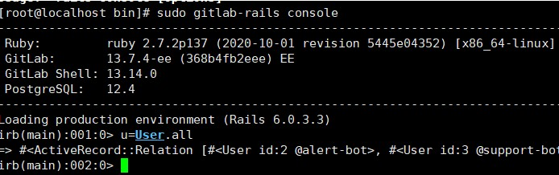
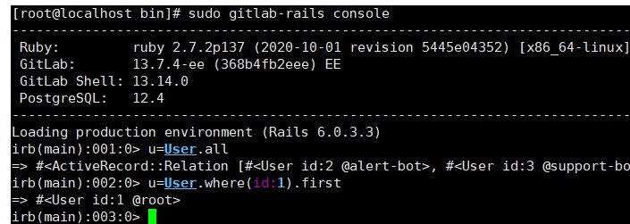
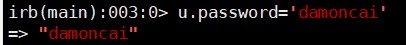

# GitLab在线安装

## 主机安装

| **主机名称**（hostname） | **主机规划**（内网） | **主机规划**（外网） |            **安装基础软件**             | **系统** | 服务器配置 |
| :----------------------: | -------------------- | -------------------- | :-------------------------------------: | -------- | ---------- |
|          GitLab          | 192.168.220.201      |                      | yum install -y vim net-tools lrzsz tree | CentOS 7 | 4C 8G      |

## GitLab架构


## 国内的源速度比较快/阿里源/清华源

> vim /etc/yum.repos.d/gitlab-ce.repo

```shell
[gitlab-ce] 
name=Gitlab CE Repository 
baseurl=https://mirrors.tuna.tsinghua.edu.cn/gitlab-ce/yum/el$releasever/ 
gpgcheck=0 
enabled=1
```

> yum makecache && yum install -y gitlab-ce


## 修改配置文件

>vim /etc/gitlab/gitlab.rb

```shell
external_url'http://IP:Port'
```

> gitlab-ctl reconfigure

等一伙时间可能较长

## 关闭防火墙或者开放端口

```shell
firewall-cmd --zone=public --add-port=8081/tcp --permanent

systemctl stop firewalld
```

## 注意

1. 如果是云主机需要将端口添加到安全组
2. 云主机内存不要太小，推荐4C 8G，内存太小容易出问题
3. gitlab-ctl restart

## 访问

 IP : PORT

如果出现502 ,等一段时间

# GitLab初始化登录

1. 切换到gitlab下的bin目录

   ````shell
   cd /opt/gitlab/bin
   ````

2. 执行如下指令进入到console

   ```shell
   sudo gitlab-rails console
   ```



3. 输入如下指令，查看所有用户

   ```shell
   u=User.all
   ```

   

4. 执行如下指令查找和切换到root用户

   ```shell
   u=User.where(id:1).first
   ```

   

5. 输入如下指令，设置的root用户的密码，如“damoncai”

   ```shell
   u.password='damoncai'
   ```

   

   

   

6. 确认密码

   ```shell
   u.password_confirmation='damoncai'
   ```

   

   

7. 执行如下指令，保存设置

   ```shell
   u.save!
   ```

8. 使用root/damoncai登录