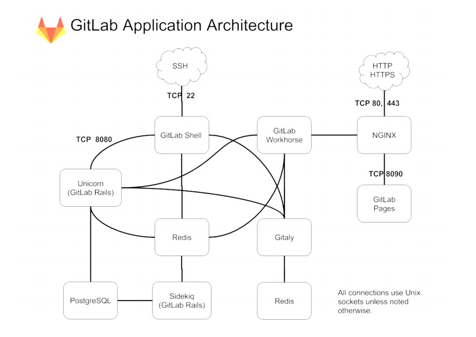
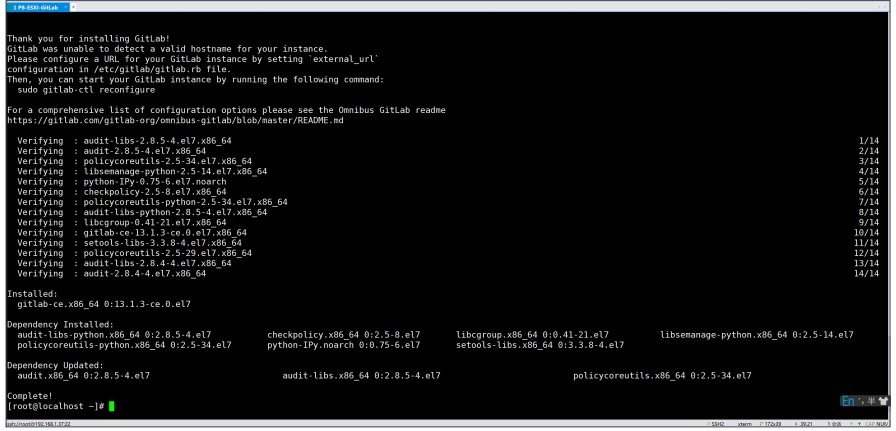

# GitLab在线安装

## 主机安装

| **主机名称**（hostname） | **主机规划**（内网） | **主机规划**（外网） |            **安装基础软件**             | **系统** | 服务器配置 |
| :----------------------: | -------------------- | -------------------- | :-------------------------------------: | -------- | ---------- |
|          GitLab          | 192.168.220.201      |                      | yum install -y vim net-tools lrzsz tree | CentOS 7 | 4C 8G      |

## GitLab架构



## 国内的源速度比较快/阿里源/清华源

**vim /etc/yum.repos.d/gitlab-ce.repo**

```shell
[gitlab-ce] 
name=Gitlab CE Repository 
baseurl=https://mirrors.tuna.tsinghua.edu.cn/gitlab-ce/yum/el$releasever/ 
gpgcheck=0 
enabled=1
```

**yum makecache && yum install -y gitlab-ce**



## 修改配置文件

**vim /etc/gitlab/gitlab.rb**

```shell
external_url'IP地址+端口号'
```

**gitlab-ctl reconfigure**

等一伙时间可能较长

## 关闭防火墙或者开放端口

```shell
firewall-cmd --zone=public --add-port=8081/tcp --permanent

systemctl stop firewalld
```

## 注意

1. 如果是云主机需要将端口添加到安全组
2. 云主机内存不要太小，推荐4C 8G，内存太小容易出问题
3. gitlab-ctl restart

## 访问

 IP : PORT