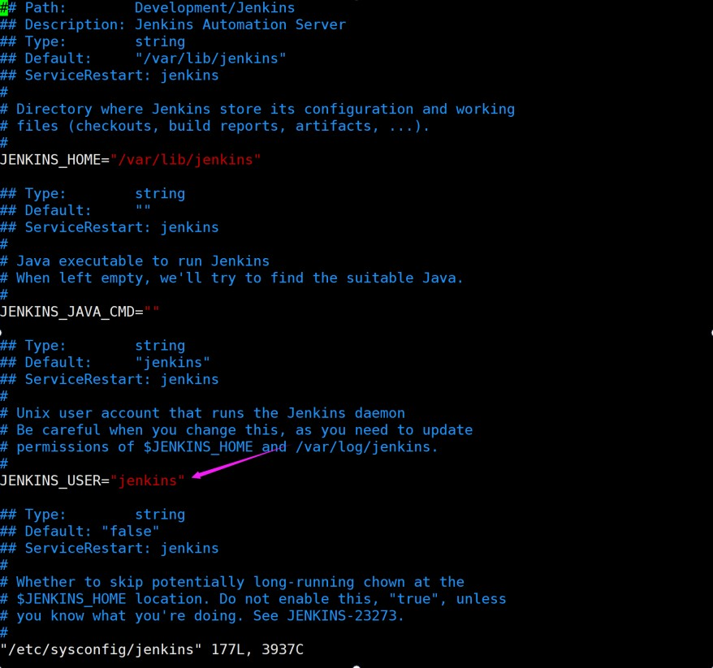
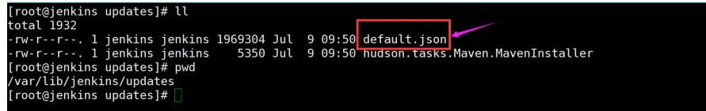
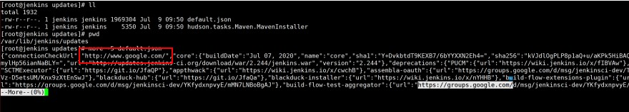
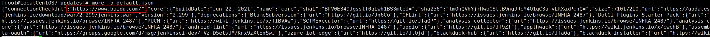
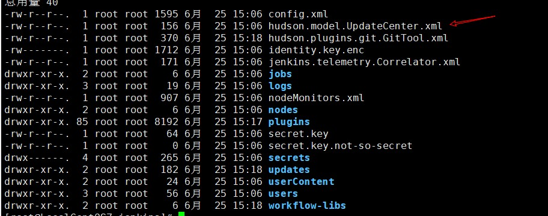
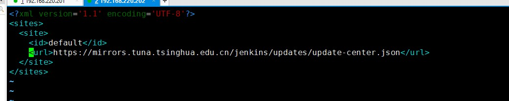

# Jekins安装

## 主机安装

| **主机名称**（hostname） | **主机规划**（内网） | **主机规划**（外网） |            **安装基础软件**             | **系统** | 服务器配置 |
| :----------------------: | -------------------- | -------------------- | :-------------------------------------: | -------- | ---------- |
|          Jekins          | 192.168.220.202      |                      | yum install -y vim net-tools lrzsz tree | CentOS 7 | 4C 8G      |

### 注意

最后运行不起来可能是内存分配不足

## 安装JDK

```shell
yum install -y java-1.8.0-openjdk*
```

## 使用清华源进行安装

```shell
yum install -y https://mirrors.tuna.tsinghua.edu.cn/jenkins/redhat/jenkins-2.299-1.1.noarch.rpm
```

## 进行配置

```shell
vim /etc/sysconfig/jenkins 

JENKINS_USER = root

# 端口默认是8080
```



## systemctl restart jenkins（/var/lib/jenkins下才会有文件）

## 国内访问国外安装插件的问题！！！国内插件加速！(重要的地方)

```shell
/var/lib/jenkins/updates/default.json 使用google的搜索以及国外的服务器
```

**如果文件不存在，在网页中先访问一下Jekins**



### 查看一下default.json

**more -5 default.json**



### 修改成百度

```shell
sed -i 's/http:\/\/updates.jenkins- ci.org\/download/https:\/\/mirrors.tuna.tsinghua.edu.cn\/jenkins/g' default.json && sed -i 's/http:\/\/www.google.com/https:\/\/www.baidu.com/g' default.json
```



## 然后插件中心使用清华源的插件镜像


**如果安装完毕以后卡在这个界面不动，需要如何优化**



**替换成** `https://mirrors.tuna.tsinghua.edu.cn/jenkins/updates/update-center.json`



## 获取管理员密码

> cat /var/lib/jenkins/secrets/initialAdminPassword

