# GitLab基础用法

## 创建分组  P8

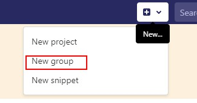

## 创建项目（从Gitee上拷贝）

**https://gitee.com/94fzb/zrlog.git**

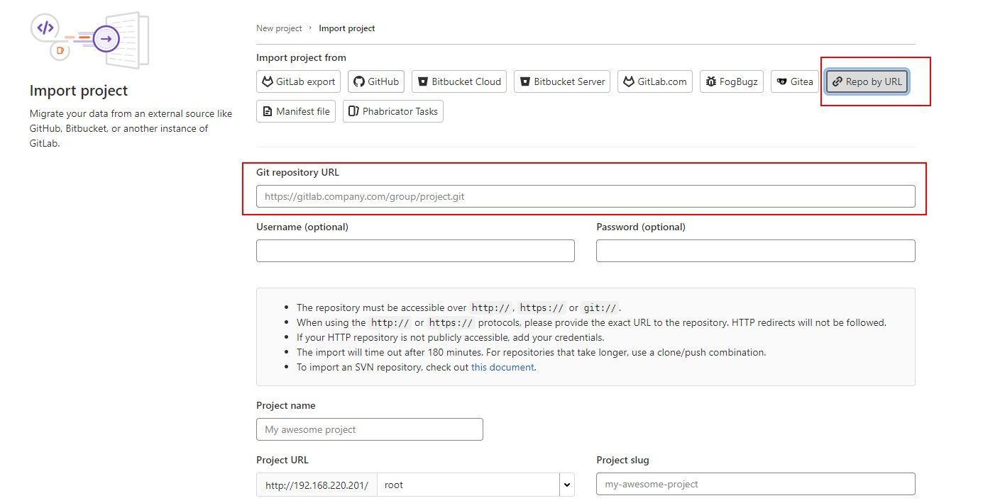

## GitLab的用户权限管理

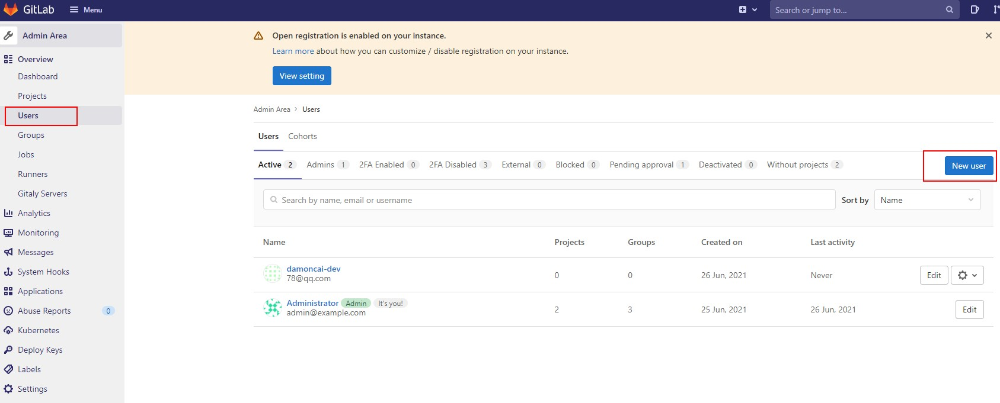

### 给新用户设置初始化密码

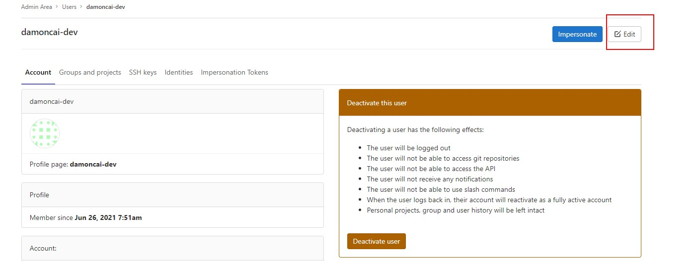

### **根据用户的角色分配不同的权限**

Dev 开发工程师/初级 中级 高级(等级管理比较严格) 部门的负责人

初级我们通过GitLab 比如没有合并主分支的权限等

运维人员

测试人员

产品经理

项目经理

**PS**：如果有多个部门协同开发项目的时候 创建多个用户

## 将用户添加到用户组中

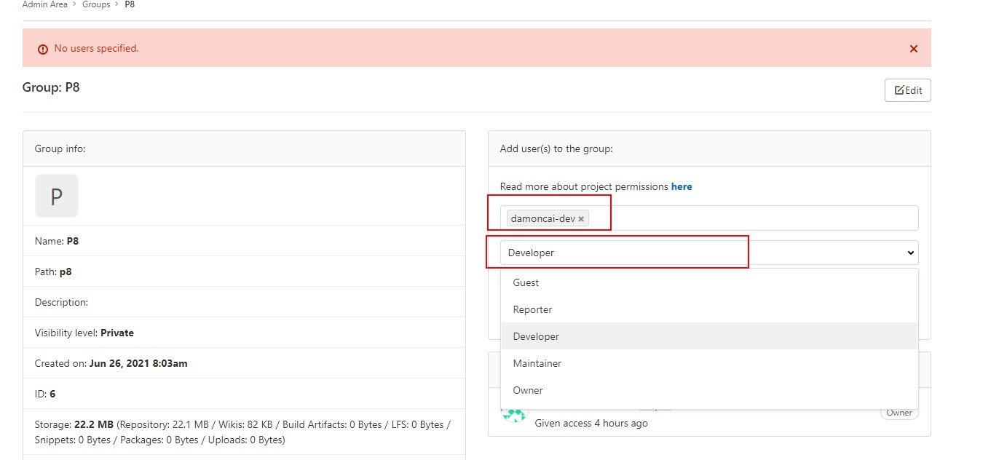

# JenkIns自动构建

## Jekins安装maven插件

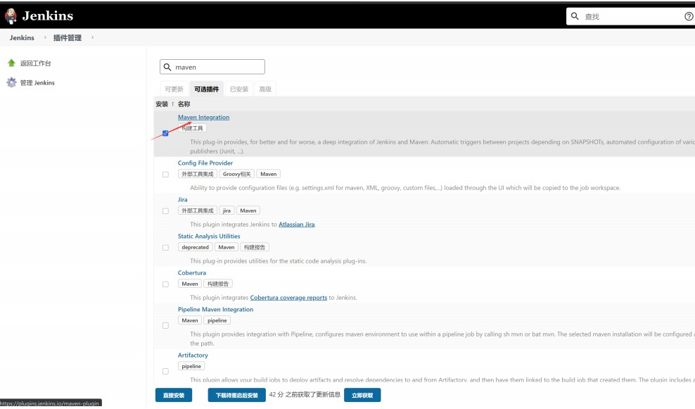

## Jekins安装GitLab和GitLab Hook插件

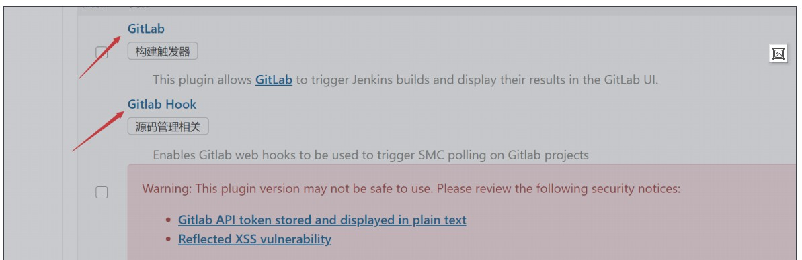

## 服务器安装Maven

1. 安装wget	

   ```shell
   yum install -y wget
   ```

2. 下载Maven (3.5.4版本)

   ```shell
   wget https://mirrors.tuna.tsinghua.edu.cn/apache/maven/maven-3/3.5.4/binaries/apache-maven-3.5.4-bin.tar.gz
   
   tar -zxvf apache-maven-3.5.4-bin.tar.gz
   
   mv apache-maven-3.5.4 maven
   ```

## 配置Maven和JDK环境

```shell
vim /etc/profile

export JAVA_HOME=/usr/lib/jvm/jre-1.8.0-openjdk-1.8.0.292.b10-1.el7_9.x86_64 ##注意自己看一下你的版本是什么再写
export M2_HOME=/usr/local/maven
export PATH=$JAVA_HOME/bin:$JAVA_HOME/jre/bin:$M2_HOME/bin:$PATH
export CLASSPATH=.:$JAVA_HOME/lib/dt.jar:$JAVA_HOME/lib/tools.jar:$JAVA_HOME/jre/lib/rt.jar
export PATH=$PATH:$JAVA_HOME/bin

source /etc/profile
```

## 服务器上安装git

```shell
yum install git
```

## Jekins 配置全局配置 JDK、Maven、Git

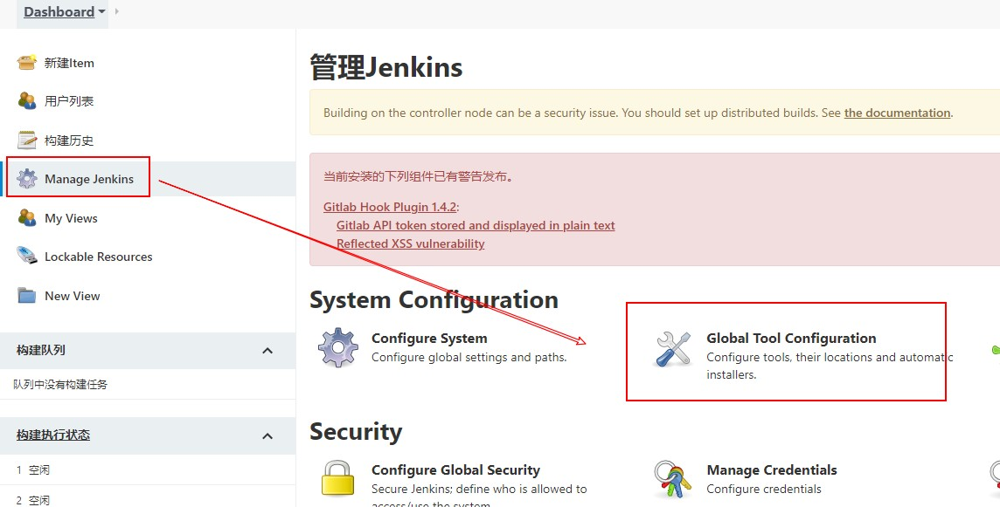

**可以让Jekins自动安装也可以添加环境**

> 可以使用 whereis jdk 查找位置

### JDK

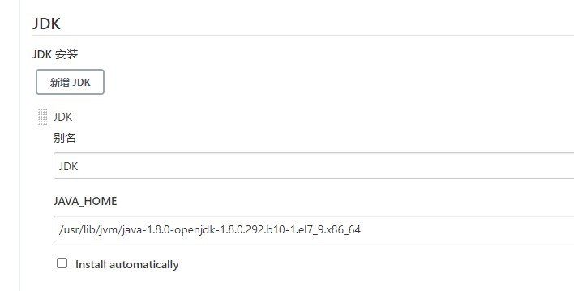

### Git

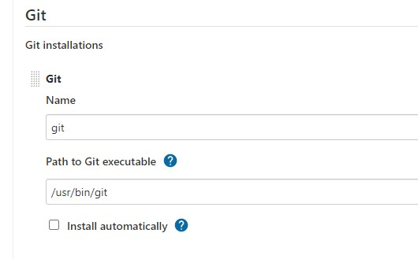

### Maven

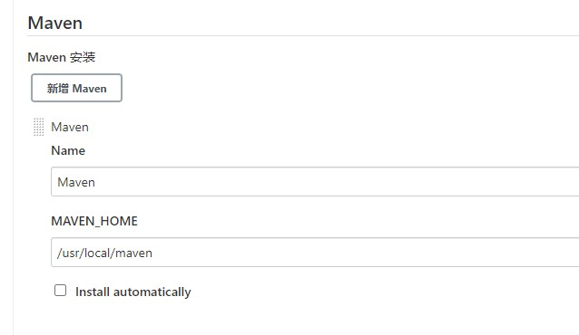

## Jekins 配置全局变量

在Jenkins的设置中可以设置全局变量, jenkins主页面->Manage Jenkins->Configure System->Global Properties 中, 将Environment variables复选框选中,会出来List of variables, 填入以下内容:

- name: JAVA_HOME value:XXX
- name: M2_HOME value:/usr/cyz/apache-maven-3.6.1
- name: `PATH+EXTRA` value: $M2_HOME/bin


## 创建一个任务

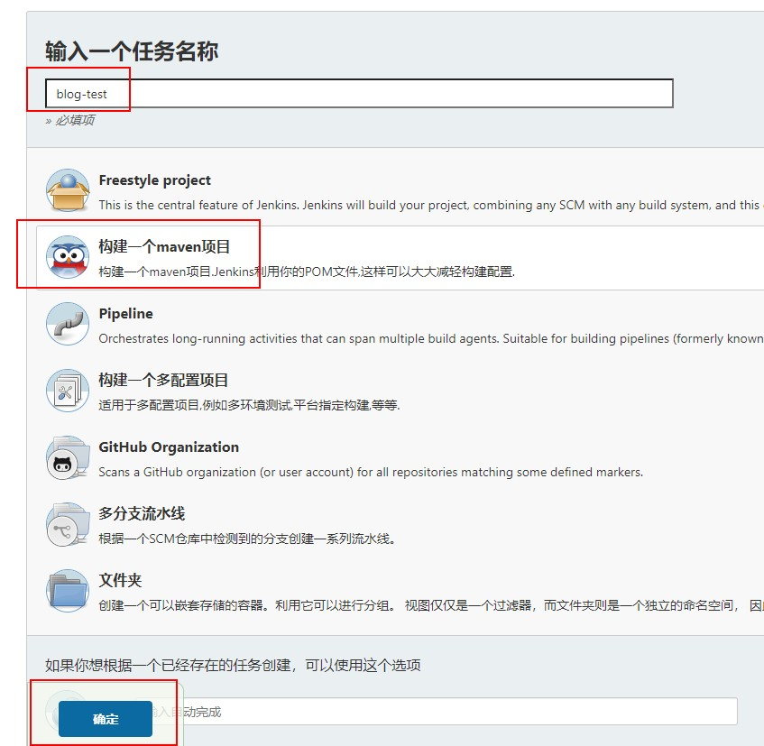

### 配置构建天数

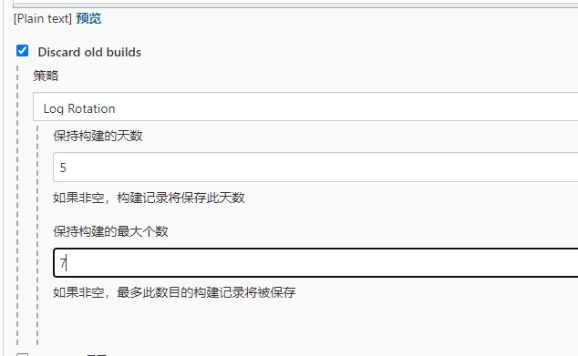

### 配置Git管理

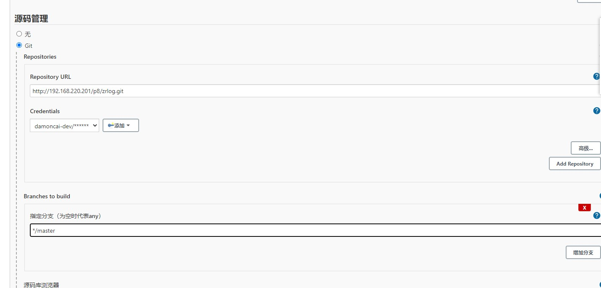

### build 配置

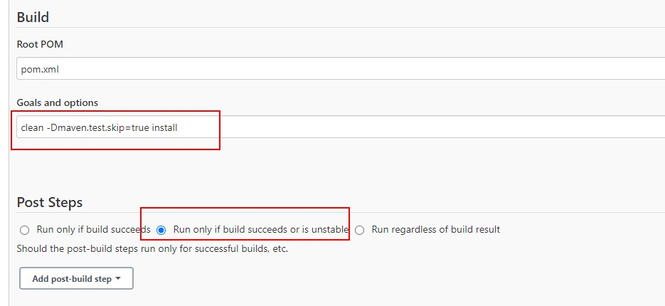

### 配置完毕立即执行

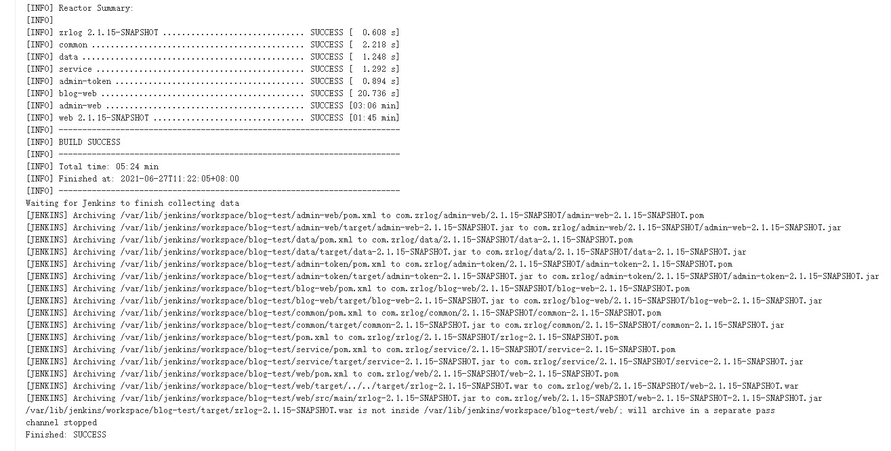