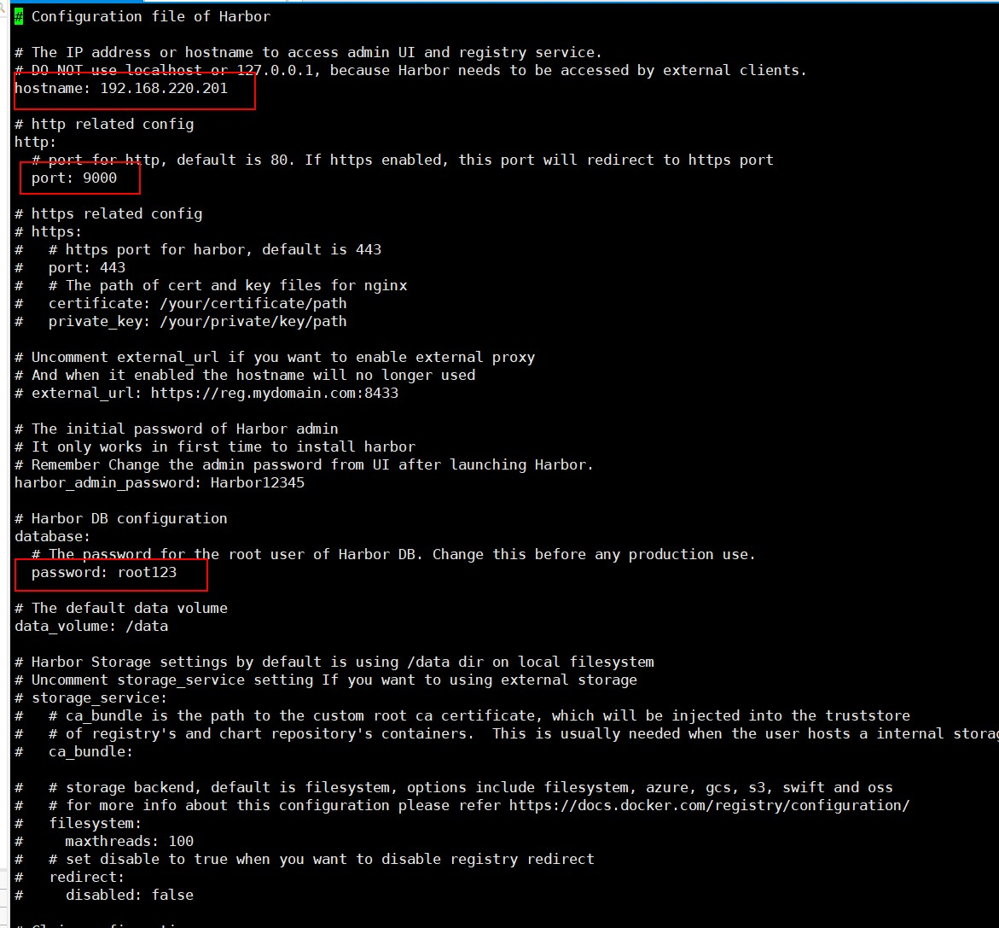
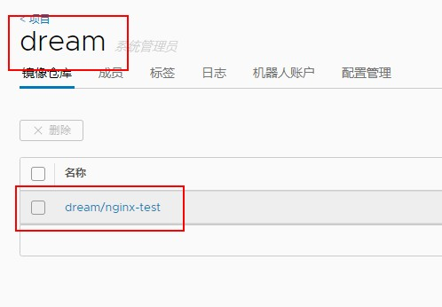

# Docker 安装

1. 升级yum到最新

   ```shell
   yum update
   ```

2. 安装必要依赖

   ```shell
   yum install -y yum-utils device-mapper-persistent-data lvm2
   ```

3. 使用阿里源安装

   ```shell
   yum-config-manager --add-repo http://mirrors.aliyun.com/docker-ce/linux/centos/docker-ce.repo
   ```

4. 查看仓库中Docker版本

   ```shell
   yum list docker-ce --showduplicates | sort -r
   ```

5. 可以指定安装版本号

   ```shell
   yum install -y docker-ce-18.03.1.ce
   
   systemctl start docker
   
   systemctl enable docker
   
   docker version
   ```

6. 配置阿里云镜像加速

   ```shell
   sudo mkdir -p /etc/docker
   sudo tee /etc/docker/daemon.json <<-'EOF'
   {
     "registry-mirrors": ["https://29tcwn8s.mirror.aliyuncs.com"]
   }
   
   EOF
   sudo systemctl daemon-reload
   sudo systemctl restart docker
   ```

# Docker-Compose安装

**官方安装教程 https://docs.docker.com/compose/install/**

**具体步骤如下：**

1. 获取Docker Compose的最新稳定版本：

   ```shell
   curl -L "https://github.com/docker/compose/releases/download/1.24.1/docker-compose-$(uname -s)-$(uname -m)" -o /usr/local/bin/docker-compose
   ```

2. 对二进制文件授予可执行权限：

   ```shell
   chmod +x /usr/local/bin/docker-compose
   ```

3. 创建link：

   ```shell
   ln -s /usr/local/bin/docker-compose /usr/bin/docker-compose
   ```

4. 查看是否安装成功

   ```shell
   docker-compose -v
   ```

# Harbor安装

1. 创建目录

   ```shell
   mkdir /home/harbor
   cd /home/harbor
   ```

2. 下载Harbor离线安装包

   ```
   wget https://storage.googleapis.com/harbor-releases/release-1.8.0/harbor-offline-installer-v1.8.4.tgz
   ```

   下载不了可以使用网盘下载

   ```shell
   链接：https://pan.baidu.com/s/1TwP6HxYcECBHHTzVxwo9CQ 
   提取码：dacu 
   --来自百度网盘超级会员V6的分享
   ```

3. 解压

4. 修改Harbor配置文件：

   ```shell
   vi harbor/harbor.yml
   ```

   将hostname修改为宿主机IP即可：

   

5. 然后执行当前目录下的install.sh脚本进行安装：

   ```shell
   harbor/install.sh
   ```

6. WEB 登录

   ```shell
   默认的用户名密码为：admin，Harbor12345
   ```

7. Docker登录Harbor

   如果在某台安装docker机器上登录Harbor需要再/etc/docker/daemon.json 文件中配置Harbor仓库实例地址

   ```shell
   vi /etc/docker/daemon.json
   
   # 添加
   "insecure-registries": ["192.168.220.201:9000"]
   
   # 刷新配置
   sudo systemctl daemon-reload
   sudo systemctl restart docker
   ```

# Harbor上传和下载镜像

1. 下载nginx

   ```shell
   docker pull nginx
   ```

2. 修改标签

   ```shell
   # Harbor IP : PORT/仓库名/镜像名称:版本
   
   docker tag nginx:latest 192.168.220.201:9000/dream/nginx-test:v1
   ```

3. 推送到仓库

   ```shell
   docker push 192.168.220.201:9000/dream/nginx-test
   ```

   

4. 将原先镜像删除 再 拉取镜像

   ```shell
   # 删除原镜像
   docker rmi 192.168.220.201:9000/dream/nginx-test:v1
   
   # 从Harbor仓库中拉取镜像
   docker pull 192.168.220.201:9000/dream/nginx-test:v1
   ```

   

   