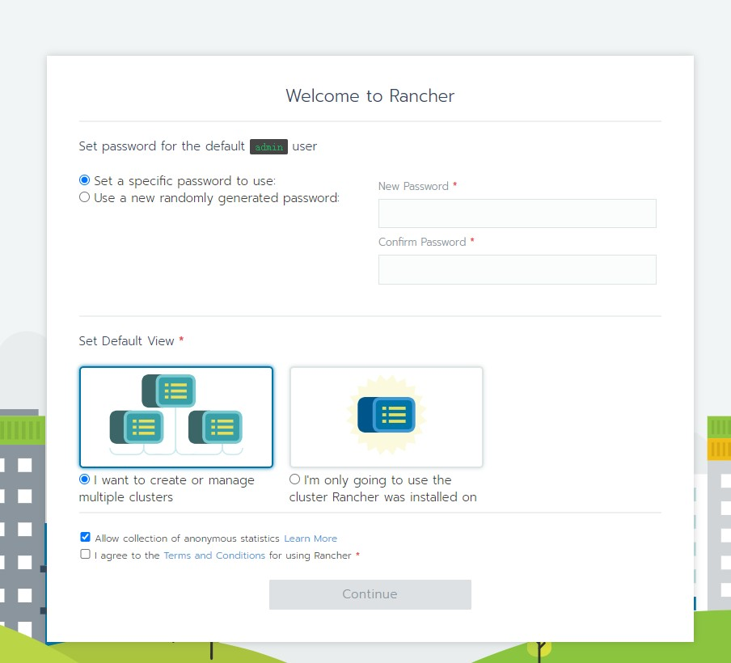
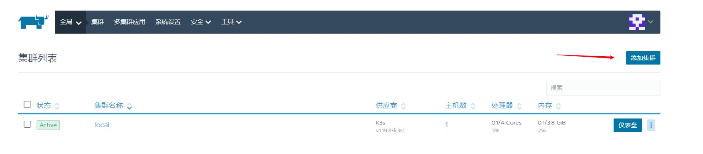
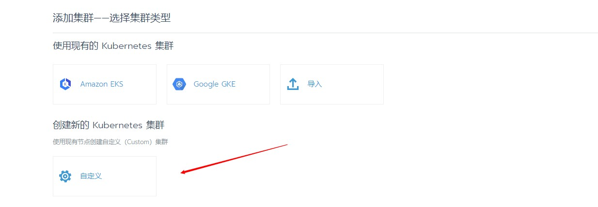
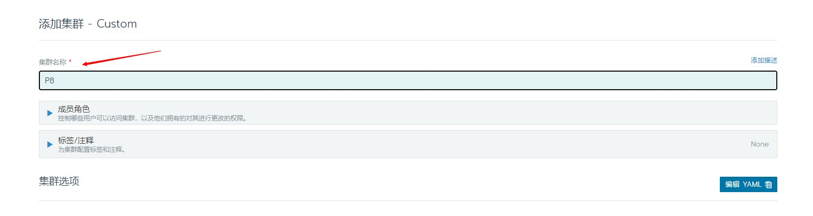
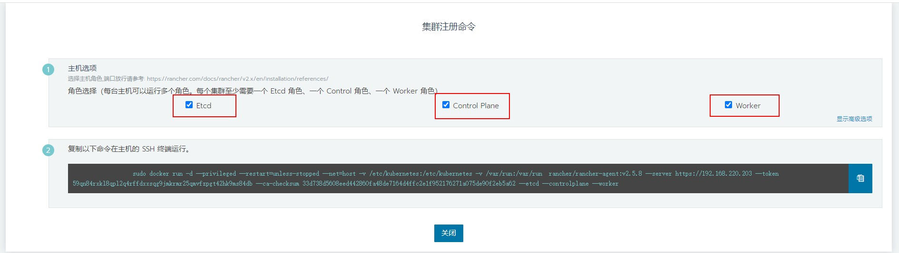

# Rancher 安装

## Docker 启动Rancher

```shell
docker run -d --restart=unless-stopped -p 80:80 -p 443:443 rancher/rancher:v2.4.5

# 注意
当时没有添加版本号，默认最新(2.5.8),创建master后，集群配置中没有添加主机节点功能
```



# Rancher上安装k8s  (各个主机hostname不能有相同的)

1. 创建一个集群

   

2. 自定义创建

   

3. 输入集群名称 - 点击下一步

   

4. 创建master （需要各个节点时间保持一致）

   1. 三个都勾选上

   2. 复制代码，在master主机上执行

      

   

# 错误解决

1. Server certificate is not valid, please check if the host has the correct time configured and if the server certificate has a notAfter date and time in the future. Certificate information is displayed above. error: Get \"https://192.168.220.203\": x509: certificate has expired or is not yet valid: current time 2021-06-27T22:08:12Z is before 2021-06-29T13:10:54Z"

   ```shell
   1.使用date命令查看Rancher主机和master主机，看看时间一不一致
   2.时间不一致，执行 ntpdate cn.pool.ntp.org
   ```

sudo docker run -d --privileged --restart=unless-stopped --net=host -v /etc/kubernetes:/etc/kubernetes -v /var/run:/var/run  rancher/rancher-agent:v2.5.8 --server https://192.168.220.203 --token h6brk6lt5p6j2rfl97r5zv5w52d8nrpn5d9rkr2r4lws2wssp5rsch --ca-checksum 33d738d5608eed442860fa48de7164d4ffc2e1f952176271a075de90f2eb5a62 --worker
   https://192.168.220.203/g/clusters/add/launch/custom

2. Error response from daemon: {"message":"No such container: kubelet"}

   ```shell
   各个主机名称 hostname有相同导致的，修改hostname并重启
   ```

   