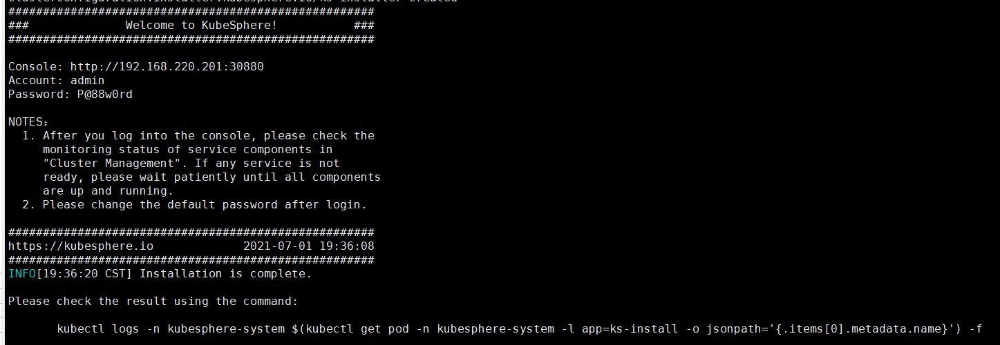

# KubeSphere 安装

参考：https://kubesphere.io/zh/docs/installing-on-linux/on-premises/install-kubesphere-on-bare-metal/

## Linux主机准备

### 系统要求

| 系统                                                         | 最低要求（每个节点）             |
| :----------------------------------------------------------- | :------------------------------- |
| **Ubuntu** *16.04，18.04*                                    | CPU：2 核，内存：4 G，硬盘：40 G |
| **Debian** *Buster，Stretch*                                 | CPU：2 核，内存：4 G，硬盘：40 G |
| **CentOS** *7*.x                                             | CPU：2 核，内存：4 G，硬盘：40 G |
| **Red Hat Enterprise Linux** *7*                             | CPU：2 核，内存：4 G，硬盘：40 G |
| **SUSE Linux Enterprise Server** *15* **/openSUSE Leap** *15.2* | CPU：2 核，内存：4 G，硬盘：40 G |

### 节点要求

- 所有节点必须都能通过 `SSH` 访问。
- 所有节点时间同步。
- 所有节点都应使用 `sudo`/`curl`/`openssl`。

### 容器运行时

您的集群必须有一个可用的容器运行时。如果您使用 KubeKey 搭建集群，KubeKey 会默认安装最新版本的 Docker。或者，您也可以在创建集群前手动安装 Docker 或其他容器运行时。

| 支持的容器运行时                   | 版本    |
| :--------------------------------- | :------ |
| Docker                             | 19.3.8+ |
| containerd（试验版，未经充分测试） | 最新版  |
| CRI-O（试验版，未经充分测试）      | 最新版  |
| iSula（试验版，未经充分测试）      | 最新版  |

### 依赖项要求

KubeKey 可以一同安装 Kubernetes 和 KubeSphere。根据要安装的 Kubernetes 版本，需要安装的依赖项可能会不同。您可以参考下表，查看是否需要提前在节点上安装相关依赖项。

| 依赖项      | Kubernetes 版本 ≥ 1.18 | Kubernetes 版本 < 1.18 |
| :---------- | :--------------------- | :--------------------- |
| `socat`     | 必须                   | 可选，但建议安装       |
| `conntrack` | 必须                   | 可选，但建议安装       |
| `ebtables`  | 可选，但建议安装       | 可选，但建议安装       |
| `ipset`     | 可选，但建议安装       | 可选，但建议安装       |

**如果没有，使用yum安装**

### 网络和 DNS 要求

- 请确保 `/etc/resolv.conf` 中的 DNS 地址可用，否则，可能会导致集群中的 DNS 出现问题。
- 如果您的网络配置使用防火墙规则或安全组，请务必确保基础设施组件可以通过特定端口相互通信。建议您关闭防火墙。有关更多信息，请参见[端口要求](https://kubesphere.io/zh/docs/installing-on-linux/introduction/port-firewall/)。
- 支持的 CNI 插件：Calico 和 Flannel。其他插件也适用（例如 Cilium 和 Kube-OVN 等），但请注意它们未经充分测试。

## 主机划分

| 主机 IP         | 主机名 | 角色         |
| :-------------- | :----- | :----------- |
| 192.168.220.201 | master | master, etcd |
| 192.168.220.202 | node1  | worker       |
| 192.168.220.203 | node2  | worker       |

## 安装步骤(重点)

1. 设置主机名

   ```shell
   hostnamectl set-hostname master | node1 | node2
   ```

2. 设置时间（时间同步）

   ```shell
   yum install -y chrony
   
   systemctl enable chronyd
   
   systemctl start chronyd
   
   timedatectl set-ntp true
   ```

3. 设置时区

   ```shell
   timedatectl set-timezone Asia/Shanghai
   
   #检查 ntp-server 是否可用
   chronyc activity -v
   ```

4. 防火墙设置 （关闭防火墙或者开放端口）

5. 更新系统包和依赖项

   ```shell
   yum update
   
   yum install openssl openssl-devel
   
   yum install socat
   
   yum install epel-release
   
   yum install conntrack-tools
   ```

6. 下载KubeKey

   1. 从 [GitHub Release Page](https://github.com/kubesphere/kubekey/releases) 下载 KubeKey 或使用以下命令（访问GitHub/Googleleapis不受限）：

      ```shell
      curl -sfL https://get-kk.kubesphere.io | VERSION=v1.1.0 sh -
      ```

   2. 访问GitHub/Googleleapis受限

      ```shell
      # 先执行以下命令以确保您从正确的区域下载 KubeKey
      export KKZONE=cn
      
      # 执行以下命令下载 KubeKey
      curl -sfL https://get-kk.kubesphere.io | VERSION=v1.1.0 sh -
      ```

   3. 为 `kk` 文件添加可执行权限。

      ```shell
      chmod +x kk
      ```

7. 创建多节点集群

   您可用使用 KubeKey 同时安装 Kubernetes 和 KubeSphere，通过自定义配置文件中的参数创建多节点集群

   创建安装有 KubeSphere 的 Kubernetes 集群（例如使用 `--with-kubesphere v3.1.0`）

   ```shell
   ./kk create config --with-kubernetes v1.20.4 --with-kubesphere v3.1.0
   ```

   **备注**

   - 安装 KubeSphere v3.1.0 的建议 Kubernetes 版本：v1.17.9，v1.18.8，v1.19.8 以及 v1.20.4。如果不指定 Kubernetes 版本，KubeKey 将默认安装 Kubernetes v1.19.8。有关受支持的 Kubernetes 版本的更多信息，请参见[支持矩阵](https://kubesphere.io/zh/docs/installing-on-linux/introduction/kubekey/#支持矩阵)。
   - 如果您在这一步的命令中不添加标志 `--with-kubesphere`，则不会部署 KubeSphere，只能使用配置文件中的 `addons` 字段安装 KubeSphere，或者在您后续使用 `./kk create cluster` 命令时再次添加该标志。
   - 如果您添加标志 `--with-kubesphere` 时不指定 KubeSphere 版本，则会安装最新版本的 KubeSphere。

8. 修改环境

   ```shell
   vi config-sample.yaml
   ```

   ```shell
   apiVersion: kubekey.kubesphere.io/v1alpha1
   kind: Cluster
   metadata:
     name: config-sample
   spec:
     hosts:
     - {name: master1, address: 192.168.60.152, internalAddress: 192.168.60.152, user: root, password: P@ssw0rd}
     - {name: worker1, address: 192.168.60.153, internalAddress: 192.168.60.153, user: root, password: P@ssw0rd}
     - {name: worker2, address: 192.168.60.154, internalAddress: 192.168.60.154, user: root, password: P@ssw0rd}
     roleGroups:
       etcd:
       - master1
       master:
       - master1
       worker:
       - worker1
       - worker2
     controlPlaneEndpoint:
       domain: lb.kubesphere.local
       address: ""                    
       port: "6443"
   ```

   1. 修改address、internalAddress、root和password(用户名对应的密码)
   2. 修改etcd节点
   3. 修改master节点
   4. 修改node节点

   详细配置说明参考：https://kubesphere.io/zh/docs/installing-on-linux/introduction/multioverview/

9. 启动

   ```shell
   ./kk create cluster -f config-sample.yaml
   ```

   需要等待10-20分钟

10. 结果

    

