# Jenkins 安装

参考：18_CICD项目中Jenkins安装

# Jenkins 环境配置

参考：18_CICD项目中 03_Jenkins 自动构建Maven项目

# Jenkins 拉取 GitLab代码两种方式

1. Jenkins上安装Git插件

   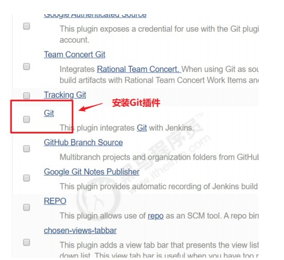

2. Jenkins上安装Git

   ```shell
   yum install git -y 安装
   
   git --version 安装后查看版本
   ```

## SSH

SSH免密登录示意图:

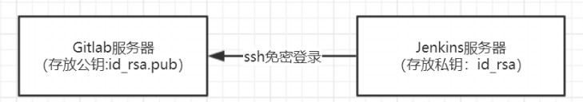


1. 使用root用户生成公钥和私钥

   > ssh-keygen -t rsa

   在/root/.ssh/目录保存了公钥和使用

   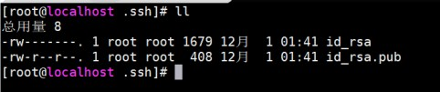

   >id_rsa：私钥文件
   >
   >id_rsa.pub：公钥文件

2. 把生成的公钥放在Gitlab中

   以root账户登录->点击头像->Settings->SSH Keys

   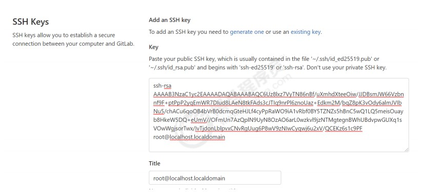

3. 在Jenkins中添加凭证，配置私钥

   在Jenkins添加一个新的凭证，类型为"SSH Username with private key"，把刚才生成私有文件内容复制过来

   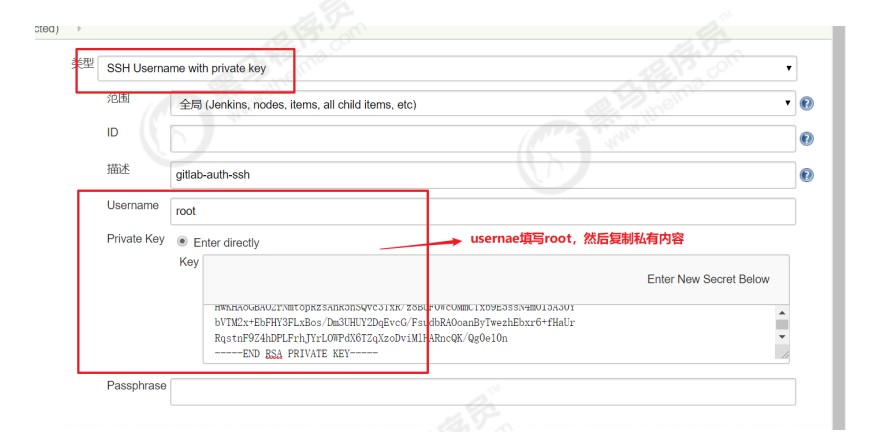

4. 在任务配置中选中Git -> 复制SSh和选中相关秘钥

   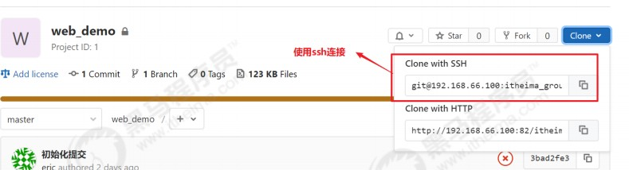

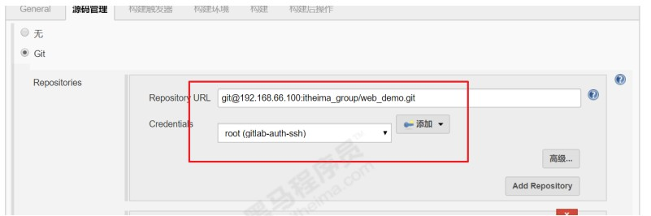

5. Buid 查看控制台输出

## 用户名和密码

**填写的用户名密码就是GitLab上登录的账户**

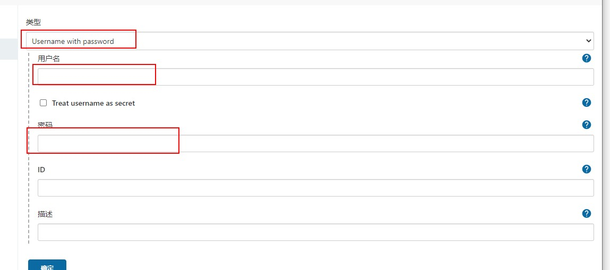


# Jenkins构建Pipeline流水线项目结构

## Pipeline描述

Pipeline，简单来说，就是一套运行在 Jenkins 上的工作流框架，将原来独立运行于单个或者多个节点的任务连接起来，实现单个任务难以完成的复杂流程编排和可视化的工作。

Pipeline以代码的形式实现，通常被检入源代码控制，使团队能够编辑，审查和迭代其传送流程。 持久：无论是计划内的还是计划外的服务器重启，Pipeline都是可恢复的。 可停止：Pipeline可接收交互式输入，以确定是否继续执行Pipeline。 多功能：Pipeline支持现实世界中复杂的持续交付要求。它支持fork/join、循环执行，并行执行任务的功能。 可扩展：Pipeline插件支持其DSL的自定义扩展 ，以及与其他插件集成的多个选项

- Pipeline 脚本是由 **Groovy** 语言实现的，但是我们没必要单独去学习 Groovy
- Pipeline 支持两种语法：**Declarative**(声明式)和 **Scripted Pipeline**(脚本式)语法
- Pipeline 也有两种创建方法：可以直接在 Jenkins 的 Web UI 界面中输入脚本；也可以通过创建一个 Jenkinsfifile 脚本文件放入项目源码库中（一般我们都推荐在 Jenkins 中直接从源代码控制(SCM)中直接载入 Jenkinsfifile Pipeline 这种方法）。

## 使用

### 安装插件

**Manage Jenkins->Manage Plugins->可选插件**

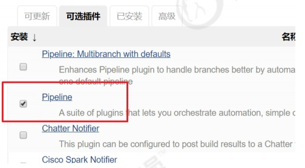

**安装插件后，创建项目的时候多了“流水线”类型**

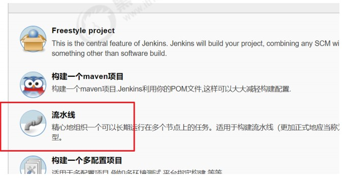

### Pipeline语法快速入门(声明式)

1. 创建项目

   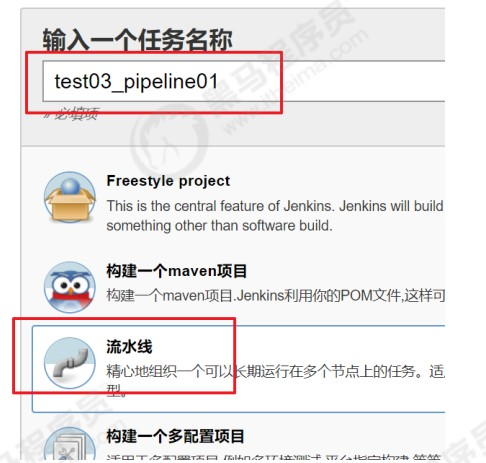

2. 流水线->选择HelloWorld模板

   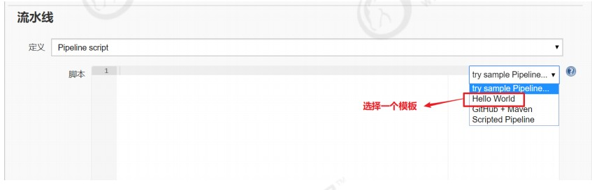

3. 模板内容解释

   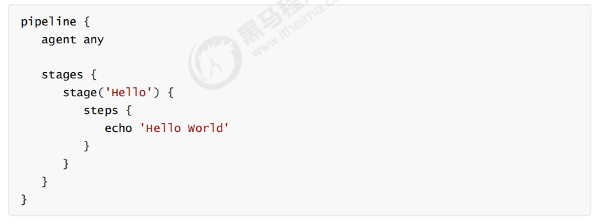

   stages：代表整个流水线的所有执行阶段。通常stages只有1个，里面包含多个stage

   stage：代表流水线中的某个阶段，可能出现n个。一般分为拉取代码，编译构建，部署等阶段。

   steps：代表一个阶段内需要执行的逻辑。steps里面是shell脚本，git拉取代码，ssh远程发布等任意内容

4. 编写一个简单声明式Pipeline： 

   ```shell
   pipeline { 
   	agent any stages { 
   		stage('拉取代码') { 
   			steps { echo '拉取代码' } 
   		}stage('编译构建') { 
   			steps { echo '编译构建' } 
   		}stage('项目部署') { 
   		steps { echo '项目部署' } 
   		} 
   	}
   }
   ```

5. 点击build查看构建过程

   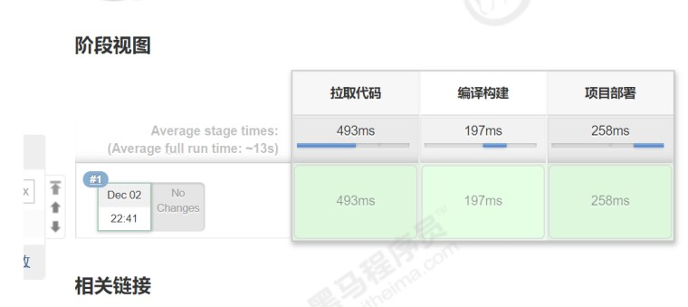

### Pipeline语法快速入门(脚本式)

1. 选择Scripted Pipeline

   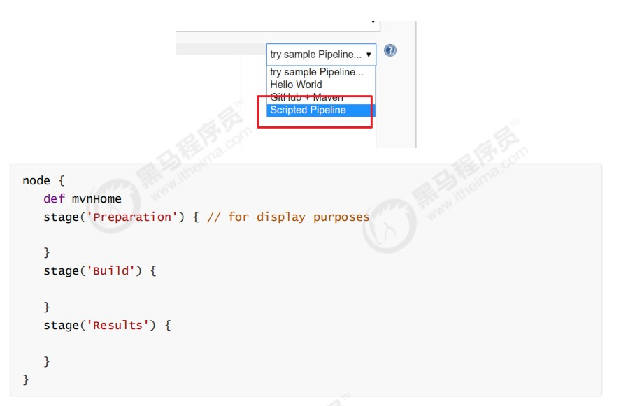

   ​		

   - Node：节点，一个 Node 就是一个 Jenkins 节点，Master 或者 Agent，是执行 Step 的具体运行环境，后续讲到Jenkins的Master-Slave架构的时候用到。
   - Stage：阶段，一个 Pipeline 可以划分为若干个 Stage，每个 Stage 代表一组操作，比如：Build、Test、Deploy，Stage 是一个逻辑分组的概念。
   - Step：步骤，Step 是最基本的操作单元，可以是打印一句话，也可以是构建一个 Docker 镜像，由各类 Jenkins 插件提供，比如命令：sh ‘make’，就相当于我们平时 shell 终端中执行 make 命令一样。

2. 编写一个简单的脚本式Pipeline

   ```shell
   node { 
   	def mvnHome 
   	stage('拉取代码') { // for display purposes 
   		echo '拉取代码' }
   	stage('编译构建') { 
   		echo '编译构建' 
   	}stage('项目部署') { 
   		echo '项目部署' 
   	} 
   }
   ```

3. 执行

### 使用流水线语法和片段生成器执行拉取代合和编译

1. 选中片段生成器

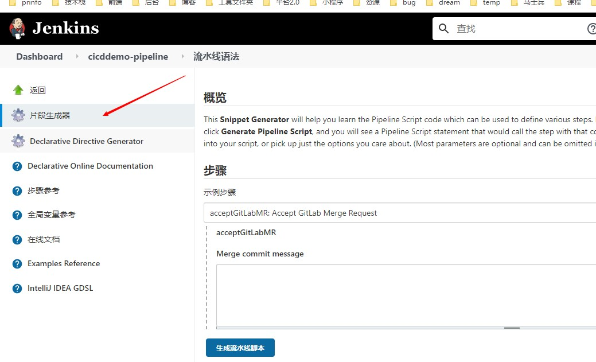

2. 生成拉取代码脚本

   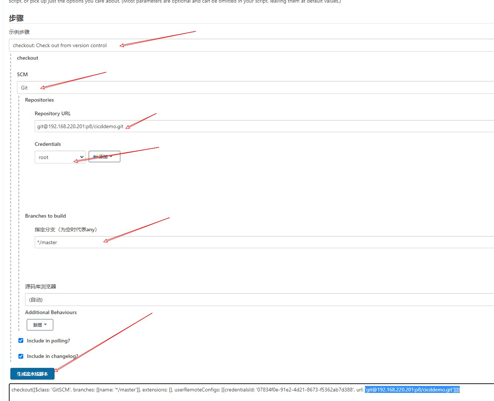

3. 生成编译脚本

   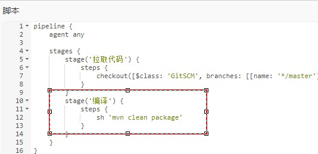

4. 编译查看结果

   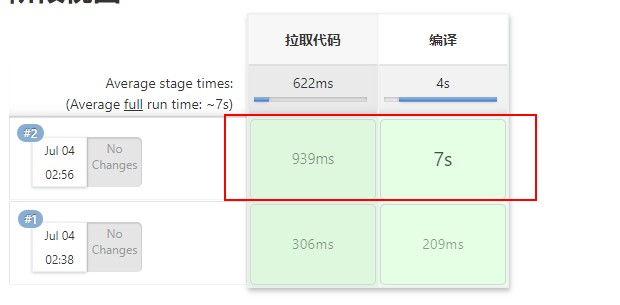


## Pipeline Script from SCM

刚才我们都是直接在Jenkins的UI界面编写Pipeline代码，这样不方便脚本维护，建议把Pipeline脚本放在项目中（一起进行版本控制）

1. 在项目根目录建立Jenkinsfifile文件，把内容复制到该文件中

   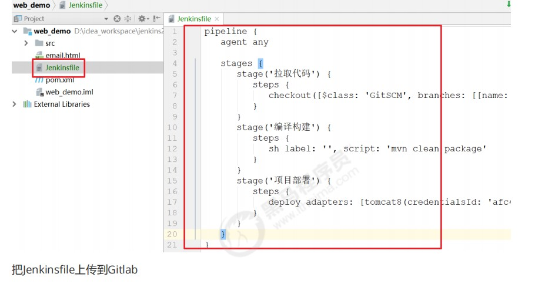

2. 上传到Gitlab

3. 在项目中引用该文件

   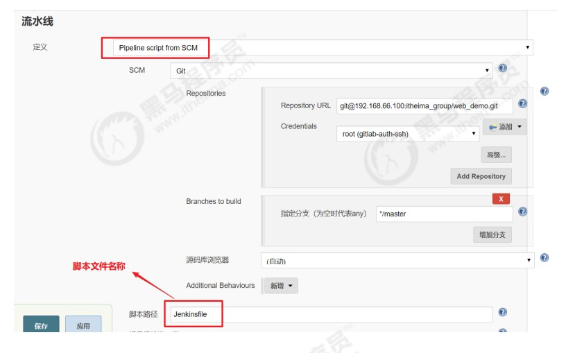

4. build


# Jenkins常用的触发器

## jenkins内置了种触发器

### 触发远程构建

1. 创建一个身份令牌

   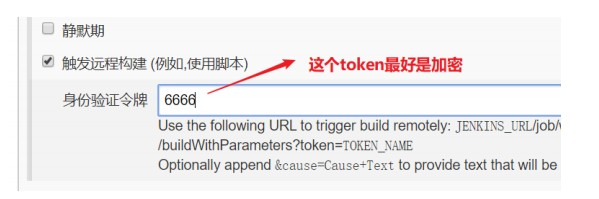

2. 通过请求方式触发构建

   http://192.168.220.202:8080/job/cicddemo-pipeline/build?token=6666


### **其他工程构建后触发**

当一个项目build构建之后触发构建

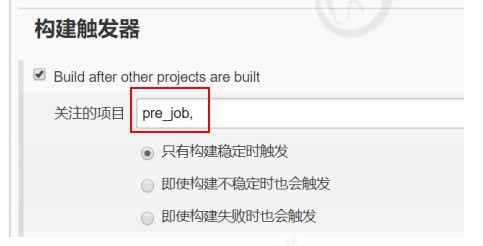

类似于监听器，监听某个项目，当这个项目被构建后触发本项目构建


### 定时构建

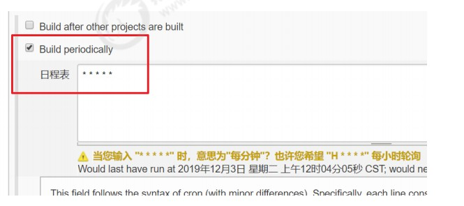

**定时字符串从左往右分别为： 分 时 日 月 周**

**一些定时表达式的例子：**

>每30分钟构建一次：H代表形参 H/30 * * * * 10:02 10:32

> 每2个小时构建一次: H H/2 * * *

> 每天的8点，12点，22点，一天构建3次： (多个时间点中间用逗号隔开) 0 8,12,22 * * *

> 每天中午12点定时构建一次 H 12 * * *

> 每天下午18点定时构建一次 H 18 * * *

> 在每个小时的前半个小时内的每10分钟 H(0-29)/10 * * * *

> 每两小时一次，每个工作日上午9点到下午5点(也许是上午10:38，下午12:38，下午2:38，下午4:38) H H(9-16)/2 * * 1-5


### 轮询SCM

轮询SCM，是指定时扫描本地代码仓库的代码是否有变更，如果代码有变更就触发项目构建

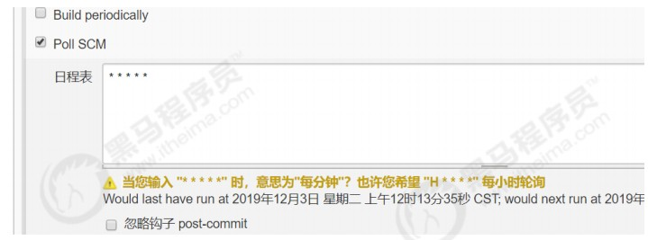

注意：这次构建触发器，Jenkins会定时扫描本地整个项目的代码，增大系统的开销，不建议使用

## 插件构建 - Git hook自动触发构建

刚才我们看到在Jenkins的内置构建触发器中，轮询SCM可以实现Gitlab代码更新，项目自动构建，但是该方案的性能不佳。那有没有更好的方案呢？ 有的。就是利用Gitlab的webhook实现代码push到仓库，立即触发项目自动构建。

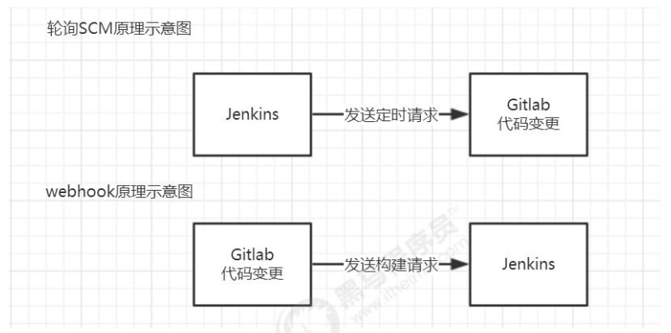

### 安装Gitlab Hook插件

**需要安装两个插件：**

> Gitlab Hook和GitLab

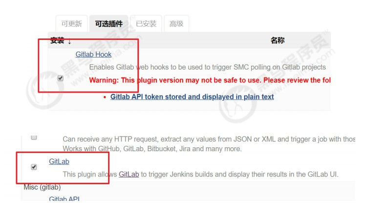

### Jenkins设置自动构建

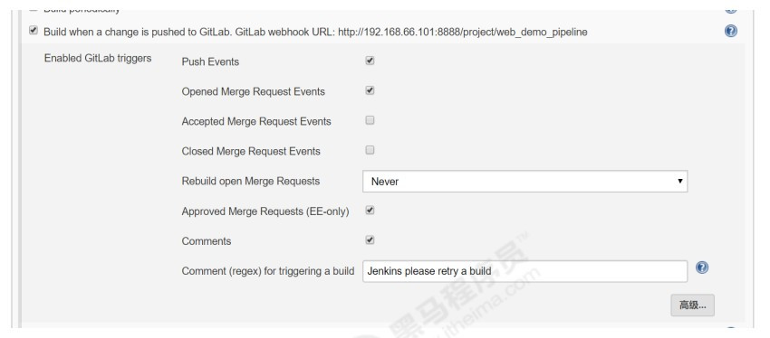


**等会需要把生成的webhook URL配置到Gitlab中。**


### Gitlab配置webhook

1. 开启webhook功能

   > 使用root账户登录到后台，点击Admin Area -> Settings -> Network
   >
   > 勾选"Allow requests to the local network from web hooks and services"

   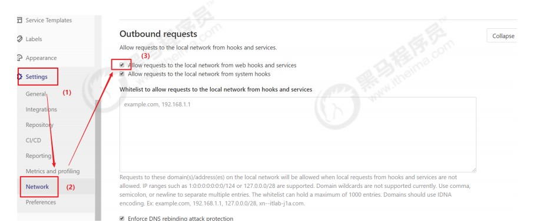

2. 在项目添加webhook

   > 点击项目->Settings->Integrations

   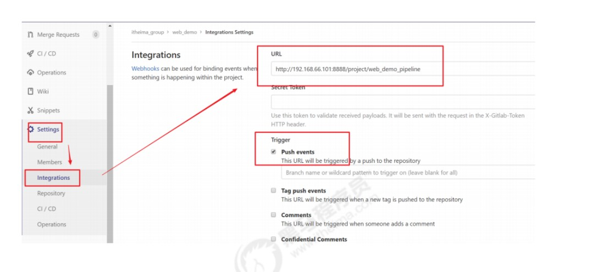

   >注意：以下设置必须完成，否则会报错！
   >
   >Manage Jenkins->Confifigure System

   

   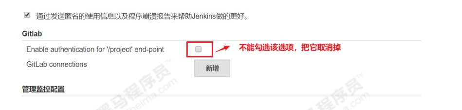

**如果勾选上代表需要做认证，具体可看 18_CICD工程下的 04_自动一体化**


# Jenkins 参数化构建

有时在项目构建的过程中，我们需要根据用户的输入动态传入一些参数，从而影响整个构建结果，这时我们可以使用参数化构建。

**Jenkins支持非常丰富的参数类型**

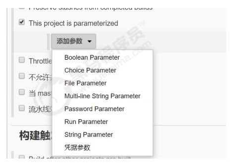

## Demo 通过构建参数，构建不同分支数据

1. Git上创建dev分支

   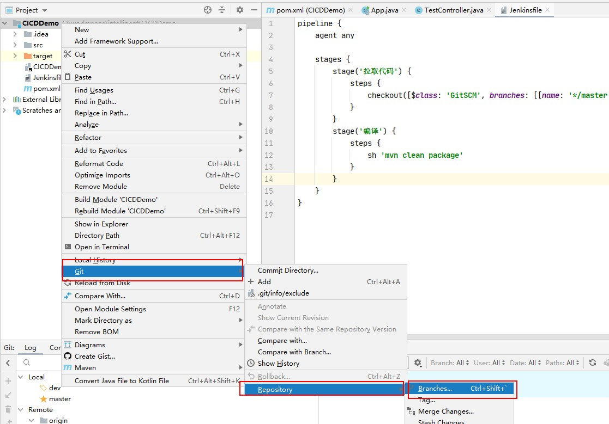

2. 在Jenkins添加字符串类型参数

   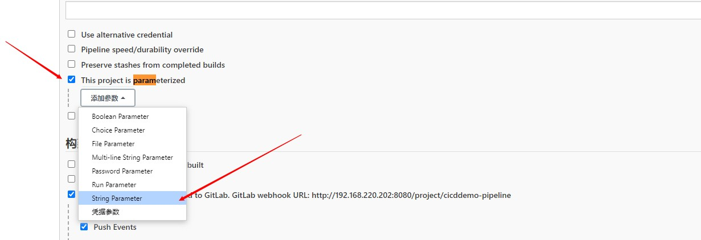

   ​	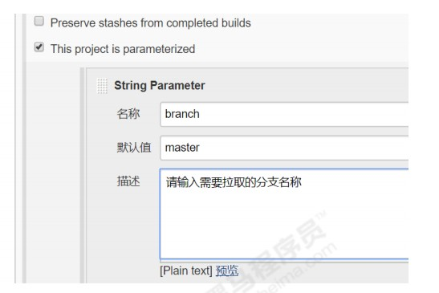

3. 改动pipeline流水线代码

   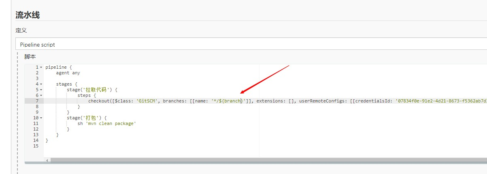

4. 结果

   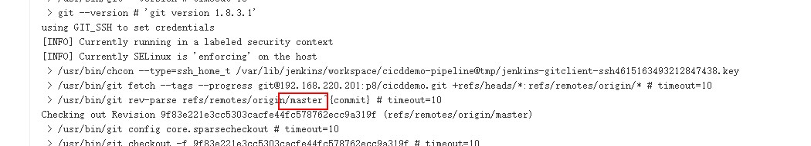

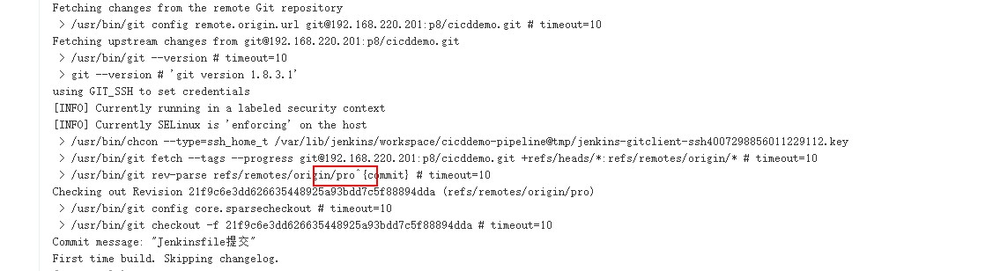

# 邮箱配置

1. 安装`Email Extension`插件

   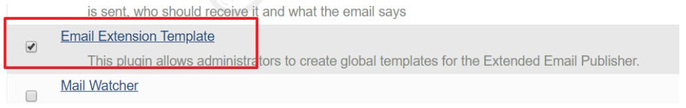

2. Jenkins设置邮箱相关参数

   > Manage Jenkins->Confifigure System

   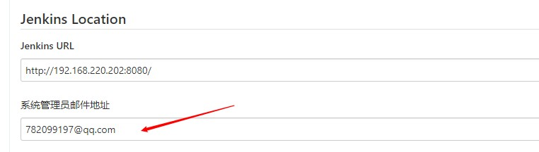

   发件人邮箱

   > 设置邮件参数

   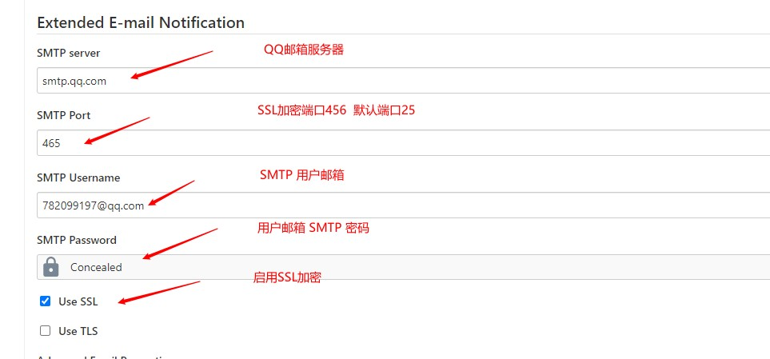

​	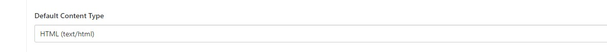

​		发送HTML邮件


​	

​		3.在项目根目录编写email.html，并把文件推送到Gitlab，内容如下：

​		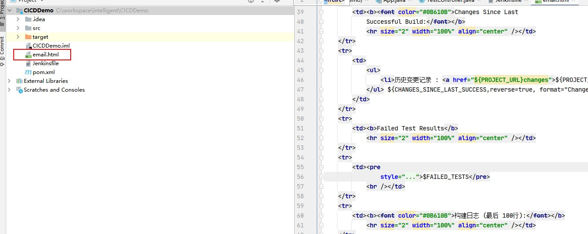

```html
<!DOCTYPE html>
<html>
<head>
    <meta charset="UTF-8">
    <title>${ENV, var="JOB_NAME"}-第${BUILD_NUMBER}次构建日志</title>
</head>

<body leftmargin="8" marginwidth="0" topmargin="8" marginheight="4"
      offset="0">
<table width="95%" cellpadding="0" cellspacing="0"
       style="font-size: 11pt; font-family: Tahoma, Arial, Helvetica, sans-serif">
    <tr>
        <td>(本邮件是程序自动下发的，请勿回复！)</td>
    </tr>
    <tr>
        <td><h2>
            <font color="#0000FF">构建结果 - ${BUILD_STATUS}</font>
        </h2></td>
    </tr>
    <tr>
        <td><br />
            <b><font color="#0B610B">构建信息</font></b>
            <hr size="2" width="100%" align="center" /></td>
    </tr>
    <tr>
        <td>
            <ul>
                <li>项目名称&nbsp;：&nbsp;${PROJECT_NAME}</li>
                <li>构建编号&nbsp;：&nbsp;第${BUILD_NUMBER}次构建</li>
                <li>触发原因：&nbsp;${CAUSE}</li>
                <li>构建日志：&nbsp;<a href="${BUILD_URL}console">${BUILD_URL}console</a></li>
                <li>构建&nbsp;&nbsp;Url&nbsp;：&nbsp;<a href="${BUILD_URL}">${BUILD_URL}</a></li>
                <li>工作目录&nbsp;：&nbsp;<a href="${PROJECT_URL}ws">${PROJECT_URL}ws</a></li>
                <li>项目&nbsp;&nbsp;Url&nbsp;：&nbsp;<a href="${PROJECT_URL}">${PROJECT_URL}</a></li>
            </ul>
        </td>
    </tr>
    <tr>
        <td><b><font color="#0B610B">Changes Since Last
            Successful Build:</font></b>
            <hr size="2" width="100%" align="center" /></td>
    </tr>
    <tr>
        <td>
            <ul>
                <li>历史变更记录 : <a href="${PROJECT_URL}changes">${PROJECT_URL}changes</a></li>
            </ul> ${CHANGES_SINCE_LAST_SUCCESS,reverse=true, format="Changes for Build #%n:<br />%c<br />",showPaths=true,changesFormat="<pre>[%a]<br />%m</pre>",pathFormat="&nbsp;&nbsp;&nbsp;&nbsp;%p"}
        </td>
    </tr>
    <tr>
        <td><b>Failed Test Results</b>
            <hr size="2" width="100%" align="center" /></td>
    </tr>
    <tr>
        <td><pre
                style="font-size: 11pt; font-family: Tahoma, Arial, Helvetica, sans-serif">$FAILED_TESTS</pre>
            <br /></td>
    </tr>
    <tr>
        <td><b><font color="#0B610B">构建日志 (最后 100行):</font></b>
            <hr size="2" width="100%" align="center" /></td>
    </tr>
    <tr>
        <td><textarea cols="80" rows="30" readonly="readonly"
                      style="font-family: Courier New">${BUILD_LOG, maxLines=100}</textarea>
        </td>
    </tr>
</table>
</body>
</html>
```

4. 编写jenkinsfifile添加构建后发送邮件

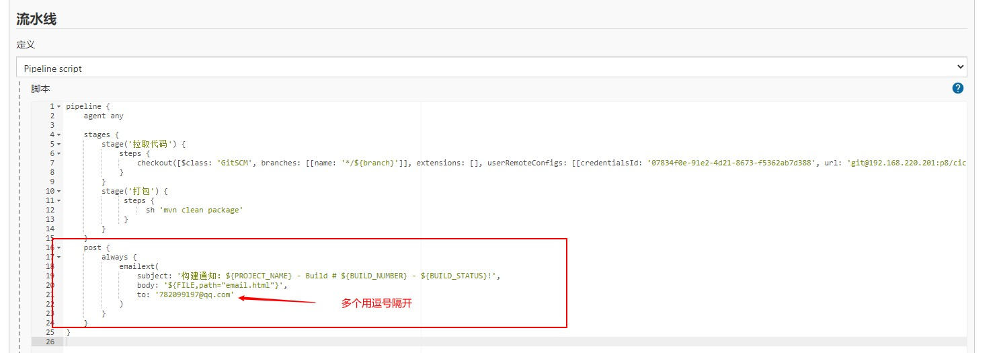

5. 邮件展示

   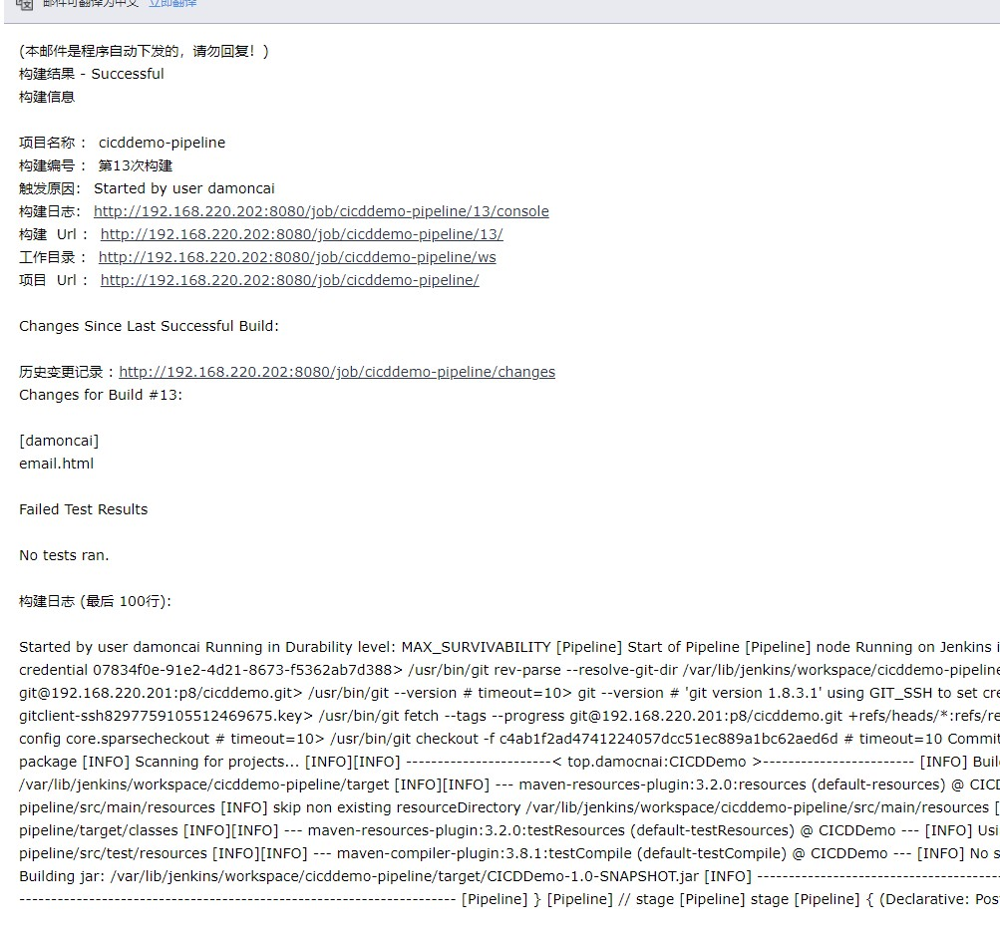

   **PS：邮件相关全局参数参考列表**

   系统设置->Extended E-mail Notifification->Content Token Reference，点击旁边的?号

   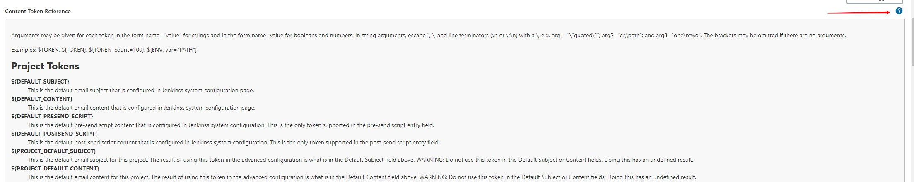


# SonarQube代码审查

## SonarQube安装

1. 环境

     JDK、MySQL、SonarQube 

2. 下载压缩包

   `https://www.sonarqube.org/downloads/`

3. 解压sonar，并设置权限

   ```shell
   yum install unzip
   unzip sonarqube-6.7.4.zip # 解压
   mkdir /opt/sonar 创建目录
   mv sonarqube-6.7.4/* /opt/sonar #移动文件
   useradd sonar #创建sonar用户，必须sonar用于启动，否则报错
   chown -R sonar. /opt/sonar #更改sonar目录及文件权限
   ```

4. 修改sonar配置文件

   在数据库中创建sonar数据库

   ```shell
   vi /opt/sonar/conf/sonar.properties
   
   内容如下(数据库连接)：
   sonar.jdbc.username=root sonar.jdbc.password=Root@123
   sonar.jdbc.url=jdbc:mysql://localhost:3306/sonar?
   useUnicode=true&characterEncoding=utf8&rewriteBatchedStatements=true&useConfigs=
   maxPerformance&useSSL=false
   ```

   **注意：**sonar默认监听9000端口，如果9000端口被占用，需要更改。

5. 启动sonar

   ```shell
   cd /opt/sonar
   su sonar ./bin/linux-x86-64/sonar.sh start 启动
   su sonar ./bin/linux-x86-64/sonar.sh status 查看状态
   su sonar ./bin/linux-x86-64/sonar.sh stop 停止
   tail -f logs/sonar.logs 查看日志
   ```

6. 访问sonar 192.168.220.202:9000

7. 登录创建token

   ```shell
   默认账户：admin/admin
   
   生成的token需要记录下来，需要和jenkins整合
   
   72b30c4d24cc268302a9eb63b02097d8c072031e
   ```

## SonarQube和Jenkins整合

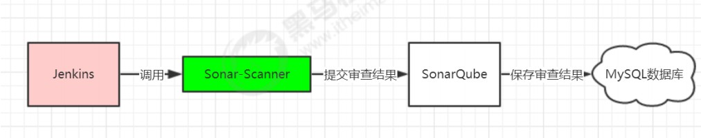

1. 安装SonarQube Scanner插件

   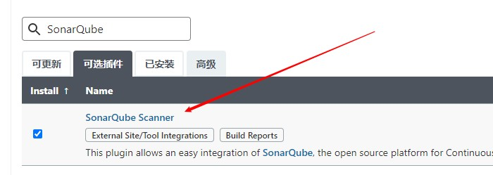

2. 添加SonarQube凭证

   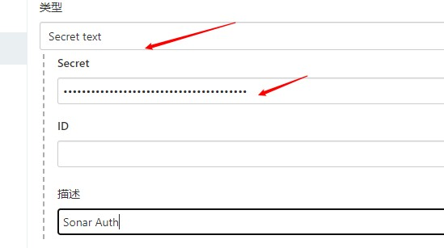
   1. 选择Secret text类型
   2. Secret是Sonar Qube生成的token

3. Jenkins进行SonarQube配置

   Manage Jenkins->Confifigure System->SonarQube servers

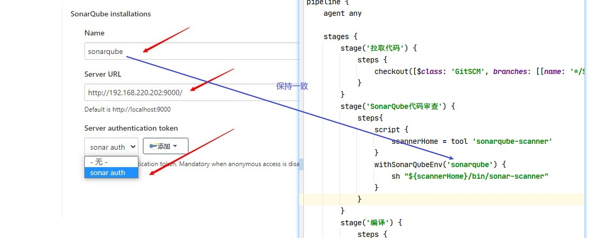


​	  Manage Jenkins->Global Tool Confifiguration

​		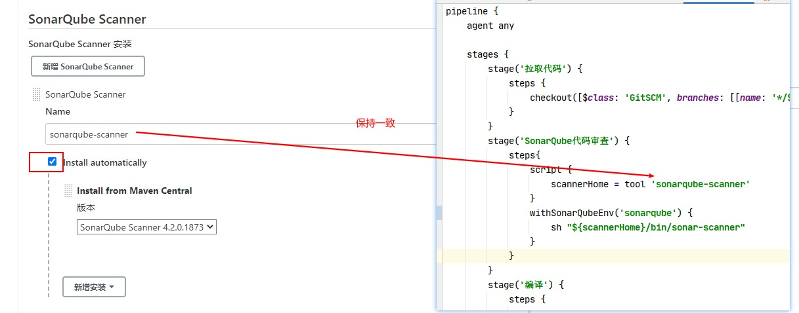

## 在项目添加SonaQube代码审查（非流水线项目）

```shell
# must be unique in a given SonarQube instance 
sonar.projectKey=web_demo
# this is the name and version displayed in the SonarQube UI. Was mandatory prior to SonarQube 6.1. 
sonar.projectName=web_demo
sonar.projectVersion=1.0
# Path is relative to the sonar-project.properties file. Replace "\" by "/" on Windows. 
# This property is optional if sonar.modules is set. 
sonar.sources=.
sonar.exclusions=**/test/**,**/target/**
sonar.java.source=1.8
sonar.java.target=1.8
Dsonar.java.binaries=target/classes
# Encoding of the source code. Default is default system encoding 
sonar.sourceEncoding=UTF-8
```

## 在项目添加SonaQube代码审查（流水线项目）

1. 项目根目录下，创建sonar-project.properties文件

   ```shell
   # must be unique in a given SonarQube instance 
   sonar.projectKey=web_demo
   # this is the name and version displayed in the SonarQube UI. Was mandatory prior to SonarQube 6.1. 
   sonar.projectName=web_demo
   sonar.projectVersion=1.0
   # Path is relative to the sonar-project.properties file. Replace "\" by "/" on Windows. 
   # This property is optional if sonar.modules is set. 
   sonar.sources=. 
   sonar.exclusions=**/test/**,**/target/**
   sonar.java.source=1.8
   sonar.java.target=1.8
   Dsonar.java.binaries=target/classes
   # Encoding of the source code. Default is default system encoding 
   sonar.sourceEncoding=UTF-8
   ```

2. 修改Jenkinsfifile，加入SonarQube代码审查阶段

   ```shell
   pipeline {
       agent any
   
       stages {
           stage('拉取代码') {
               steps {
                   checkout([$class: 'GitSCM', branches: [[name: '*/${branch}']], extensions: [], userRemoteConfigs: [[credentialsId: '07834f0e-91e2-4d21-8673-f5362ab7d388', url: 'git@192.168.220.201:p8/cicddemo.git']]])
               }
           }
           stage('SonarQube代码审查') {
               steps{
                   script {
                       scannerHome = tool 'sonarqube-scanner'
                   }
                   withSonarQubeEnv('sonarqube') {
                       sh "${scannerHome}/bin/sonar-scanner"
                   }
               }
           }
           stage('编译') {
               steps {
                   sh 'mvn clean package'
               }
           }
       }
        post {
           always {
               emailext(
                   subject: '构建通知：${PROJECT_NAME} - Build # ${BUILD_NUMBER} - ${BUILD_STATUS}!',
                   body: '${FILE,path="email.html"}',
                   to: '782099197@qq.com'
               )
           }
       }
   }
   ```

   