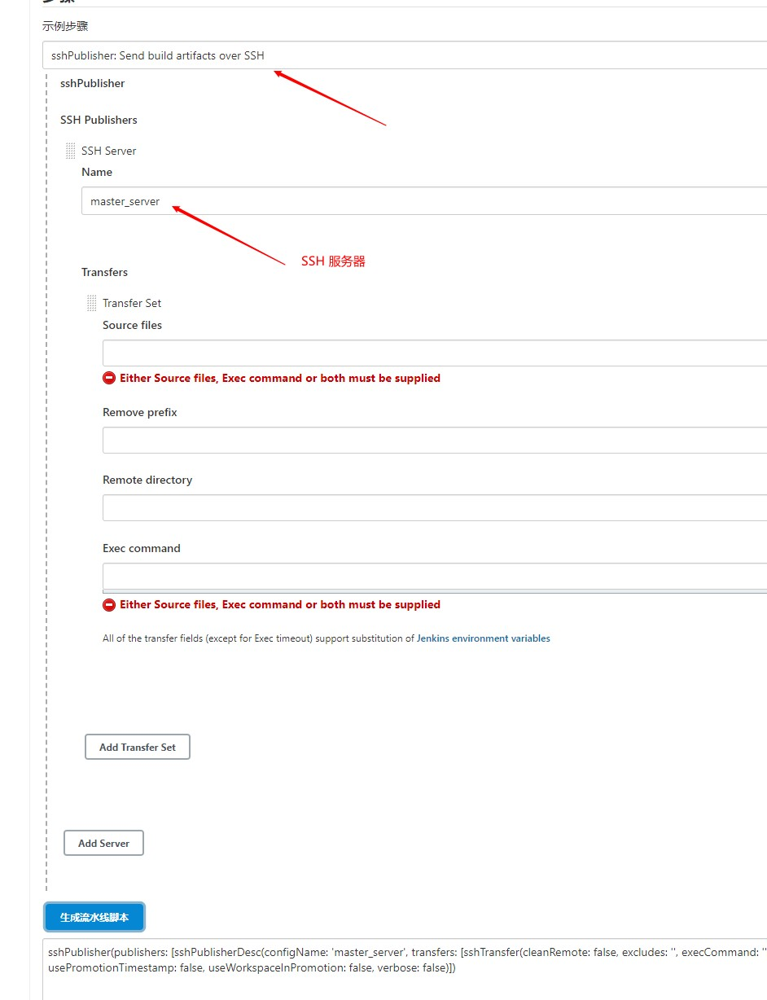

# 后端部署

## 上传后端代码到GitLab上


## 编写Jenkinsfle实现代码拉取

```shell
def git_auth = "3d4ccc33-d166-40d4-8aef-0a00841ad0e6"
def git_url = "http://192.168.220.201:9001/damoncai/tensquare-back.git"

node {
	stage('拉取代码') {
	checkout([$class: 'GitSCM', branches: [[name: '*/${branch}']], extensions: [], userRemoteConfigs: [[credentialsId: "${git_auth}", url: "${git_url}"]]])
	}
}
```

**需要注意的是${git_auth}需要双引号**

## 配置SonarQube代码审查

1. Jenkins上添加参数

   

2. 每个项目的根目录下添加sonar-project.properties

   ```shell
   # must be unique in a given SonarQube instance
   sonar.projectKey=tensquare_admin_service
   # this is the name and version displayed in the SonarQube UI. Was mandatory prior to SonarQube 6.1.
   sonar.projectName=tensquare_admin_service
   sonar.projectVersion=1.0
   
   # Path is relative to the sonar-project.properties file. Replace "\" by "/" on Windows.
   # This property is optional if sonar.modules is set.
   sonar.sources=.
   sonar.exclusions=**/test/**,**/target/**
   sonar.java.binaries=.
   
   sonar.java.source=1.8
   sonar.java.target=1.8
   #sonar.java.libraries=**/target/classes/**
   
   # Encoding of the source code. Default is default system encoding
   sonar.sourceEncoding=UTF-8
   ```

   **注意：修改sonar.projectKey和sonar.projectName**

3. 修改Jenkinsfifile构建脚本

   ```shell
   node {
   	stage('拉取代码') {
   		checkout([$class: 'GitSCM', branches: [[name: '*/${branch}']], extensions: [], userRemoteConfigs: [[credentialsId: "${git_auth}", url: "${git_url}"]]])
   	}
   	stage('代码审查') { 
   		def scannerHome = tool 'sonarqube-scanner' 
   		withSonarQubeEnv('sonarqube') { 
   		# 通过参数化实现打开哪个项目
   			sh """ cd ${project_name} 
   			${scannerHome}/bin/sonar-scanner """ 
   		} 
   	}
   }
   ```

## 完善pipeline实现打包方式

```shell
def git_auth = "3d4ccc33-d166-40d4-8aef-0a00841ad0e6"
def git_url = "http://192.168.220.201:9001/damoncai/tensquare-back.git"

node {
	stage('拉取代码') {
		checkout([$class: 'GitSCM', branches: [[name: '*/${branch}']], extensions: [], userRemoteConfigs: [[credentialsId: "${git_auth}", url: "${git_url}"]]])
	}
	stage('代码审查') { 
		def scannerHome = tool 'sonarqube-scanner' 
		withSonarQubeEnv('sonarqube') { 
			sh """ cd ${project_name} 
			${scannerHome}/bin/sonar-scanner """ 
		} 
	}
	stage('编译公共子工程') { 
		sh "mvn -f tensquare_common clean install"
	}
	stage('编译打包微服务工程') { 
		sh "mvn -f ${project_name} clean package"
	}
}
```

**如果依赖父工程需要将父工程手动打包上传**


## 使用Dockerfile编译、生成镜像

1. 在每个微服务项目的pom.xml加入dockerfifile-maven-plugin插件

   ```shell
    <plugin>
    <groupId>com.spotify</groupId>
    <artifactId>dockerfile-maven-plugin</artifactId>
    <version>1.3.6</version>
        <configuration>
            <repository>${project.artifactId}</repository>
            <buildArgs>
            <JAR_FILE>target/${project.build.finalName}.jar</JAR_FILE>
            </buildArgs>
        </configuration>
    </plugin>
   ```

2. 在每个微服务项目根目录下建立Dockerfifile文件

   ```shell
   #FROM java:8
   FROM openjdk:8-jdk-alpine
   ARG JAR_FILE
   COPY ${JAR_FILE} app.jar
   EXPOSE 10086
   ENTRYPOINT ["java","-jar","/app.jar"]
   ```

3. 编写Jenkinsfile实现打包镜像

   ```shell
   def git_auth = "3d4ccc33-d166-40d4-8aef-0a00841ad0e6"
   def git_url = "http://192.168.220.201:9001/damoncai/tensquare-back.git"
   
   node {
   	stage('拉取代码') {
   		checkout([$class: 'GitSCM', branches: [[name: '*/${branch}']], extensions: [], userRemoteConfigs: [[credentialsId: "${git_auth}", url: "${git_url}"]]])
   	}
   	stage('代码审查') { 
   		def scannerHome = tool 'sonarqube-scanner' 
   		withSonarQubeEnv('sonarqube') { 
   			sh """ cd ${project_name} 
   			${scannerHome}/bin/sonar-scanner """ 
   		} 
   	}
   	stage('编译公共子工程') { 
   		sh "mvn -f tensquare_common clean install"
   	}
   	stage('编译打包微服务工程') { 
   		sh "mvn -f ${project_name} clean package dockerfile:build"
   	}
   }
   ```

   ## 推送镜像到Harbor

   1. jenkins上创建凭证

      

2. jenkins上使用流水线语法生成代码

   

3. 编写Jenkinsfile温家安

   ```shell
   def git_auth = "3d4ccc33-d166-40d4-8aef-0a00841ad0e6"
   def git_url = "http://192.168.220.201:9001/damoncai/tensquare-back.git"
   def harbor_url = "192.168.220.203:9000"
   def harbor_project = "tensquare"
   def harbor_auth = "92adab8d-6cbb-4c91-b2c6-532da0ec84e7"
   def tag = "v1"
   node {
   	stage('拉取代码') {
   		checkout([$class: 'GitSCM', branches: [[name: '*/${branch}']], extensions: [], userRemoteConfigs: [[credentialsId: "${git_auth}", url: "${git_url}"]]])
   	}
   	stage('代码审查') { 
   		def scannerHome = tool 'sonarqube-scanner' 
   		withSonarQubeEnv('sonarqube') { 
   			sh """ cd ${project_name} 
   			${scannerHome}/bin/sonar-scanner """ 
   		} 
   	}
   	stage('编译公共子工程') { 
   		sh "mvn -f tensquare_common clean install"
   	}
   	stage('编译打包微服务工程,生成镜像,上传镜像') { 
   		sh "mvn -f ${project_name} clean package dockerfile:build"
   	}
   	stage('推送镜像到Harbor') {
   	    def imageName = "${project_name}"
   	    // 打标签
   	    sh "docker tag ${imageName} ${harbor_url}/${harbor_project}/${imageName}:${tag}"
   
   	    //推送镜像
           withCredentials([usernamePassword(credentialsId: "${harbor_auth}", passwordVariable: 'password', usernameVariable: 'username')]) {
   
                 //登录
                 sh "docker login -u ${username} -p ${password} ${harbor_url}"
   
                 //上传镜像
                 sh "docker push ${harbor_url}/${harbor_project}/${imageName}:${tag}"
   
                 sh "echo 上传成功"
           }
       }
   }
   ```

   

## 服务器镜像拉取和发布应用

1. Jenkins安装 Publish Over SSH插件 

   

2. 拷贝公钥到远程服务器

   ```shell
   ssh-copy-id 192.168.220.201
   ```

   如果未创建公钥和私钥

   ```shell
   ssh-keygen -t rsa # 创建ssh公钥和私钥
   ```

3. 系统配置->添加远程服务器

   

4. 修改Jenkinsfile构建脚本

   1. 使用pipeline流水线语法生成片段

      

   2. 添加端口参数

      

   3. Jenkinsfile脚本编写

      ```shell
      def git_auth = "3d4ccc33-d166-40d4-8aef-0a00841ad0e6"
      def git_url = "http://192.168.220.201:9001/damoncai/tensquare-back.git"
      def harbor_url = "192.168.220.203:9000"
      def harbor_project_name = "tensquare"
      def harbor_auth = "92adab8d-6cbb-4c91-b2c6-532da0ec84e7"
      def tag = "v1"
      def imageName = "${project_name}"
      node {
      	stage('拉取代码') {
      		checkout([$class: 'GitSCM', branches: [[name: '*/${branch}']], extensions: [], userRemoteConfigs: [[credentialsId: "${git_auth}", url: "${git_url}"]]])
      	}
      	stage('代码审查') { 
      		def scannerHome = tool 'sonarqube-scanner' 
      		withSonarQubeEnv('sonarqube') { 
      			sh """ cd ${project_name} 
      			${scannerHome}/bin/sonar-scanner """ 
      		} 
      	}
      	stage('编译公共子工程') { 
      		sh "mvn -f tensquare_common clean install"
      	}
      	stage('编译打包微服务工程,生成镜像,上传镜像') { 
      		sh "mvn -f ${project_name} clean package dockerfile:build"
      	}
      	stage('推送镜像到Harbor') {
      	    // 打标签
      	    sh "docker tag ${imageName} ${harbor_url}/${harbor_project_name}/${imageName}:${tag}"
      
      	    //推送镜像
              withCredentials([usernamePassword(credentialsId: "${harbor_auth}", passwordVariable: 'password', usernameVariable: 'username')]) {
      
                    //登录
                    sh "docker login -u ${username} -p ${password} ${harbor_url}"
      
                    //上传镜像
                    sh "docker push ${harbor_url}/${harbor_project_name}/${imageName}:${tag}"
      
                    sh "echo 上传成功"
              }
          }
          stage('服务器拉取镜像、部署服务') {
           //删除本地镜像
           sh "docker rmi -f ${imageName}"
           sh "docker rmi -f ${harbor_url}/${harbor_project_name}/${imageName}"
           sshPublisher(publishers: [sshPublisherDesc(configName: 'master_server', transfers: [sshTransfer(cleanRemote: false, excludes: '', execCommand: "/opt/jenkins_shell/deploy.sh $harbor_url $harbor_project_name $project_name $tag $port", execTimeout: 120000, flatten: false, makeEmptyDirs: false, noDefaultExcludes: false, patternSeparator: '[, ]+', remoteDirectory: '', remoteDirectorySDF: false, removePrefix: '', sourceFiles: '')], usePromotionTimestamp: false, useWorkspaceInPromotion: false, verbose: false)])
          }
      }
      ```

   4. deploy.sh脚本编写

      ```shell
      #! /bin/sh
      #接收外部参数
      harbor_url=$1
      harbor_project_name=$2
      project_name=$3
      tag=$4
      port=$5
      
      imageName=$harbor_url/$harbor_project_name/$project_name:$tag
      
      echo "$imageName"
      
      #查询容器是否存在，存在则删除
      containerId=`docker ps -a | grep -w ${project_name}:${tag}  | awk '{print $1}'`
      if [ "$containerId" !=  "" ] ; then
          #停掉容器
          docker stop $containerId
      
          #删除容器
          docker rm $containerId
      	
      	echo "成功删除容器"
      fi
      
      #查询镜像是否存在，存在则删除
      imageId=`docker images | grep -w $project_name  | awk '{print $3}'`
      
      if [ "$imageId" !=  "" ] ; then
            
          #删除镜像
          docker rmi -f $imageId
      	
      	echo "成功删除镜像"
      fi
      
      # 登录Harbor
      docker login -u eric -p Eric123456 $harbor_url
      
      # 下载镜像
      docker pull $imageName
      
      # 启动容器
      docker run -di -p $port:$port $imageName
      
      echo "容器启动成功"
      ```

      

   

# 前端部署

## Nginx环境

```shell
yum install epel-release

yum -y install nginx #安装
```

还需要关闭selinux，将SELINUX=disabled

```shell
setenforce 0 先临时关闭
vi /etc/selinux/config 编辑文件，永久关闭 SELINUX=disabled
```

启动Nginx

```shell
systemctl enable nginx 设置开机启动
systemctl start nginx 启动
systemctl stop nginx 停止
systemctl restart nginx 重启
```

## 安装NodeJS插件


## 配置工具

Manage Jenkins->Global Tool Confifiguration


## GitLab上传前端工程

## Jenkins创建流水线并编写流水线脚本

```shell
node {
   
    stage('拉取代码') { // for display purposes
       checkout([$class: 'GitSCM', branches: [[name: '*/${branch}']], extensions: [], userRemoteConfigs: [[credentialsId: '07834f0e-91e2-4d21-8673-f5362ab7d388', url: 'git@192.168.220.201:damoncai/tensquare-front.git']]])
    }
   stage('打包，部署网站') { 
        nodejs('nodeJS16'){ 
        sh '''
            npm install
            npm run build
        ''' 
        }
        //bushu部署
        sshPublisher(publishers: [sshPublisherDesc(configName: 'master_server', transfers: [sshTransfer(cleanRemote: false, excludes: '', execCommand: '', execTimeout: 120000, flatten: false, makeEmptyDirs: false, noDefaultExcludes: false, patternSeparator: '[, ]+', remoteDirectory: '/usr/share/nginx/html', remoteDirectorySDF: false, removePrefix: 'dist', sourceFiles: 'dist/**')], usePromotionTimestamp: false, useWorkspaceInPromotion: false, verbose: false)])
    }
}
```

