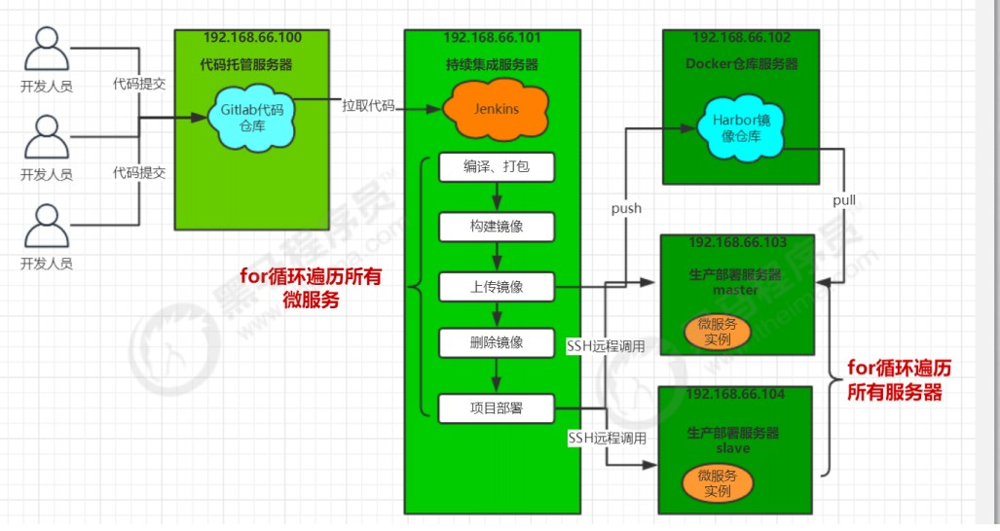
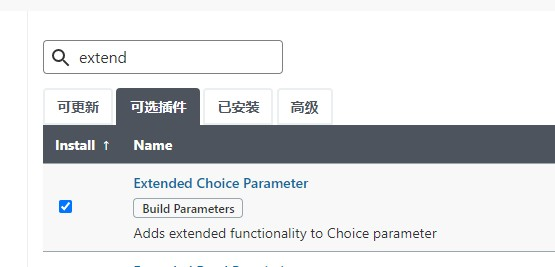
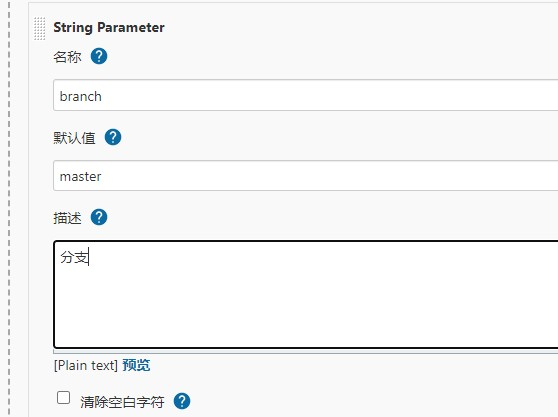
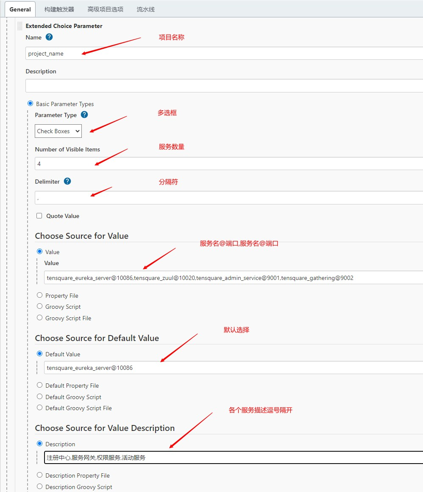
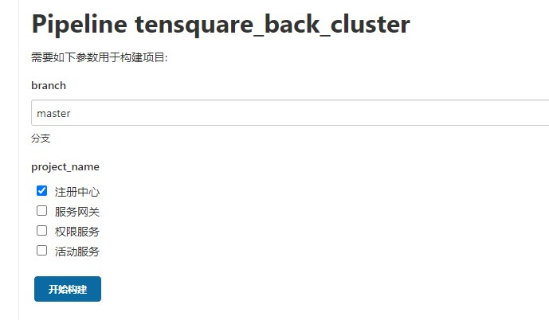
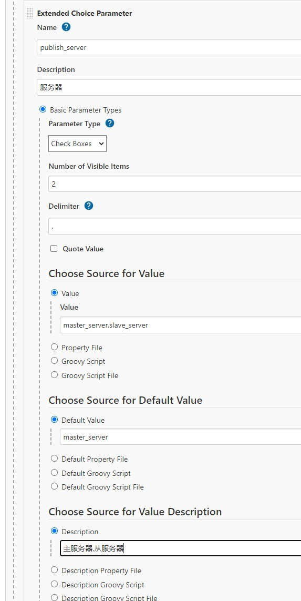
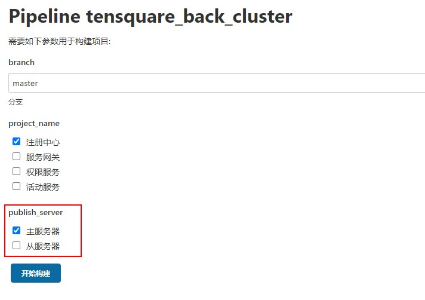
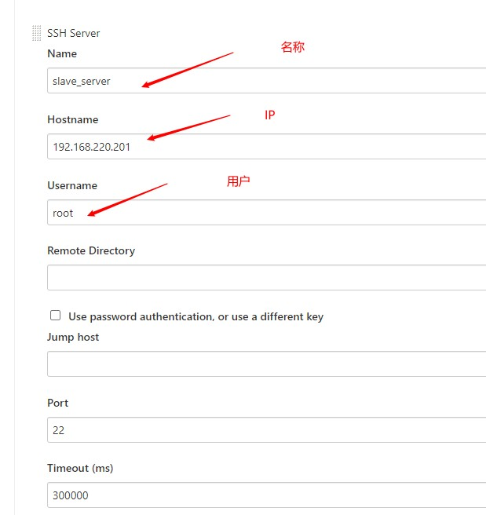

# 多服务部署

## 安装Extended Choice Parameter插件(支持多选框)



## 创建流水线项目 - tensquare_back_cluster


## 添加参数

1. 字符串参数：分支名称

   

2. 多选框：项目名称



​				**效果**

​				

## 编写pipeline脚本

```shell
def git_auth = "3d4ccc33-d166-40d4-8aef-0a00841ad0e6"
def git_url = "http://192.168.220.201:9001/damoncai/tensquare-back.git"
def harbor_url = "192.168.220.203:9000"
def harbor_project_name = "tensquare"
def harbor_auth = "92adab8d-6cbb-4c91-b2c6-532da0ec84e7"
def tag = "v1"
def imageName = "${project_name}"
//把选择的项目信息转为数组
def selectedProjects = "${project_name}".split(',')
node {
	stage('拉取代码') {
		checkout([$class: 'GitSCM', branches: [[name: '*/${branch}']], extensions: [], userRemoteConfigs: [[credentialsId: "${git_auth}", url: "${git_url}"]]])
	}
	stage('代码审查') { 
		def scannerHome = tool 'sonarqube-scanner' 
		withSonarQubeEnv('sonarqube') {
		    for(int i=0;i<selectedProjects.size();i++){
		        //取出每个项目的名称和端口
		        def currentProject = selectedProjects[i];
		        //项目名称
		        def currentProjectName = currentProject.split('@')[0]
		        //项目启动端口
		        def currentProjectPort = currentProject.split('@')[1]
		        sh """
                    cd ${currentProjectName}
                    ${scannerHome}/bin/sonar-scanner
                """
                echo "${currentProjectName}完成代码审查"
		    }
		}
	}
	stage('编译公共子工程') { 
		sh "mvn -f tensquare_common clean install"
	}
	stage('编译打包微服务工程,生成镜像') {
	    for(int i=0;i<selectedProjects.size();i++){
            //取出每个项目的名称和端口
            def currentProject = selectedProjects[i];
            //项目名称
            def currentProjectName = currentProject.split('@')[0]
            //项目启动端口
            def currentProjectPort = currentProject.split('@')[1]
	    	sh "mvn -f ${currentProjectName} clean package dockerfile:build"
	    	echo "${currentProjectName}完成打包和镜像生产"
         }
	}
	stage('推送镜像到Harbor') {
	    //推送镜像
        withCredentials([usernamePassword(credentialsId: "${harbor_auth}", passwordVariable: 'password', usernameVariable: 'username')]) {

              //登录
              sh "docker login -u ${username} -p ${password} ${harbor_url}"

               for(int i=0;i<selectedProjects.size();i++){
                //取出每个项目的名称和端口
               def currentProject = selectedProjects[i];
               //项目名称
               def currentProjectName = currentProject.split('@')[0]
               //项目启动端口
               def currentProjectPort = currentProject.split('@')[1]

                // 打标签
               sh "docker tag ${currentProjectName} ${harbor_url}/${harbor_project_name}/${currentProjectName}:${tag}"

               //上传镜像
               sh "docker push ${harbor_url}/${harbor_project_name}/${currentProjectName}:${tag}"

               echo "${currentProjectName}镜像上传成功"
               }
        }
    }
}
```


# 服务集群部署

## Jenkins上添加部署服务器选择项



​	**效果**

​	

## 给salve服务器配置ssh免密登录

1. 拷贝公钥到远程服务器

   ```shell
   ssh-copy-id 192.168.220.201
   ```

   如果未创建公钥和私钥

   ```shell
   ssh-keygen -t rsa # 创建ssh公钥和私钥
   ```


## Jenkins上配置salve_server服务器



## 编写pipeline脚本

```shell
def git_auth = "3d4ccc33-d166-40d4-8aef-0a00841ad0e6"
def git_url = "http://192.168.220.201:9001/damoncai/tensquare-back.git"
def harbor_url = "192.168.220.203:9000"
def harbor_project_name = "tensquare"
def harbor_auth = "92adab8d-6cbb-4c91-b2c6-532da0ec84e7"
def tag = "v1"
def imageName = "${project_name}"
//把选择的项目信息转为数组
def selectedProjects = "${project_name}".split(',')
def publishServers = "${publish_server}".split(',')
node {
	stage('拉取代码') {
		checkout([$class: 'GitSCM', branches: [[name: '*/${branch}']], extensions: [], userRemoteConfigs: [[credentialsId: "${git_auth}", url: "${git_url}"]]])
	}
	stage('代码审查') { 
		def scannerHome = tool 'sonarqube-scanner' 
		withSonarQubeEnv('sonarqube') {
		    for(int i=0;i<selectedProjects.size();i++){
		        //取出每个项目的名称和端口
		        def currentProject = selectedProjects[i];
		        //项目名称
		        def currentProjectName = currentProject.split('@')[0]
		        //项目启动端口
		        def currentProjectPort = currentProject.split('@')[1]
		        sh """
                    cd ${currentProjectName}
                    ${scannerHome}/bin/sonar-scanner
                """
                echo "${currentProjectName}完成代码审查"
		    }
		}
	}
	stage('编译公共子工程') { 
		sh "mvn -f tensquare_common clean install"
	}
	stage('编译打包微服务工程,生成镜像') {
	    for(int i=0;i<selectedProjects.size();i++){
            //取出每个项目的名称和端口
            def currentProject = selectedProjects[i];
            //项目名称
            def currentProjectName = currentProject.split('@')[0]
            //项目启动端口
            def currentProjectPort = currentProject.split('@')[1]
	    	sh "mvn -f ${currentProjectName} clean package dockerfile:build"
	    	echo "${currentProjectName}完成打包和镜像生产"
         }
	}
	stage('推送镜像到Harbor') {
	    //推送镜像
        withCredentials([usernamePassword(credentialsId: "${harbor_auth}", passwordVariable: 'password', usernameVariable: 'username')]) {

              //登录
              sh "docker login -u ${username} -p ${password} ${harbor_url}"

               for(int i=0;i<selectedProjects.size();i++){
                //取出每个项目的名称和端口
               def currentProject = selectedProjects[i];
               //项目名称
               def currentProjectName = currentProject.split('@')[0]
               //项目启动端口
               def currentProjectPort = currentProject.split('@')[1]

                // 打标签
               sh "docker tag ${currentProjectName} ${harbor_url}/${harbor_project_name}/${currentProjectName}:${tag}"

               //上传镜像
               sh "docker push ${harbor_url}/${harbor_project_name}/${currentProjectName}:${tag}"

               echo "${currentProjectName}镜像上传成功"
               }
        }
    }
     stage('发布') {
        for(int i=0;i<selectedProjects.size();i++){
           //取出每个项目的名称和端口
           def currentProject = selectedProjects[i];
           //项目名称
           def currentProjectName = currentProject.split('@')[0]
           //项目启动端口
           def currentProjectPort = currentProject.split('@')[1]
            //删除本地镜像
            sh "docker rmi -f ${currentProjectName}"
            sh "docker rmi -f ${harbor_url}/${harbor_project_name}/${currentProjectName}"
            for(int j = 0 ; j < publishServers.size(); j++) {
                String server_name = publishServers[j];
                def activeFile = "--spring.profiles.active=";
                if(server_name == "master_server") {
                    activeFile = activeFile + "eureka-server1";
                }else if(server_name == "slave_server") {
                    activeFile = activeFile + "eureka-server2";
                }
                sshPublisher(publishers: [sshPublisherDesc(configName: "${server_name}", transfers: [sshTransfer(cleanRemote: false, excludes: '', execCommand: "/opt/jenkins_shell/deployCluster.sh $harbor_url $harbor_project_name $currentProjectName $tag $currentProjectPort $activeFile", execTimeout: 120000, flatten: false, makeEmptyDirs: false, noDefaultExcludes: false, patternSeparator: '[, ]+', remoteDirectory: '', remoteDirectorySDF: false, removePrefix: '', sourceFiles: '')], usePromotionTimestamp: false, useWorkspaceInPromotion: false, verbose: false)])
                echo "${currentProjectName}发布成功"
            }

        }
    }
}
```

## 拷贝脚本deployCluster.sh并赋予执行权限 chomd +x deployCluster.sh

**注意：**服务器需要先登录Harbor仓库