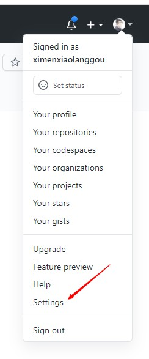
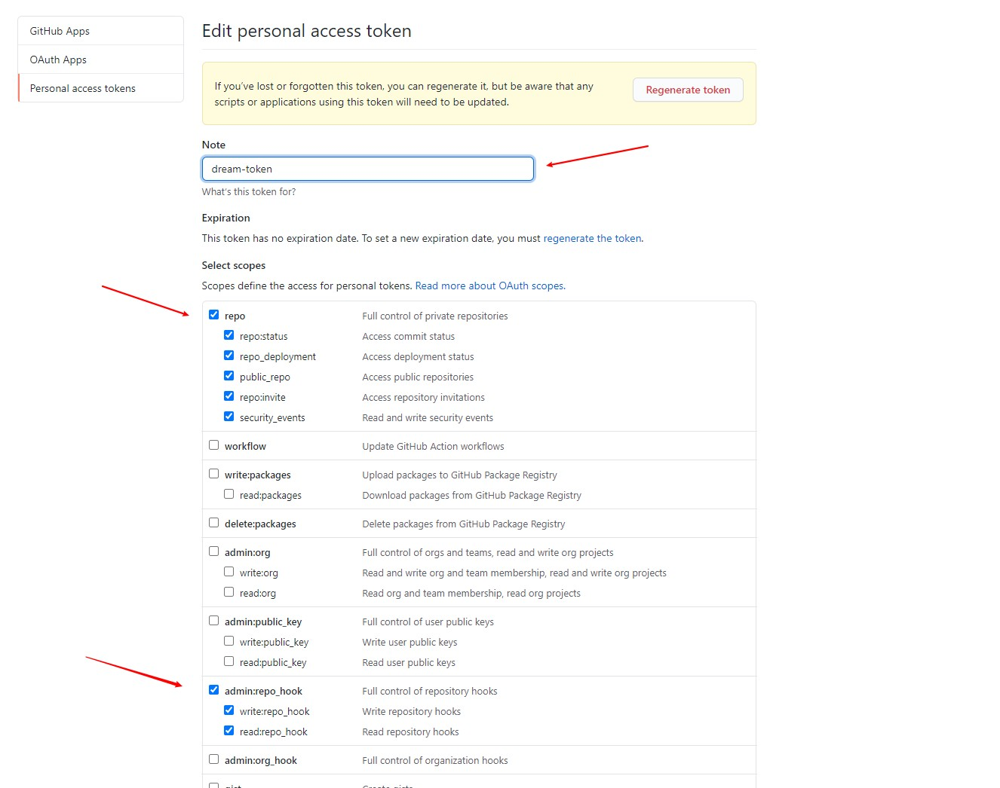
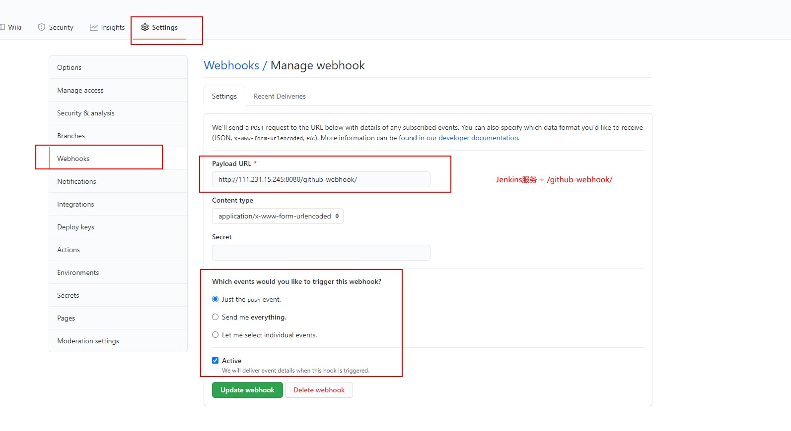
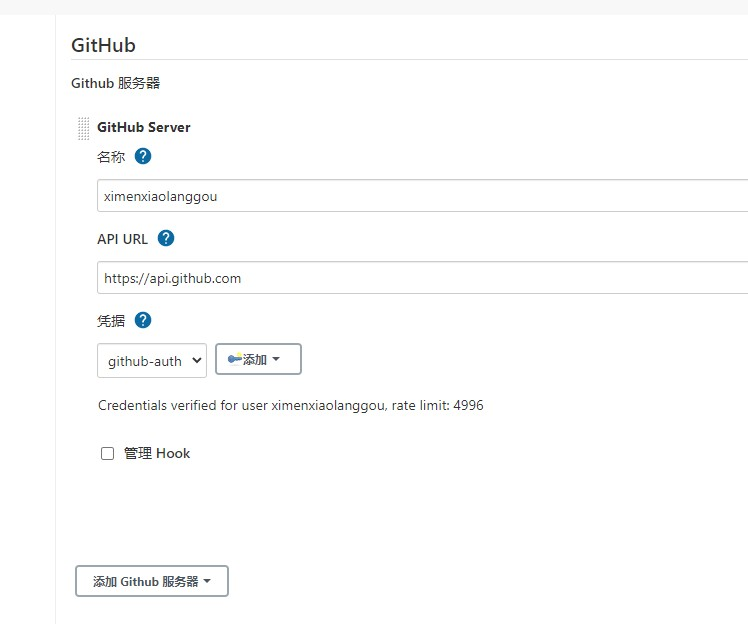
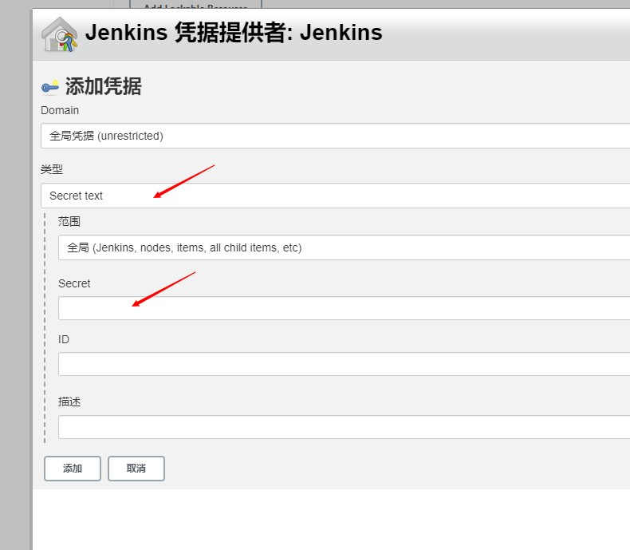

# GitHub配置
1. 创建Token(以后Jenkins配置GitHub服务器需要用到)
   
>Settings -> Developer settings -> Personal access tokens -> Generate New Token

2.配置WebHook
> 进入GitHub上指定的项目 --> setting --> WebHooks --> add webhook

**注意：** 地址需要'/'结尾
# Jenkins配置
1. 安装GitHub Plugin插件
2. 配置GitHub Plugin
系统管理 --> 系统设置 --> GitHub --> Add GitHub Sever

**凭据中的Secret就是之前GitHub上生成的Token

# 编写pipeline脚本
