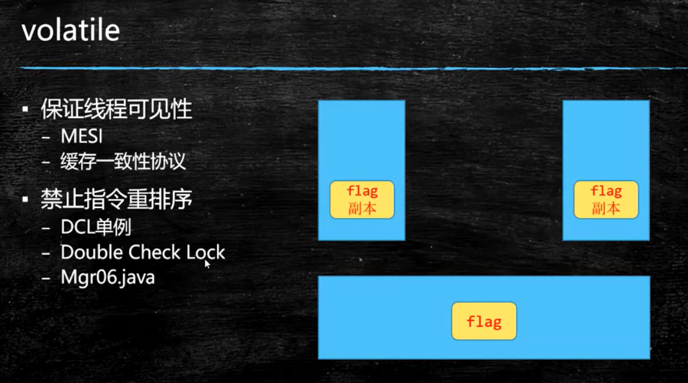

## 线程各状态装换图

## 第一天内容

## volatile

## ReentrantLock
- 必须要必须要必须要手动释放锁
- 用reentrantlock可以进行“尝试锁定”tryLock，这样无法锁定，或者在指定时间内无法锁定，线程可以决定是否继续等待
  使用tryLock进行尝试锁定，不管锁定与否，方法都将继续执行,
  可以根据tryLock的返回值来判定是否锁定
  也可以指定tryLock的时间，由于tryLock(time)抛出异常，所以要注意unclock的处理，必须放到finally中
- 使用ReentrantLock还可以调用lockInterruptibly方法，可以对线程interrupt方法做出响应，在一个线程等待锁的过程中，可以被打断
- ReentrantLock还可以指定为公平锁 ReentrantLock lock=new ReentrantLock(true); //参数为true表示为公平锁，请对比输出结果

## CountDownLatch
## CyclicBarrier
## Phase
## ReentrantReadWriteLock
## Semaphore 限流收费站
## AQS 
## 强引用 软引用 弱引用 需引用
- 强引用
- 软引用
/**
 * 软引用
 * 软引用是用来描述一些还有用但并非必须的对象。
 * 对于软引用关联着的对象，在系统将要发生内存溢出异常之前，将会把这些对象列进回收范围进行第二次回收。
 * 如果这次回收还没有足够的内存，才会抛出内存溢出异常。
 * -Xmx20M
 */
- 弱引用

## 容器

## ConcurrentHashMap
## ConcurrentSkipListMap 跳表 并发并排好序
## CopyOnWriteArrayList
## ConcurrentLinkedQueue
## LinkedBlockingQueue
## ArrayBlockingQueue
## PriorityQueue
## DelayQueue
## SynchronousQueue
## LinkedTransferQueue

## Callable - > Runnable + 结果
## Future 存储执行的将来才回产生的结果
## FutureTask - > Future + Runnerable
## CompletableFuture

