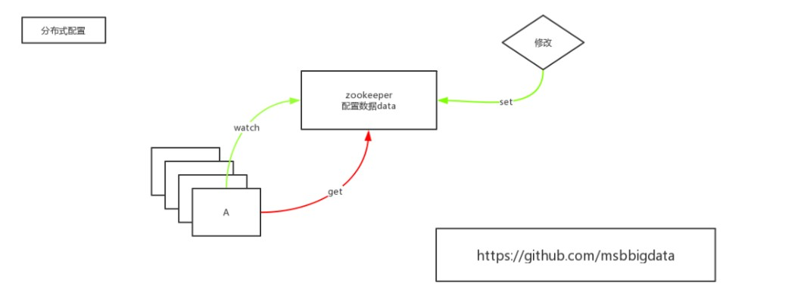

# Zookeeper集群安装

### 依赖JDK环境

安装JDK

### 安装Zookeeper

1. 解压文件

2. 将配置文件zoo_sample.cfg复制一份改名为zoo.cfg

3. 修改zoocfg配置信息

   ```
   # 修改数据存储目录
   dataDir=/home/zkData
   
   #添加集群节点信息
   server.1=master:2888:3888
   server.2=node1:2888:3888
   server.3=node2:2888:3888
   ```

4. 向其他集群发送zookpeer文件

   ```shell 
   scp zookeeper-3.4.6/ node1:/home/
   
   scp zookeeper-3.4.6/ node2:/home/
   ```

5. 各台服务器上创建数据存储目录

   ```
   mkdir -p /home/zkData
   ```

6. 各台服务器zkData文件夹中添加myid文件并写入不同的序号

   ```shell
   echo 1 > myid
   
   echo 2 > myid
   
   echo 3 > myid
   ```

   

# 基本信息


1. cZxid：全局事务ID
2. mZxid：修改事务ID
3. pZxid：节点下最后创建节点的ID

# Zookeeper 分布式协调服务

### 基本概述

1. 描述
   1. leader肯定会挂
   2. 服务不可用
   3. 不可靠集群
   4. 事实，zk集群及其高可用
   5. 如果有一种方式快速的恢复出一个leader
2. zookeeper有两种运行状态
   1. 可用状态
   2. 不可用状态
   3. 不可用状态恢复到可用状态越快越好
3. **不要把zookeeper当数据库用**


### 存储结构 - 目录树结构

1. zookeeper是个目录树结构
2. node可以存储数据 1MB
3. 节点可以分为四类
   1. 持久节点
   2. 持久序号节点
   3. 临时节点 - session
   4. 临时序号节点 - session
4. 用途
   1. 统一配置管理 < 1M数据
   2. 分组管理 < -path 结构
   3. 统一命名 < -sequential


5. 特性和保障
   1. 顺序性 - 客户端更新将按发送顺序应用
   2. 原子性 - 更新成功或失败，没有部分结果
   3. 统一视图 - 无论服务器连接到哪个服务器，客户端看到相同的服务视图
   4. 可靠性 - 一旦应用更新，它将从那时起持续到客户端覆盖更新
   5. 及时性 - 系统的客户视图保证在特定时间范围内饰是新的


# 集群搭建总结和集群节点间连接情况(4台为例)


# Zookeeper 扩展性、可靠性、时序性、快速


# Zookeeper选主


# Zookeeper Watch


# 分布式配置



# 分布式锁


