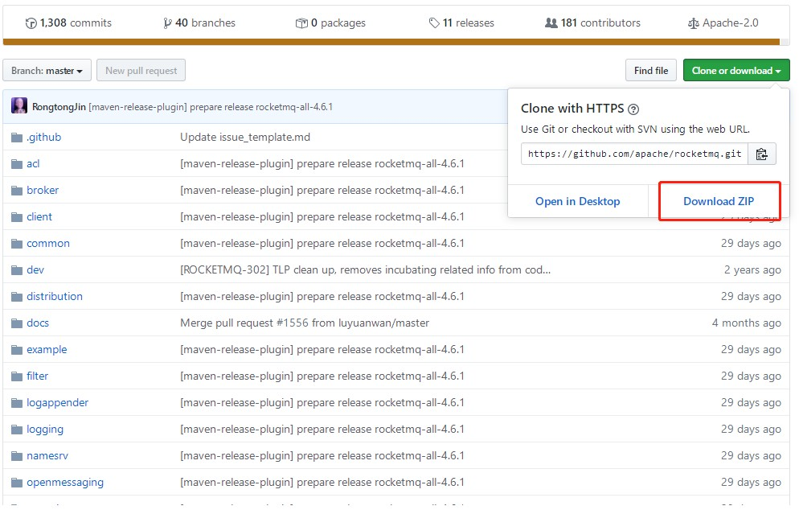
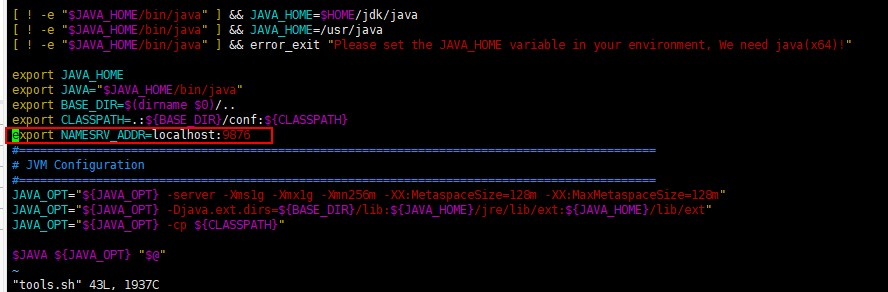

# 前提

1. 安装JDK并配置环境变量
2. 安装Maven并配置环境变量

# 编译

### 从GitHub上下载源码并上传到服务器



### 解压文件

```
unzip rocketmq-master.zip
```

### 进入文件夹并编译

```shell
mvn -Prelease-all -DskipTests clean install -U
```

### 编译完文件位置

```shell
rocketmq-master/distribution/target
```


# 启动

### 前提：修改分配内存配置信息

```shell
# 编辑runbroker.sh和runserver.sh修改默认JVM大小
vi runbroker.sh
vi runserver.sh

#参考设置
JAVA_OPT="${JAVA_OPT} -server -Xms256m -Xmx256m -Xmn128m -XX:MetaspaceSize=128m -XX:MaxMetaspaceSize=320m"
```

### 启动nameserver

```shell
bin目录下执行
./mqnamesrv
```

### 启动Broker

```shell
./mqbroker -n localhost:9876
```

# 测试

### 修改tool.sh脚本

```shell
# 在tools脚本中添加

export NAMESRV_ADDR=localhost:9876
```

**注意位置：不能放在最后**




### 发送消息

```shell
./tools.sh org.apache.rocketmq.example.quickstart.Producer
```

### 接收消息

```shell
./tools.sh org.apache.rocketmq.example.quickstart.Consumer
```


# 日期校准

```shell
yum install ntpdate

ntpdate ntp1.aliyun.com
```

