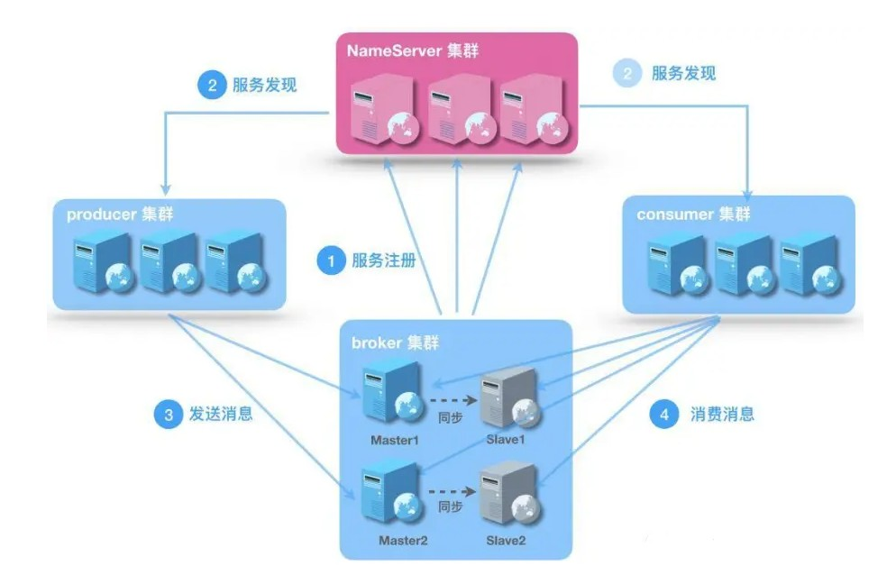

# 系统架构

**broker**

- Broker面向producer和consumer接受和发送消息
- 向nameserver提交自己的信息
- 是消息中间件的消息存储、转发服务器
- 每个Broker节点，在启动时，都会遍历NameServer列表，与每个NameServer建立长连接，注册自己的信息，之后定时上报

**broker集群**

- Broker高可用，可以配成Master/Slave结构，Master可写可读，Slave只可以读，Master将写入的数据同步给Slave
  - 一个Master可以对应多个Slave，但是一个Slave只能对应一个Master
  - Master与Slave的对应关系通过指定相同的BrokerName，不同的BrokerId来定义BrokerId为0表示Master，非0表示Slave
- Master多机负载，可以部署多个broker
  - 每个Broker与nameserver集群中的所有节点建立长连接，定时注册Topic信息到所有nameserver

**producer**

- 消息的生产者
- 通过集群中的其中一个节点（随机选择）建立长连接，获得Topic的路由信息，包括Topic下面有哪些Queue，这些Queue分布在哪些Broker上等
- 接下来向提供Topic服务的Master建立长连接，且定时向Master发送心跳

**consumer**

- 消息的消费者，通过NameServer集群获得Topic的路由信息，连接到对应的Broker上消费消息
- 注意，由于Master和Slave都可以读取消息，因此Consumer会与Master和Slave都建立连接

**nameserver**

底层由netty实现，提供了路由管理、服务注册、服务发现的功能，是一个无状态节点

**nameserver是服务发现者**集群中各个角色（producer、broker、consumer等）都需要定时想nameserver上报自己的状态，以便互相发现彼此，超时不上报的话，nameserver会把它从列表中剔除

**nameserver可以部署多个**，当多个nameserver存在的时候，其他角色同时向他们上报信息，以保证高可用

**nameserver集群间互不通信**，没有主备的概念

**nameserver内存式存储**，nameserver中的broker、topic等信息默认不会持久化

**Topic是一个逻辑上的概念，实际上Message是在每个Broker上以Queue的形式记录**

