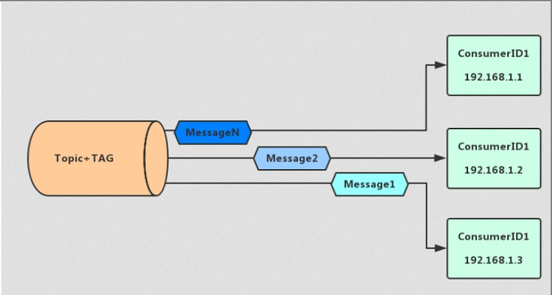

# 消息

### 消费模式

**消息消费模式由消费者来决定，可以由消费者设置MessageModel来决定消息模式**

**消息模式默认为集群消费模式**

```shell
 consumer.setMessageModel(MessageModel.BROADCASTING);
 consumer.setMessageModel(MessageModel.CLUSTERING);
```

#### 集群消费



集群消息是指**集群化部署消费者**

当使用集群消费模式时，MQ 认为任意一条消息只需要被集群内的任意一个消费者处理即可

**特点**

- 每条消息只需要被处理一次，broker只会把消息发送给消费集群中的一个消费者
- 在消息重投时，不能保证路由到同一台机器上
- 消费状态由broker维护

#### 广播消息

当使用广播消费模式时，MQ 会将每条消息推送给集群内所有注册过的客户端，保证消息至少被每台机器消费一次

**特点**

- 消费进度由consumer维护
- 保证每个消费者消费一次消息
- 消费失败的消息不会重投


# 消息发送方式

### 同步消息

消息发送中进入同步等待状态，可以保证消息投递一定到达

### 异步消息

想要快速发送消息，又不想丢失的时候可以使用异步消息

```java
 producer.send(message,new SendCallback() {		
     public void onSuccess(SendResult sendResult) {
         // TODO Auto-generated method stub
         System.out.println("ok");
     }

     public void onException(Throwable e) {
         // TODO Auto-generated method stub
         e.printStackTrace();
         System.out.println("err");
     }
 });
```

### 单向消息

只发送消息，不等待服务器响应，只发送请求不等待应答。此方式发送消息的过程耗时非常短，一般在微秒级别。

```java
producer.sendOneway(message);
```

### 批量消息发送

可以多条消息打包一起发送，减少网络传输次数提高效率。

`producer.send(Collection c) `方法可以接受一个集合 实现批量发送

```java
 public SendResult send(
     Collection<Message> msgs) throws MQClientException, RemotingException, MQBrokerException, InterruptedException {
     return this.defaultMQProducerImpl.send(batch(msgs));
 }
```

- 批量消息要求必要具有同一topic、相同消息配置
- 不支持延时消息
- 建议一个批量消息最好不要超过1MB大小
- 如果不确定是否超过限制，可以手动计算大小分批发送

### TAG

可以使用tag来过滤消费

 在Producer中使用Tag：

```
Message msg = new Message("TopicTest","TagA" ,("Hello RocketMQ " ).getBytes(RemotingHelper.DEFAULT_CHARSET));
```

  在Consumer中订阅Tag：

```
consumer.subscribe("TopicTest", "TagA||TagB");// * 代表订阅Topic下的所有消息
```

### SQL表达式过滤

消费者将收到包含TAGA或TAGB或TAGB的消息. 但限制是一条消息只能有一个标签，而这对于复杂的情况可能无效。 在这种情况下，您可以使用SQL表达式筛选出消息.

#### 配置

在broker.conf 中添加配置

```shell
enablePropertyFilter=true
```

启动broker 加载指定配置文件

```shell
../bin/mqbroker -n 192.168.150.113:9876 -c broker.conf 
```

#### 实例

```java
MessageSelector selector = MessageSelector.bySql("order > 5");
consumer.subscribe("xxoo3", selector);
```

#### 语法

RocketMQ只定义了一些基本的语法来支持这个功能。 你也可以很容易地扩展它.

1. 数字比较, 像 `>`, `>=`, `<`, `<=`, `BETWEEN`, `=`;
2. 字符比较, 像 `=`, `<>`, `IN`;
3. `IS NULL` 或者 `IS NOT NULL`;
4. 逻辑运算`AND`, `OR`, `NOT`;

常量类型是:

1. 数字, 像123, 3.1415;
2. 字符串, 像‘abc’,必须使用单引号;
3. `NULL`, 特殊常数;
4. 布尔常量, `TRUE` 或`FALSE`;

# 顺序消费

队列先天支持FIFO模型，单一生产和消费者下只要保证使用`MessageListenerOrderly`监听器即可

顺序消费表示消息消费的顺序同生产者为每个消息队列发送的顺序一致，所以如果正在处理全局顺序是强制性的场景，需要确保使用的主题只有一个消息队列。

并行消费不再保证消息顺序，消费的最大并行数量受每个消费者客户端指定的线程池限制。

那么只要顺序的发送，再保证一个线程只去消费一个队列上的消息，那么他就是有序的。

跟普通消息相比，顺序消息的使用需要在producer的send()方法中添加MessageQueueSelector接口的实现类，并重写select选择使用的队列，因为顺序消息局部顺序，需要将所有消息指定发送到同一队列中。

**顺序消费**

1. 同一个Topic
2. 同一个队列
3. 同一个线程存放数据
4. 同一个线程取出数据

**生产者**

```java
package top.damoncai.rocketmq.demo_08_sequencemsg;

import org.apache.rocketmq.client.producer.DefaultMQProducer;
import org.apache.rocketmq.client.producer.MessageQueueSelector;
import org.apache.rocketmq.common.message.Message;
import org.apache.rocketmq.common.message.MessageQueue;

import java.util.List;

/**
 * @author zhishun.cai
 * @date 2021/3/23 10:53
 */

public class Producer {


    /**
     *
     * 顺序消费：
     *  1.同一个Topic
     *  2.同一个队列
     *  3.同一个线程存放数据
     *  4.同一个线程取出数据
     *
     * @param args
     * @throws Exception
     */

    public static void main(String[] args) throws Exception {
        DefaultMQProducer producer = new DefaultMQProducer("pg001");

        //设置nameserver地址
        producer.setNamesrvAddr("192.168.220.201:9876");
//        producer.setSendMsgTimeout(6000);
        producer.start();

        //topic 消息发送的主题
        //body 消息发送的内容
        for (int i = 1 ; i <= 11 ; i++) {
            Message message = new Message("myTopic003", ("hello world - Tag " + i).getBytes());
            producer.send(message, new MessageQueueSelector() {

                /**
                 * list 队列集合
                 * message send方法中传递的Message
                 * o send方法中arg参数
                 * @param list
                 * @param message
                 * @param o
                 * @return
                 */
                @Override
                public MessageQueue select(List<MessageQueue> list, Message message, Object o) {
                    //向同一个队列中存放数据
                    Integer index = (int) o;
                    return list.get(index);
                }
            },0,3000);
        }
        producer.shutdown();
        System.out.println("消息发送完毕 ~~~");
    }
}
```

**消费者**

```java
package top.damoncai.rocketmq.demo_08_sequencemsg;

import org.apache.rocketmq.client.consumer.DefaultMQPushConsumer;
import org.apache.rocketmq.client.consumer.MessageSelector;
import org.apache.rocketmq.client.consumer.listener.*;
import org.apache.rocketmq.common.message.MessageExt;
import org.apache.rocketmq.common.protocol.heartbeat.MessageModel;

import java.util.List;

/**
 * @author zhishun.cai
 * @date 2021/3/23 11:01
 */

public class Consumer01 {

    public static void main(String[] args) throws Exception {
        DefaultMQPushConsumer consumer = new DefaultMQPushConsumer("cg001");
        consumer.setNamesrvAddr("192.168.220.201:9876");

        //每个Comsumer关注一个topic

        //topic关注的消息的地址
        consumer.subscribe("myTopic003","*");

        /**
         * MessageListenerConcurrently 并发消费/开启多线程 所以不能保证消费顺序
         */
//        consumer.registerMessageListener(new MessageListenerConcurrently() {
//            @Override
//            public ConsumeConcurrentlyStatus consumeMessage(List<MessageExt> list, ConsumeConcurrentlyContext consumeConcurrentlyContext) {
//                for (MessageExt message : list) {
//                    System.out.println(new String(message.getBody()));
//                }
//                return ConsumeConcurrentlyStatus.CONSUME_SUCCESS;
//            }
//        });

        /**
         * MessageListenerOrderly 书序消费，对一个queue 开启一个线程，多个queue开多个线程
         */
        consumer.setConsumeThreadMax(5);
        consumer.setConsumeThreadMin(1);
        consumer.registerMessageListener(new MessageListenerOrderly() {
            @Override
            public ConsumeOrderlyStatus consumeMessage(List<MessageExt> list, ConsumeOrderlyContext consumeOrderlyContext) {
                for (MessageExt message : list) {
                    System.out.println(new String(message.getBody()) + " " + Thread.currentThread().getName());
                }
                return ConsumeOrderlyStatus.SUCCESS;
            }
        });

        consumer.start();
        System.out.println("消费者启动完毕 ~~~");
    }
}
```


# 事务消息

### 事务消息

分布式系统中的事务可以使用TCC（Try、Confirm、Cancel）、2pc来解决分布式系统中的消息原子性

RocketMQ 4.3+提供分布事务功能，通过 RocketMQ 事务消息能达到分布式事务的最终一致

#### RocketMQ实现方式

**Half Message：**预处理消息，当broker收到此类消息后，会存储到RMQ_SYS_TRANS_HALF_TOPIC的消息消费队列中

**检查事务状态：**Broker会开启一个定时任务，消费RMQ_SYS_TRANS_HALF_TOPIC队列中的消息，每次执行任务会向消息发送者确认事务执行状态（提交、回滚、未知），如果是未知，等待下一次回调。

**超时：**如果超过回查次数，默认回滚消息

#### TransactionListener的两个方法

##### executeLocalTransaction

半消息发送成功触发此方法来执行本地事务

##### checkLocalTransaction

broker将发送检查消息来检查事务状态，并将调用此方法来获取本地事务状态

##### 本地事务执行状态

**LocalTransactionState.COMMIT_MESSAGE**

执行事务成功，确认提交

**LocalTransactionState.ROLLBACK_MESSAGE**

回滚消息，broker端会删除半消息

**LocalTransactionState.UNKNOW**

暂时为未知状态，等待broker回查

**生产者代码**

```java
package top.damoncai.rocketmq.demo_09_txmsg;

import org.apache.rocketmq.client.producer.*;
import org.apache.rocketmq.common.message.Message;
import org.apache.rocketmq.common.message.MessageExt;
import org.apache.rocketmq.common.message.MessageQueue;

import java.util.List;

/**
 * @author zhishun.cai
 * @date 2021/3/23 10:53
 */

public class Producer {


    /**
     *
     * 顺序消费：
     *  1.同一个Topic
     *  2.同一个队列
     *  3.同一个线程存放数据
     *  4.同一个线程取出数据
     *
     * @param args
     * @throws Exception
     */

    public static void main(String[] args) throws Exception {
        TransactionMQProducer producer = new TransactionMQProducer("pg001");

        //设置nameserver地址
        producer.setNamesrvAddr("192.168.220.201:9876");

        // 回调
        producer.setTransactionListener(new TransactionListener() {

            public LocalTransactionState executeLocalTransaction(Message msg, Object arg) {
                // 执行 本地事务


                System.out.println("=====executeLocalTransaction");
                System.out.println("msg:" + new String(msg.getBody()));
                System.out.println("msg:" + msg.getTransactionId());

                /**
                 *
                 * 事务方法 写这里
                 *
                 * 同步执行
                 * -----a----
                 * a 提交注册信息()  ;
                 * b 写入数据库();
                 * c 新用户() -> 发消息;
                 *
                 * 事务消息的应用场景是不是适合发送多个消息要保证同时成功或失败？
                 *
                 * ----b----
                 *
                 * 读取消息
                 * 拿到新用户的信息 发短信
                 *
                 *
                 * 那如果最后一个commit发送失败，
                 * 业务的事务 异常， 然后broker等超时回调检查 发现失败，就扔掉数据是吗？
                 *
                 *
                 */
                try {

                    // 业务
                } catch (Exception e) {
                    //
                    System.out.println("错误");
                    return LocalTransactionState.ROLLBACK_MESSAGE;
                }
                // 真正发出去的数据 可用
                return LocalTransactionState.COMMIT_MESSAGE;
            }

            public LocalTransactionState checkLocalTransaction(MessageExt msg) {
                // Broker 端 回调 ，检查事务

                System.out.println("=====checkLocalTransaction");
                System.out.println("msg:" + new String(msg.getBody()));
                System.out.println("msg:" + msg.getTransactionId());


                // 事务执行成功
                return LocalTransactionState.COMMIT_MESSAGE;
                // 等会儿
                //		return LocalTransactionState.UNKNOW;
                // 回滚消息
                //		return LocalTransactionState.ROLLBACK_MESSAGE;
            }
        });


        producer.start();

        //topic 消息发送的主题
        //body 消息发送的内容
        Message message = new Message("myTopic003", ("hello world - Tag ").getBytes());
        producer.sendMessageInTransaction(message,null);
        producer.shutdown();
        System.out.println("消息发送完毕 ~~~");
    }
}
```

